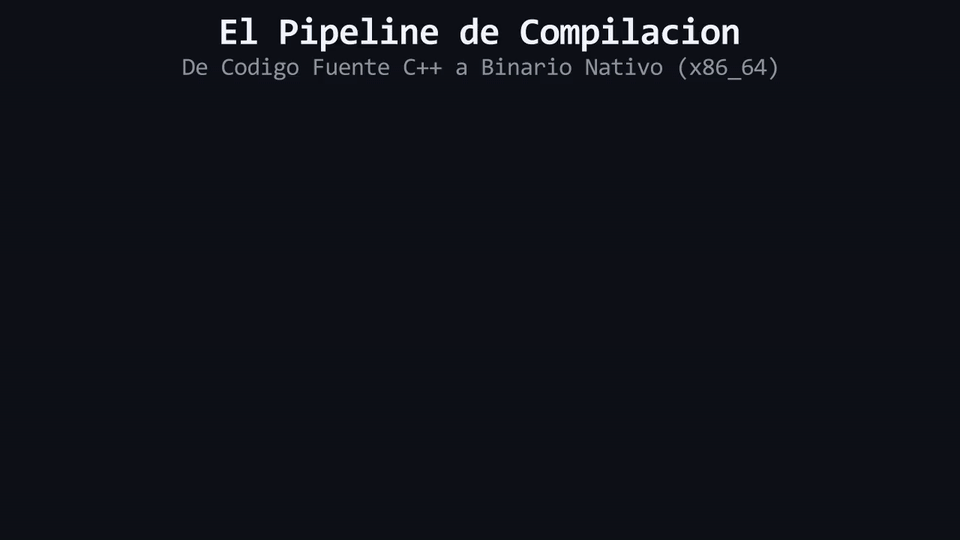

# L00 · ¿Qué es programar?

> **Módulo 01 — Getting Started**  
> Lección conceptual · Sin código · Sin instalación

---

## ¿Qué es un programa?

Cuando enciendes una computadora y abres una aplicación — un navegador, un videojuego, una calculadora — lo que estás ejecutando es un **programa**.

Un programa es simplemente una serie de instrucciones que la computadora sigue, una por una, en orden. Nada más. No hay magia detrás: la computadora no "piensa", no "decide" por su cuenta, no "entiende" lo que quieres hacer. Solo ejecuta instrucciones, exactamente como se las dieron, exactamente en el orden en que se las dieron.

Piénsalo así: si le dices a alguien que nunca cocinó en su vida que prepare una tortilla, no va a saber qué hacer. Pero si le das una receta con pasos numerados — "1. rompe dos huevos en un tazón, 2. bátelos con un tenedor, 3. calienta una sartén..." — puede seguirla sin entender por qué cada paso existe. La computadora es ese cocinero: puede seguir cualquier serie de pasos con precisión absoluta, pero alguien tiene que escribir esos pasos primero.

Ese "alguien" eres tú. Eso es programar: **escribir las instrucciones que la computadora va a seguir**.

---

## Las instrucciones que una computadora puede entender

Aquí hay algo importante que entender antes de seguir: una computadora, en su nivel más básico, solo entiende electricidad. Circuitos que están encendidos o apagados. Unos y ceros. Nada más.

Entonces surge una pregunta natural: si queremos darle instrucciones a la computadora, ¿las tenemos que escribir en unos y ceros?

Técnicamente, sí. Eso es lo único que la computadora puede ejecutar directamente — una secuencia de unos y ceros que le dice exactamente qué operaciones hacer en su hardware.

El problema es evidente: ninguna persona piensa en unos y ceros. Nadie puede escribir un programa complejo así, ni leerlo, ni encontrar un error en él. Sería como intentar escribir una novela en código morse, carácter por carácter, sin cometer un solo error.

Por eso existen los **lenguajes de programación**: son un puente entre la forma en que piensan los humanos y la forma en que funciona la computadora. Un lenguaje de programación te permite escribir instrucciones en algo que se parece al razonamiento humano — con palabras, estructuras lógicas, nombres que tú eliges — y luego hay una herramienta que convierte eso en los unos y ceros que la máquina puede ejecutar.

C++ es uno de esos lenguajes. Y en este curso vas a aprenderlo.

---

## El código fuente: instrucciones escritas para humanos

Cuando un programador escribe un programa, lo que produce es un archivo de texto. Un archivo completamente normal, que podrías abrir con cualquier editor de texto y leer — o intentar leer, si conoces el lenguaje.

Ese archivo se llama **código fuente**.

El código fuente es el programa *tal como lo escribió el programador*: con palabras, con estructura, con lógica que un humano puede seguir y entender. Es la receta completa, escrita para que otra persona (o tú mismo en el futuro) pueda leerla, modificarla, mejorarla.

Pero hay algo que el código fuente no puede hacer por sí solo: **ejecutarse**. La computadora no puede leer un archivo de texto con instrucciones en un lenguaje de programación y seguirlas directamente. Recuerda: la computadora solo entiende unos y ceros.

El código fuente es como un plano arquitectónico: está lleno de información precisa y útil, pero no es el edificio. Todavía falta convertirlo en algo real.

---

## El compilador: el traductor entre tú y la máquina

  

#### 🔍 Traducción Visual del Pipeline:
* **Panel Izquierdo (`main.cpp`):** Código fuente en C++ legible por desarrolladores.
* **Panel Central (`Compilador g++`):** Motor de análisis semántico y traducción que transforma el código en AST y lenguaje ensamblador.
* **Panel Derecho (`app.exe`):** Binario de máquina nativo (`x86_64`) con instrucciones en código binario listas para ser ejecutadas directamente por la CPU.

Para que la computadora pueda ejecutar tu código fuente, alguien tiene que traducirlo de "lenguaje humano" a "unos y ceros". Ese trabajo lo hace una herramienta llamada **compilador**.

El compilador es un programa especial que toma tu archivo de código fuente como entrada, lo lee completo, y produce como salida un nuevo archivo — uno que ya está en el formato que la computadora puede ejecutar directamente. A ese archivo resultante se le llama **ejecutable** (en Windows, los archivos `.exe` son ejecutables).

La traducción que hace el compilador es exhaustiva y exacta:
- Verifica que las instrucciones que escribiste tengan sentido en el lenguaje.
- Detecta errores antes de que el programa llegue a ejecutarse.
- Genera el código en unos y ceros que corresponde a lo que pediste.

Si el compilador encuentra algo que no puede traducir — una instrucción mal escrita, una palabra que no existe en el lenguaje, una contradicción lógica — te avisa con un **error de compilación** y no produce el ejecutable. Nada se ejecuta hasta que el código fuente sea válido.

Esto puede sonar frustrante al principio ("¿por qué no me deja ejecutarlo si ya lo escribí?"), pero en realidad es una ventaja enorme: el compilador es el primer lector de tu código, y te avisa de los problemas antes de que lleguen a la computadora real.

---

## Escribir vs. ejecutar — la diferencia que lo cambia todo

Hay una distinción fundamental que vale la pena dejar muy clara:

**Escribir** el código fuente y **ejecutar** el programa son dos momentos completamente separados.

Cuando escribes código, estás en modo autor: tomando decisiones, describiendo qué debe hacer el programa, estructurando la lógica. El programa no hace nada todavía — es solo un texto.

Cuando compilas y ejecutas, la computadora toma el control: sigue las instrucciones que dejaste, exactamente como las escribiste, sin improvisación, sin interpretación.

Esta separación tiene una consecuencia práctica importante: **los errores también tienen dos momentos distintos**.

Un error de compilación ocurre antes de que el programa se ejecute — el compilador lo detecta mientras traduce tu código. Un error de ejecución ocurre mientras el programa ya está corriendo — algo que parecía correcto al escribirlo resulta no funcionar bien cuando la computadora lo lleva a cabo.

La receta de cocina, de nuevo: puedes escribir "añade 3 tazas de sal" y la receta es perfectamente legible, no hay ningún error de escritura. El problema solo aparece cuando alguien la ejecuta y prueba el resultado. En programación pasa algo similar: hay errores que el compilador puede detectar antes, y hay errores que solo se revelan cuando el programa corre.

Con el tiempo, aprenderás a anticipar ambos tipos. Por ahora, basta con entender que existen y que son distintos.

---

## ✦ Resumen

Un **programa** es una secuencia de instrucciones que la computadora sigue paso a paso. Como la computadora solo entiende unos y ceros, los **lenguajes de programación** sirven de puente: te permiten escribir instrucciones de una forma que los humanos pueden razonar. Esas instrucciones escritas forman el **código fuente**. Para que la computadora pueda ejecutarlas, el **compilador** las traduce a un formato ejecutable. Escribir el código y ejecutar el programa son dos momentos separados — y los errores también ocurren en momentos distintos.

---

## ✦ Preguntas de autochequeo

> [!WARNING]
> **Regla de oro:** Estas preguntas se pueden responder *solo* con lo que leíste en esta lección. No busques en internet — si no puedes responderlas de memoria, relee la sección correspondiente.

<b>1. ¿Por qué no se puede escribir directamente en el lenguaje que la computadora entiende?</b>

> Porque la computadora solo entiende ceros y unos. Escribir lógica compleja directamente en binario sería humanamente imposible de leer, estructurar o corregir. Los lenguajes de programación actúan como el puente necesario.

<b>2. ¿Qué diferencia hay entre el código fuente y el ejecutable?</b>

> El **código fuente** es el texto escrito por el humano (legible, pero la máquina no lo entiende). El **ejecutable** es el archivo resultante después de que el compilador tradujo ese código fuente a ceros y unos (la máquina lo entiende, pero es ilegible para el humano).

<b>3. Si el compilador encuentra un error en tu código fuente, ¿el programa se ejecuta de todas formas?</b>

> **No.** El compilador se detiene de inmediato, te avisa del error y se niega a producir el archivo ejecutable. Nada corre hasta que el código esté limpio.

---

| 🏠 [Inicio del Curso](../../README.md) | 📖 [Menú del Módulo](../README.md) | ➡️ [Siguiente: Instalando herramientas](L01_InstalandoHerramientas.md) |
|---|---|---|

---

  Maintained by <strong>MiniLux0</strong> · 2026

