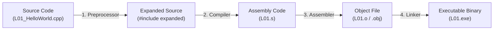

# Lesson 01 — Hello World & C++ Program Anatomy

> [!NOTE]
> **Academic Foundation:** This lesson synthesizes core concepts from **MIT 6.096 Lecture 01** ([`Lecture01_Introduction.pdf`](../../files/mit6096/lectures/Lecture01_Introduction.pdf)) and **Stanford CS106L Lecture 01** ([`WLecture1_intro.pdf`](../../files/cs106l/lectures/WLecture1_intro.pdf)).

---

## 🧭 Quick Navigation

- 📄 **Base Academic Lectures:**
  - 🏛️ [MIT 6.096 — Lecture 01: Introduction & C++ Anatomy](../../files/mit6096/lectures/Lecture01_Introduction.pdf)
  - ⚙️ [Stanford CS106L — Lecture 01: Overview of C++](../../files/cs106l/lectures/WLecture1_intro.pdf)
- 💻 **Code Lab:** [`L01_HelloWorld.cpp`](../code/L01_HelloWorld.cpp)

---

## Learning Objectives

- [ ] Understand what C++ is and its position as a high-performance compiled language.
- [ ] Master the 4-stage GCC compilation pipeline (`.cpp` $`\to`$ Preprocessor $`\to`$ Compiler $`\to`$ Linker $`\to`$ `.exe`).
- [ ] Dissect the line-by-line anatomy of a standard C++ program.
- [ ] Understand preprocessor directives (`#include`), the `main()` entry point, and output streams (`std::cout`).

---

## 1. What is C++?

C++ is a high-performance, compiled, statically-typed programming language created by Bjarne Stroustrup in 1979 at Bell Labs.

> [!TIP]
> **Why C++?**
> C++ provides direct access to system memory and hardware without garbage collection overhead, making it the industry standard for:
> - Game Engines (Unreal Engine 5)
> - Operating Systems (Windows, macOS, Linux kernels)
> - High-Frequency Trading (HFT) platforms
> - Web Browsers (Chrome V8 engine, Firefox SpiderMonkey)

---

## 2. The GCC Compilation Pipeline

Unlike interpreted languages (like Python or JavaScript), C++ source code cannot be executed directly by the CPU. It must be translated into native machine code binary (`0`s and `1`s) through a 4-step pipeline:



1. **Preprocessing (`#include`):** Copies standard headers and resolves macro directives before compilation.
2. **Compilation:** Translates high-level C++ statements into architecture-specific assembly instructions.
3. **Assembly:** Converts assembly text into machine code object files (`.o` or `.obj`).
4. **Linking:** Combines object files with C++ Standard Library binaries to create the final `.exe` file.

> [!TIP]
> **Don't know how to compile?**
> If you are unsure how to compile and run your first C++ program from the command line, check the central build documentation at 📂 [**`docs/README.md`**](../../docs/README.md).

---

## 3. Dissecting the "Hello World" Anatomy

Here is a minimal, complete C++ program:

```cpp
#include <iostream>

int main() {
    std::cout << "Hello, World!\n";
    return 0;
}
```

> [!IMPORTANT]
> **Line-by-Line Breakdown:**
>
> 1. **`#include <iostream>`**: A **preprocessor directive**. It instructs the compiler to include the Input/Output Stream library header, providing access to `std::cout` and `std::cin`.
> 2. **`int main()`**: The **entry point function** of every C++ program. The Operating System begins execution strictly at `main()`. The `int` return type indicates an exit code returned to the OS.
> 3. **`{ ... }`**: Curly braces define the **scope block** containing the executable statements of `main()`.
> 4. **`std::cout << "Hello, World!\n";`**:
>    - `std::cout`: Standard Output Stream object ("console output").
>    - `<<`: The **stream insertion operator**. Sends data to the console output stream.
>    - `"Hello, World!\n"`: A **string literal**. `\n` represents the newline character.
>    - `;`: The **semicolon**. Every statement in C++ **MUST** end with a semicolon.
> 5. **`return 0;`**: Signals to the Operating System that the program executed successfully without runtime errors (`0` = Success).

---

## ❓ Self-Assessment Checkpoint #1 — The Role of the Semicolon

What happens if you omit the semicolon `;` at the end of `std::cout << "Hello, World!\n"`?

<details>
<summary>🔍 <strong>View Explanation & Answer</strong></summary>

> [!CAUTION]
> **Compiler Error:** The C++ compiler will generate a syntax error (e.g., `error: expected ';' before 'return'`).
> In C++, whitespace (spaces, tabs, newlines) is ignored by the parser. Semicolons are mandatory statement terminators that tell the compiler where one instruction ends and the next begins.

</details>

---

## 📝 Summary & Key Takeaways

1. **Compilation:** C++ compiles directly to native machine instructions.
2. **Entry Point:** Every executable C++ program requires exactly one `main()` function.
3. **I/O Library:** `#include <iostream>` is required for console output (`std::cout`) and input (`std::cin`).
4. **Syntax:** Statements end with `;`, and code blocks are enclosed in `{}`.

---

<div align="center">

### 🧭 Navigation & Progression

| ⬅️ Previous Lesson | 🏠 Section Home | ➡️ Next Lesson |
|:------------------:|:--------------:|:--------------:|
| **Start of Course** | [**🏠 Getting Started**](../README.md) | [**L02 — Namespaces & std:: ➡️**](L02_NamespacesAndStd.md) |

</div>


---

<div align="center">
  <sub>Maintained by <strong>MiniLux0</strong> · 2026</sub>
</div>