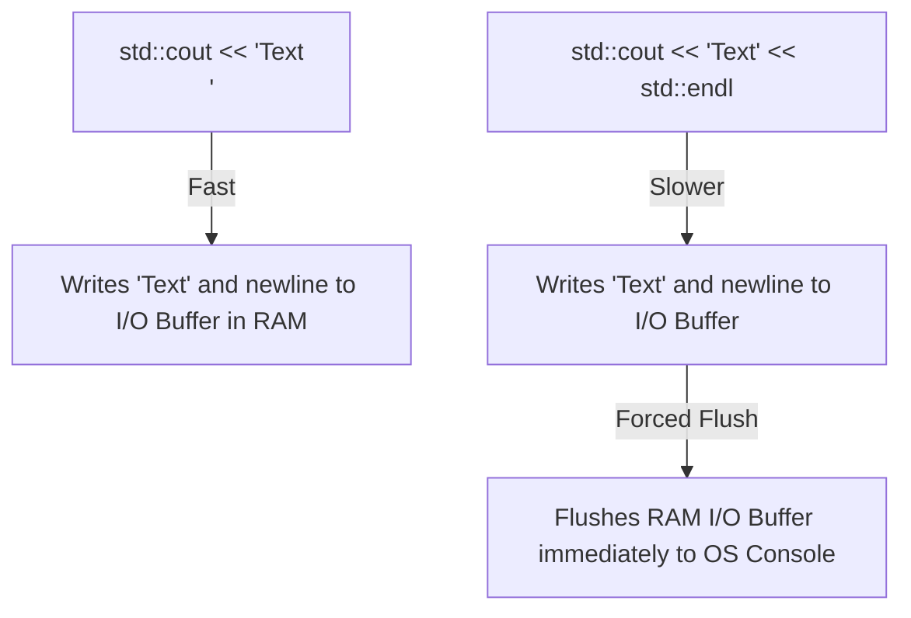

# Lesson 03 — Comments, Escape Sequences & Code Formatting

> [!NOTE]
> **Academic Foundation:** This lesson synthesizes core concepts from **MIT 6.096 Lecture 01** ([`Lecture01_Introduction.pdf`](../../files/mit6096/lectures/Lecture01_Introduction.pdf)) and **Stanford CS106L Lecture 01** ([`WLecture1_intro.pdf`](../../files/cs106l/lectures/WLecture1_intro.pdf)).

---

## 🧭 Quick Navigation

- 📄 **Base Academic Lectures:**
  - 🏛️ [MIT 6.096 — Lecture 01: Code Formatting & Comments](../../files/mit6096/lectures/Lecture01_Introduction.pdf)
  - ⚙️ [Stanford CS106L — Lecture 01: Escape Sequences & Stream Buffer Flushing](../../files/cs106l/lectures/WLecture1_intro.pdf)
- 💻 **Code Lab:** [`L03_CommentsAndFormatting.cpp`](../code/L03_CommentsAndFormatting.cpp)

---

## Learning Objectives

- [ ] Write single-line (`//`) and multi-line (`/* */`) comments effectively without over-commenting obvious code.
- [ ] Master common **escape sequences** (`\n`, `\t`, `\"`, `\\`).
- [ ] Understand the technical performance difference between `\n` and `std::endl` (buffer flushing).
- [ ] Apply clean C++ formatting and consistent 4-space indentation rules.

---

## 1. Comments in C++

Comments are developer notes ignored completely by the C++ preprocessor and compiler. They do not consume runtime memory or CPU cycles in the compiled executable.

### Single-Line Comments (`//`)
```cpp
// This is a single-line comment
int score = 100; // Inline explanation
```

### Multi-Line Comments (`/* ... */`)
```cpp
/*
 * Multi-line comment block.
 * Used for high-level module descriptions,
 * algorithm documentation, or license notices.
 */
```

> [!TIP]
> **Self-Documenting Code Rule:**
> Write comments that explain **WHY** an algorithm performs a specific task or calculation, not **WHAT** the code literally states. Prefer clear variable names (`int elapsedSeconds;`) over cryptic names with explanatory comments (`int s; // seconds`).

---

## 2. Escape Sequences & Formatting

Escape sequences begin with a backslash `\` and allow inserting non-printable or special characters into string literals:

| Escape Sequence | Symbol Name | Description / Output Behavior |
| :---: | :--- | :--- |
| **`\n`** | Newline | Moves the output cursor to the beginning of the next line. |
| **`\t`** | Horizontal Tab | Inserts a tab stop space for aligning tabular data. |
| **`\"`** | Double Quote | Escapes double quotes inside a string literal (`"Hello \"World\""`). |
| **`\\`** | Backslash | Prints a literal backslash character (`\\`). |

---

## 3. `\n` vs. `std::endl` — Buffer Flushing Performance

Both `\n` and `std::endl` move the console output cursor to the next line, but they behave differently under the hood:



- **`\n` (Recommended Default):** Appends a newline character to the output stream buffer in RAM. The OS flushes the buffer automatically when full or at program termination.
- **`std::endl`:** Appends a newline **AND forces an immediate hardware flush** of the stream buffer to screen.

> [!IMPORTANT]
> Calling `std::endl` repeatedly in tight loops (e.g., printing $1,000,000$ lines) slows down execution significantly due to millions of redundant hardware I/O flushes. Use `\n` by default, and reserve `std::endl` for interactive prompts where immediate screen feedback is required.

---

## ❓ Self-Assessment Checkpoint #1 — Output Prediction

Predict the exact output printed by the following statement:

```cpp
std::cout << "C:\\Program Files\\App\n\"C++\"\tRules!\n";
```

<details>
<summary>🔍 <strong>View Explanation & Output</strong></summary>

> [!NOTE]
> **Output:**
> ```text
> C:\Program Files\App
> "C++"    Rules!
> ```
>
> **Explanation:**
> 1. `\\` outputs a single literal backslash `\`.
> 2. `\n` moves execution to a new line.
> 3. `\"` prints literal quotes `"C++"`.
> 4. `\t` inserts a tab space before `Rules!`.

</details>

---

## 📝 Summary & Key Takeaways

1. **Comments:** Ignored by compiler; used to document intent (**why**, not **what**).
2. **Escape Sequences:** Preceded by `\` (`\n` for newline, `\t` for tab, `\"` for quotes).
3. **Performance:** Prefer `\n` over `std::endl` to avoid unnecessary stream buffer flushes.

---

<div align="center">

### 🧭 Navigation & Progression

| ⬅️ Previous Lesson | 🏠 Section Home | ➡️ Next Lesson |
|:------------------:|:--------------:|:--------------:|
| [**⬅️ L02 — Namespaces & std::**](L02_NamespacesAndStd.md) | [**🏠 Getting Started**](../README.md) | [**L04 — User Input std::cin ➡️**](L04_UserInputCin.md) |

</div>

---
*MiniLux0 — Learning C++ Section 01*
