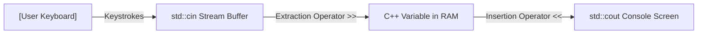

# Lesson 04 — Interactive User Input (`std::cin` & Stream Extraction)

> [!NOTE]
> **Academic Foundation:** This lesson synthesizes core concepts from **Stanford CS106L Lecture 04** ([`WL4_Streams.pdf`](../../files/cs106l/lectures/WL4_Streams.pdf)) and **MIT 6.096 Lecture 01** ([`Lecture01_Introduction.pdf`](../../files/mit6096/lectures/Lecture01_Introduction.pdf)).

---

## 🧭 Quick Navigation

- 📄 **Base Academic Lectures:**
  - ⚙️ [Stanford CS106L — Lecture 04: Stream Abstractions & Abuses](../../files/cs106l/lectures/WL4_Streams.pdf)
  - 🏛️ [MIT 6.096 — Lecture 01: Interactive Keyboard Input](../../files/mit6096/lectures/Lecture01_Introduction.pdf)
- 💻 **Code Lab:** [`L04_UserInputCin.cpp`](../code/L04_UserInputCin.cpp)

---

## Learning Objectives

- [ ] Master interactive keyboard input using `std::cin` and the **extraction operator (`>>`)**.
- [ ] Understand whitespace-delimited token extraction (spaces, tabs, newlines).
- [ ] Contrast `std::cout <<` (insertion) vs. `std::cin >>` (extraction).
- [ ] Identify stream extraction failure states when data types mismatch.

---

## 1. The Standard Input Stream (`std::cin`)

While `std::cout` pushes data **OUT** to the screen, `std::cin` pulls data **IN** from the user's keyboard.



- **Insertion (`std::cout << data`):** Points left $\leftarrow$, pushing data toward output.
- **Extraction (`std::cin >> variable`):** Points right $\rightarrow$, extracting tokens from the input buffer into variables.

---

## 2. Basic Input Mechanics

```cpp
#include <iostream>
#include <string>

int main() {
    std::string name;
    int age;

    std::cout << "Enter your first name: ";
    std::cin >> name; // Extracts text up to the first whitespace

    std::cout << "Enter your age: ";
    std::cin >> age;  // Extracts characters and parses them into an integer

    std::cout << "Hello " << name << ", age " << age << "!\n";
    return 0;
}
```

> [!IMPORTANT]
> **Whitespace Skipping Rule:**
> By default, `std::cin >>` automatically skips leading whitespace (spaces, tabs, newlines) and stops reading as soon as it encounters trailing whitespace. If the user enters `"John Doe"`, `std::cin >> name` will extract `"John"`, leaving `"Doe"` inside the stream buffer for the next extraction call!

---

## 3. Data Type Validation & Stream Failures

When extracting into a typed variable (such as `int age`), `std::cin` attempts to parse ASCII characters into numeric binary representation:

> [!WARNING]
> **Stream Fail State:**
> If the user types `"twenty"` when `std::cin >> age` expects a number, the extraction fails. `std::cin` enters a **fail state** (`std::cin.fail() == true`), zero-initializes or corrupts subsequent input operations, and ignores future input requests until `std::cin.clear()` is invoked.

---

## ❓ Self-Assessment Checkpoint #1 — Stream Buffer Residuals

If a program executes:
```cpp
std::string firstName, lastName;
std::cin >> firstName;
std::cin >> lastName;
```
And the user types `"Alice Cooper"` on a single line and presses Enter:

**What will `firstName` and `lastName` contain?**

<details>
<summary>🔍 <strong>View Explanation & Answer</strong></summary>

> [!NOTE]
> **Result:** `firstName = "Alice"`, `lastName = "Cooper"`.
>
> **Explanation:**
> The user's input `"Alice Cooper\n"` enters the RAM stream buffer. The first `std::cin >> firstName` reads `"Alice"` and stops at the space. The second `std::cin >> lastName` does NOT pause for new keyboard input; it immediately extracts the remaining `"Cooper"` from the stream buffer!

</details>

---

## 📝 Summary & Key Takeaways

1. **Extraction (`>>`):** Pulls formatted tokens from the input stream buffer into declared variables.
2. **Whitespace Delimitation:** `std::cin >>` stops reading at spaces, tabs, or newlines.
3. **Stream Buffer:** Extra input typed on a line remains in memory for subsequent extraction statements.

---

<div align="center">

### 🧭 Navigation & Progression

| ⬅️ Previous Lesson | 🏠 Section Home | ➡️ Next Lesson |
|:------------------:|:--------------:|:--------------:|
| [**⬅️ L03 — Comments & Formatting**](L03_CommentsAndFormatting.md) | [**🏠 Getting Started**](../README.md) | [**L05 — Profile Generator Project ➡️**](L05_InteractiveProfileApp.md) |

</div>

---
*MiniLux0 — Learning C++ Section 01*
