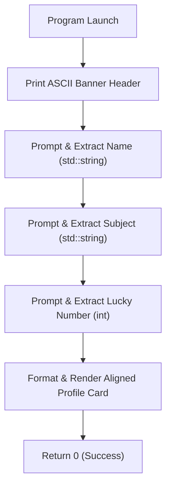

# Lesson 05 — Capstone Project: Interactive Profile Generator

> [!NOTE]
> **Academic Foundation:** This capstone lesson integrates concepts from **MIT 6.096 Lecture 01** ([`Lecture01_Introduction.pdf`](../../files/mit6096/lectures/Lecture01_Introduction.pdf)) and **Stanford CS106L Lecture 01** ([`WLecture1_intro.pdf`](../../files/cs106l/lectures/WLecture1_intro.pdf)).

---

## 🧭 Quick Navigation

- 📄 **Base Academic Lectures:**
  - �� [MIT 6.096 — Lecture 01: Consolidated I/O Syntax](../../files/mit6096/lectures/Lecture01_Introduction.pdf)
  - ⚙� [Stanford CS106L — Lecture 01: Interactive Program Design](../../files/cs106l/lectures/WLecture1_intro.pdf)
- 💻 **Code Lab:** [`L05_InteractiveProfileApp.cpp`](../code/L05_InteractiveProfileApp.cpp)

---

## Learning Objectives

- [ ] Synthesize program anatomy, stream output (`std::cout`), escape sequences, and stream input (`std::cin`).
- [ ] Design an interactive console UI with aligned ASCII banners and formatted profile summaries.
- [ ] Practice variable declaration and memory allocation for string and integer data types.
- [ ] Verify clean compilation and execution using automated `makefile` scripts.

---

## 1. Project Specifications

The **Interactive Profile Generator** acts as a comprehensive capstone for Section 01:
1. **ASCII Header Banner:** Prints a formatted title block using escape sequences (`\n`, `\t`).
2. **Interactive Prompts:** Sequentially prompts the user for name, academic interest, and a lucky integer.
3. **Formatted Card Output:** Displays an aligned user profile summary block.



---

## 2. Full Code Implementation

```cpp
#include <iostream>
#include <string>

int main() {
    // 1. ASCII Banner Header
    std::cout << "========================================\n";
    std::cout << "    WELCOME TO C++ PROFILE GENERATOR    \n";
    std::cout << "========================================\n\n";

    // 2. Variable Declarations
    std::string name;
    std::string topic;
    int luckyNumber;

    // 3. Interactive Data Collection
    std::cout << "1. Enter your name: ";
    std::cin >> name;

    std::cout << "2. Enter your favorite topic: ";
    std::cin >> topic;

    std::cout << "3. Enter your lucky number: ";
    std::cin >> luckyNumber;

    // 4. Render Aligned Profile Card
    std::cout << "\n----------------------------------------\n";
    std::cout << "          USER PROFILE CARD             \n";
    std::cout << "----------------------------------------\n";
    std::cout << " Name           : " << name << "\n";
    std::cout << " Favorite Topic : " << topic << "\n";
    std::cout << " Lucky Number   : " << luckyNumber << "\n";
    std::cout << " Status         : Ready for Section 02!\n";
    std::cout << "----------------------------------------\n";

    return 0;
}
```

> [!TIP]
> **Compilation & Verification:**
> Test your implementation in terminal using `make`:
> ```bash
> cd 01_GettingStarted/code
> make
> .\L05_InteractiveProfileApp.exe
> ```

---

## � Self-Assessment Checkpoint #1 — Stream Buffer Handling

What happens if you enter a full name with a space (e.g., `"Ada Lovelace"`) at the first prompt (`1. Enter your name: `)?

<details>
<summary>� <strong>View Explanation & Behavior Analysis</strong></summary>

> [!WARNING]
> **Behavior Analysis:**
> `std::cin >> name` extracts `"Ada"` into `name`. The trailing `"Lovelace"` remains in the input stream buffer.
> When the program reaches `2. Enter your favorite topic: `, `std::cin >> topic` immediately extracts `"Lovelace"` from the stream without waiting for new keyboard input!
> *(Note: In Section 02 and 04, we will introduce `std::getline(std::cin, str)` to read full lines containing spaces).*

</details>

---

## � Section 01 Mastery Summary

1. **Anatomy:** Every program starts at `int main()` and ends with `return 0;`.
2. **Preprocessors:** `#include <iostream>` provides console I/O stream access.
3. **Namespaces:** Prefer `std::` explicitly over `using namespace std;`.
4. **Streams:** Use `std::cout <<` to insert output and `std::cin >>` to extract input.

---

<div align="center">

### 🧭 Navigation & Progression

| ⬅� Previous Lesson | � Section Home | �� Next Lesson |
|:------------------:|:--------------:|:--------------:|
| [**⬅� L04 — User Input std::cin**](L04_UserInputCin.md) | [**� Getting Started**](../README.md) | [**Section 02: Basic Syntax ��**](../../02_BasicSyntax/README.md) |

</div>

---
*MiniLux0 — Learning C++ Section 01 Capstone*

---

<div align="center">
  <sub>Maintained by <strong>MiniLux0</strong> · 2026</sub>
</div>