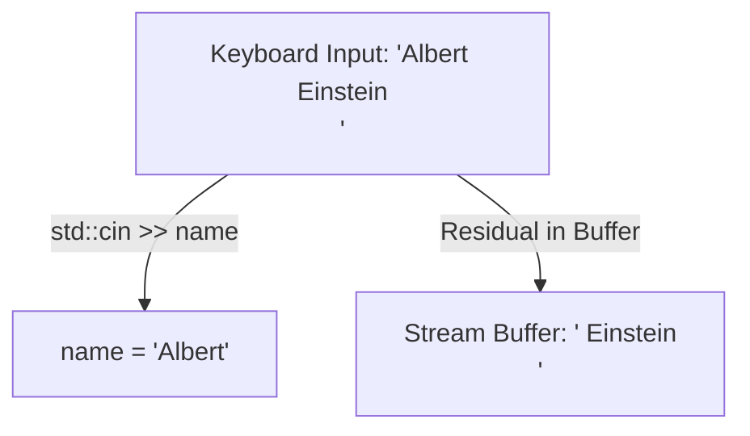

# Lesson 08 — Advanced User Input (`std::cin` vs. `std::getline`)

> [!NOTE]
> **Academic Foundation:** This lesson synthesizes core concepts from **Stanford CS106L Lecture 04** ([`WL4_Streams.pdf`](../../files/cs106l/lectures/WL4_Streams.pdf)) and **MIT 6.096 Lecture 01** ([`Lecture01_Introduction.pdf`](../../files/mit6096/lectures/Lecture01_Introduction.pdf)).

---

## 🧭 Quick Navigation

- 📄 **Base Academic Lectures:**
  - ⚙️ [Stanford CS106L — Lecture 04: Advanced Stream Reading & Line Buffers](../../files/cs106l/lectures/WL4_Streams.pdf)
  - 🏛️ [MIT 6.096 — Lecture 01: Line-Oriented Input Processing](../../files/mit6096/lectures/Lecture01_Introduction.pdf)
- 💻 **Code Lab:** [`L08_UserInput.cpp`](../code/L08_UserInput.cpp)

---

## Learning Objectives

- [ ] Understand why `std::cin >>` fails when reading multi-word strings containing spaces.
- [ ] Master line-oriented string extraction using `std::getline(std::cin, str)`.
- [ ] Resolve the classic **`std::cin` buffer newline trap** using `std::cin.ignore()`.

---

## 1. The Whitespace Limitation of `std::cin >>`

The stream extraction operator `std::cin >>` reads formatted tokens until it encounters the first **whitespace character** (space, tab, newline).



If the user enters `"Albert Einstein"`, `std::cin >> name` extracts `"Albert"` and leaves `" Einstein\n"` inside the RAM stream buffer, contaminating subsequent reads.

---

## 2. Line-Oriented Input: `std::getline()`

To capture full sentences containing spaces, C++ provides `std::getline(std::cin, stringVariable)`:

```cpp
#include <iostream>
#include <string>

int main() {
    std::string fullName;

    std::cout << "Enter your full name (with spaces): ";
    std::getline(std::cin, fullName); // Reads the ENTIRE line up to '\n'

    std::cout << "Welcome, " << fullName << "!\n";
    return 0;
}
```

---

## 3. The `std::cin >>` followed by `getline()` Trait & Fix

Mixing `std::cin >>` (for numbers) with `std::getline()` (for text) creates a notorious C++ beginner bug:

```cpp
int age;
std::string address;

std::cout << "Enter age: ";
std::cin >> age; // User types 25 and presses Enter ('25\n')

std::cout << "Enter address: ";
std::getline(std::cin, address); // SKIPPED! Reads residual '\n' left by std::cin
```

> [!CAUTION]
> **The Newline Buffer Trap:**
> `std::cin >> age` reads `25` but leaves the trailing newline `'\n'` in the buffer. When `std::getline()` immediately follows, it reads that leftover `'\n'`, sees an empty line, and returns immediately!

### The Fix: `std::cin.ignore()`
```cpp
std::cin >> age;
std::cin.ignore(10000, '\n'); // Discards leftover newline from buffer
std::getline(std::cin, address); // Now correctly waits for user input!
```

---

## ❓ Self-Assessment Checkpoint #1 — Stream Buffer Traps

What method resolves leftover newline characters in the stream buffer when switching from `std::cin >>` to `std::getline()`?

<details>
<summary>🔍 <strong>View Explanation & Answer</strong></summary>

> [!TIP]
> **Answer:** `std::cin.ignore(std::numeric_limits<std::streamsize>::max(), '\n');` (or `std::cin.ignore()`).
>
> **Explanation:**
> `std::cin.ignore()` clears non-extracted newline characters sitting in the input buffer, allowing the subsequent `std::getline()` to wait cleanly for new keyboard keystrokes.

</details>

---

## 📝 Summary & Key Takeaways

1. **Token Extraction:** `std::cin >>` stops reading at spaces.
2. **Line Extraction:** `std::getline(std::cin, str)` reads full lines including spaces.
3. **Buffer Management:** Always call `std::cin.ignore()` after `std::cin >>` before calling `std::getline()`.

---

<div align="center">

### 🧭 Navigation & Progression

| ⬅️ Previous Lesson | 🏠 Section Home | ➡️ Next Lesson |
|:------------------:|:--------------:|:--------------:|
| [**⬅️ L07 — Strings & Text**](L07_Strings.md) | [**🏠 Basic Syntax**](../README.md) | [**L09 — Binary & Bit Layouts ➡️**](L09_BinaryNumbers.md) |

</div>

---
*MiniLux0 — Learning C++ Section 02*
