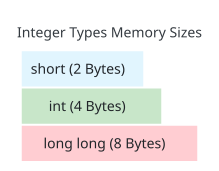

# Lesson 10 — Integer Types, Memory Sizes & Overflow

> [!NOTE]
> **Academic Foundation:** This lesson synthesizes core concepts from **MIT 6.096 Lecture 01** ([`Lecture01_Introduction.pdf`](../../files/mit6096/lectures/Lecture01_Introduction.pdf)) and **Stanford CS106B Textbook Appendix A** ([`CS106BX-Reader.pdf`](https://web.stanford.edu/class/cs106x/res/reader/CS106BX-Reader.pdf)).

---

## 🧭 Quick Navigation

- 📄 **Base Academic Lectures:**
  - 🏛️ [MIT 6.096 — Lecture 01: Integer Types & Fixed Width Allocation](../../files/mit6096/lectures/Lecture01_Introduction.pdf)
  - 🌲 [Stanford CS106B — Appendix A: Representation of Integers & Limits](https://web.stanford.edu/class/cs106x/res/reader/CS106BX-Reader.pdf)
- 💻 **Code Lab:** [`L10_IntegerTypes.cpp`](../code/L10_IntegerTypes.cpp)

---

## Learning Objectives

- [ ] Select appropriate integer types (`short`, `int`, `long long`) based on memory bounds.
- [ ] Understand signed vs. unsigned binary representation (Two's Complement).
- [ ] Inspect platform limits using `#include <climits>` (`INT_MAX`, `INT_MIN`, `LLONG_MAX`).
- [ ] Recognize and prevent **Integer Overflow** and Undefined Behavior.

---

## 1. Integer Data Types & Memory Bounds

| Data Type | Standard Memory | Minimum Value ( $2^{k-1}$ ) | Maximum Value ( $2^{k-1}-1$ ) | Typical Application |
| :--- | :---: | :---: | :---: | :--- |
| **`short`** | 2 Bytes (16 bits) | $-32,768$ | $+32,767$ | Memory-constrained embedded sensors. |
| **`int`** | 4 Bytes (32 bits) | $-2,147,483,648$ | $+2,147,483,647$ | Default choice for general loop counters and quantities. |
| **`long long`** | 8 Bytes (64 bits) | $\approx -9.22 \times 10^{18}$ | $\approx +9.22 \times 10^{18}$ | Financial balances, timestamps, planetary distances. |

> [!TIP]
> **Checking Machine Limits at Runtime:**
> You can query exact hardware size limits using `<climits>`:
> ```cpp
> #include <iostream>
> #include <climits>
> 
> cout << "Max int: " << INT_MAX << "\n"; // 2147483647
> ```

---

## 2. Signed vs. Unsigned Integers (Two's Complement)

By default, integers are **signed** (the most significant bit MSB acts as a negative sign flag in Two's Complement representation).

When a variable is declared `unsigned`, the sign bit is re-purposed as a magnitude bit, **doubling the positive maximum range**:



```cpp
unsigned int score = 4000000000U; // Valid! Fits within 4.2 billion unsigned limit
```

---

## 3. Integer Overflow (Two's Complement Wrap-Around)

What happens if you add `1` to `INT_MAX`?

```cpp
int maxVal = INT_MAX; // 2,147,483,647
maxVal = maxVal + 1;  // OVERFLOW! Wraps around to -2,147,483,648
```

> [!CAUTION]
> **Undefined Behavior (UB):**
> In C++, signed integer overflow is officially **Undefined Behavior (UB)** under the ISO C++ standard. Modern compilers with optimization enabled (`-O2` or `-O3`) may assume signed overflow never happens and optimize away loop termination checks entirely!

---

## ❓ Self-Assessment Checkpoint #1 — Overflow Behavior

If `short count = 32767;` and you execute `count++;`, what value will `count` contain on a standard 16-bit short system?

<details>
<summary>🔍 <strong>View Explanation & Answer</strong></summary>

> [!NOTE]
> **Result:** `-32768`.
>
> **Explanation:**
> `32767` in 16-bit binary is `0111 1111 1111 1111`. Adding `1` yields `1000 0000 0000 0000`, which represents `-32768` in Two's Complement signed representation.

</details>

---

## 📝 Summary & Key Takeaways

1. **Selection:** Use `int` for general calculations; use `long long` for values exceeding 2 billion.
2. **Unsigned:** Doubles positive range, but cannot store negative numbers.
3. **Overflow:** Exceeding type limits wraps around and causes undefined behavior in signed types.

---

<div align="center">

### 🧭 Navigation & Progression

| ⬅️ Previous Lesson | 🏠 Section Home | ➡️ Next Lesson |
|:------------------:|:--------------:|:--------------:|
| [**⬅️ L09 — Binary & Bit Layouts**](L09_BinaryNumbers.md) | [**🏠 Basic Syntax**](../README.md) | [**L11 — Floating-Point Types ➡️**](L11_FloatingPointTypes.md) |

</div>


---

<div align="center">
  <sub>Maintained by <strong>MiniLux0</strong> · 2026</sub>
</div>