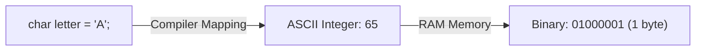

# Lesson 12 — Characters (`char`), ASCII Encoding & Booleans (`bool`)

> [!NOTE]
> **Academic Foundation:** This lesson synthesizes core concepts from **MIT 6.096 Lecture 01** ([`Lecture01_Introduction.pdf`](../../files/mit6096/lectures/Lecture01_Introduction.pdf)) and **Stanford CS106B Textbook Chapter 3** ([`CS106BX-Reader.pdf`](../../files/cs106b/textbook/CS106BX-Reader.pdf)).

---

## 🧭 Quick Navigation

- 📄 **Base Academic Lectures:**
  - 🏛️ [MIT 6.096 — Lecture 01: Character Encodings & Boolean Logic](../../files/mit6096/lectures/Lecture01_Introduction.pdf)
  - 🌲 [Stanford CS106B — Chapter 3: ASCII Codes & Character Functions](../../files/cs106b/textbook/CS106BX-Reader.pdf)
- 💻 **Code Lab:** [`L12_CharAndBool.cpp`](../code/L12_CharAndBool.cpp)

---

## Learning Objectives

- [ ] Understand `char` as an 8-bit integer type storing ASCII numerical encodings ($0 \dots 127$).
- [ ] Perform character arithmetic (e.g., `'a' - 'A'` case shifting).
- [ ] Understand `bool` logical states (`true` / `false`) stored as 1 byte in RAM.
- [ ] Format boolean stream output using `boolalpha`.

---

## 1. Characters (`char`) & ASCII Numerical Encoding

In C++, a `char` stores a single character enclosed in **single quotes** (`'A'`). Under the hood, a `char` is simply a 1-byte (8-bit) integer storing an **ASCII code**:



- `'A'` $\rightarrow$ ASCII `65`
- `'a'` $\rightarrow$ ASCII `97`
- `'0'` $\rightarrow$ ASCII `48`

```cpp
#include <iostream>

int main() {
    char ch = 'A';
    cout << "Character Value : " << ch << "\n";
    cout << "ASCII Numerical : " << static_cast<int>(ch) << "\n"; // Outputs 65

    // ASCII Arithmetic
    char nextChar = ch + 1; // 65 + 1 = 66 -> 'B'
    cout << "Next Character  : " << nextChar << "\n";
    return 0;
}
```

> [!TIP]
> **Case Conversion Math:**
> Because ASCII uppercase `'A'` ($65$) and lowercase `'a'` ($97$) are separated by a constant offset of $32$:
> ```cpp
> char upper = 'G';
> char lower = upper + ('a' - 'A'); // Converts 'G' -> 'g'
> ```

---

## 2. Booleans (`bool`) & Stream Formatting

A `bool` represents a binary truth state (`true` or `false`). In memory, `bool` reserves **1 byte** (8 bits).

By default, `cout` prints `bool` values as numeric integers (`1` for `true`, `0` for `false`). To output literal text `"true"` or `"false"`, use `boolalpha`:

```cpp
#include <iostream>

int main() {
    bool isPassed = true;
    bool isFailed = false;

    cout << "Numeric Default : " << isPassed << ", " << isFailed << "\n"; // Outputs: 1, 0
    cout << "With boolalpha   : " << boolalpha << isPassed << ", " << isFailed << "\n"; // Outputs: true, false
    return 0;
}
```

---

## ❓ Self-Assessment Checkpoint #1 — Character Digit Conversion

How do you convert a numeric character `'7'` into its integer value `7` in C++?

<details>
<summary>🔍 <strong>View Explanation & Answer</strong></summary>

> [!NOTE]
> **Code:** `int num = '7' - '0';`
>
> **Explanation:**
> In the ASCII table, digits `'0'` through `'9'` are stored contiguously ($48 \dots 57$). Subtracting `'0'` ($48$) from any digit character yields its exact numeric integer value ($55 - 48 = 7$).

</details>

---

## 📝 Summary & Key Takeaways

1. **`char`:** 1-byte integer type storing ASCII numerical encodings.
2. **ASCII Math:** Perform arithmetic directly on characters (`'A' + 1 == 'B'`).
3. **`bool`:** Stores `true`/`false`; use `boolalpha` to display boolean text.

---

<div align="center">

### 🧭 Navigation & Progression

| ⬅️ Previous Lesson | 🏠 Section Home | ➡️ Next Lesson |
|:------------------:|:--------------:|:--------------:|
| [**⬅️ L11 — Floating-Point Types**](L11_FloatingPointTypes.md) | [**🏠 Basic Syntax**](../README.md) | [**L13 — Control Flow: if Statements ➡️**](L13_If.md) |

</div>

---
*MiniLux0 — Learning C++ Section 02*
