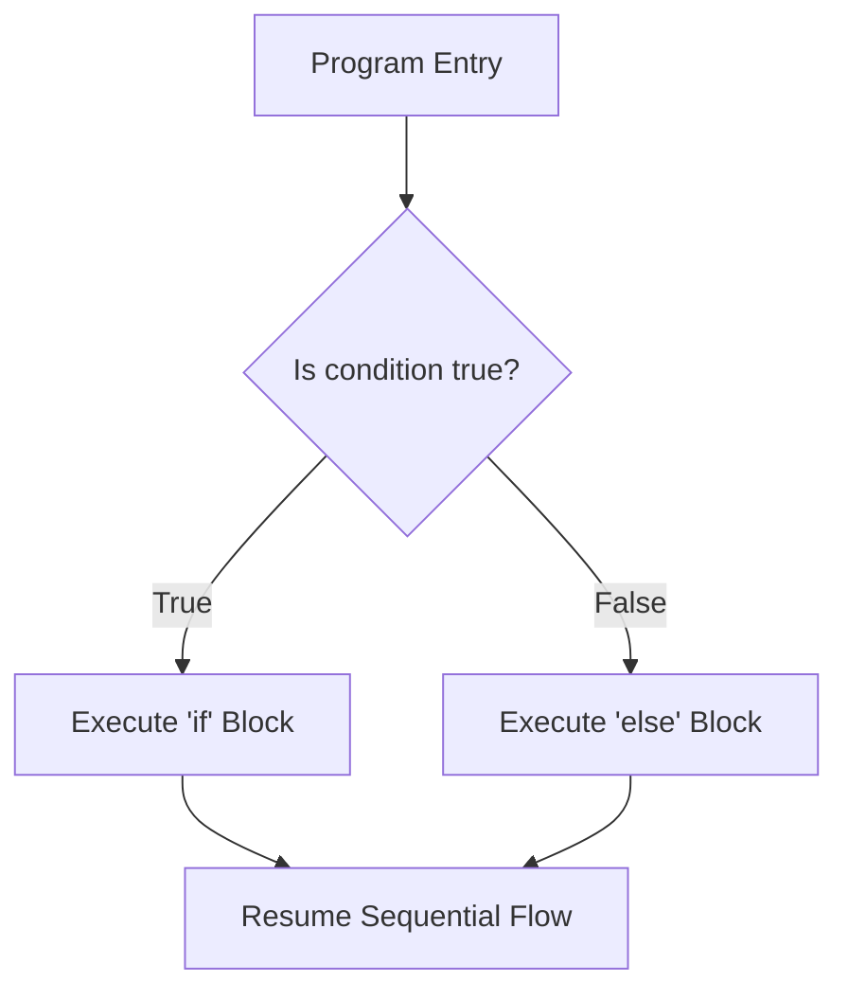

# Lesson 14 — Dual-Branch Decision Making (`if-else`)

> [!NOTE]
> **Academic Foundation:** This lesson synthesizes core concepts from **MIT 6.096 Lecture 02** ([`Lecture02_FlowOfControl.pdf`](../../files/mit6096/lectures/Lecture02_FlowOfControl.pdf)) and **Stanford CS106B Textbook Chapter 1** ([`CS106BX-Reader.pdf`](../../files/cs106b/textbook/CS106BX-Reader.pdf)).

---

## 🧭 Quick Navigation

- 📄 **Base Academic Lectures:**
  - 🏛️ [MIT 6.096 — Lecture 02: Dual-Branch Control Flow](../../files/mit6096/lectures/Lecture02_FlowOfControl.pdf)
  - 🌲 [Stanford CS106B — Chapter 1: The if-else Structure](../../files/cs106b/textbook/CS106BX-Reader.pdf)
- 💻 **Code Lab:** [`L14_IfElse.cpp`](../code/L14_IfElse.cpp)

---

## Learning Objectives

- [ ] Implement dual-branch conditional logic using `if` and `else`.
- [ ] Guarantee mutually exclusive execution paths.
- [ ] Understand scope lifetime of variables declared inside `if` or `else` blocks.

---

## 1. Dual-Branch Control Mechanics (`if-else`)

When a program needs to guarantee that **exactly one of two alternative paths** executes, use `if-else`:



```cpp
#include <iostream>

int main() {
    int balance = 45;
    int itemCost = 50;

    if (balance >= itemCost) {
        std::cout << "Transaction Approved! Item purchased.\n";
    } else {
        std::cout << "Transaction Declined! Insufficient funds.\n";
    }

    return 0;
}
```

> [!IMPORTANT]
> **Mutual Exclusivity:**
> The `if` block and `else` block are **mutually exclusive**. It is physically impossible for both blocks to execute during a single run of the program.

---

## ❓ Self-Assessment Checkpoint #1 — Block Scope

Can a variable declared inside an `if` block be accessed inside the `else` block?

<details>
<summary>🔍 <strong>View Explanation & Answer</strong></summary>

> [!CAUTION]
> **Answer:** No.
>
> **Explanation:**
> Variables declared inside `{}` have **block scope**. When execution exits the `if` block, all local variables declared inside it are popped off the call stack and destroyed. Accessing them inside `else` results in a compile-time undeclared identifier error.

</details>

---

## 📝 Summary & Key Takeaways

1. **`if-else`:** Guarantees execution of exactly one of two mutually exclusive code paths.
2. **Block Scope:** Variables declared inside `{}` live only within that specific block.

---

<div align="center">

### 🧭 Navigation & Progression

| ⬅️ Previous Lesson | 🏠 Section Home | ➡️ Next Lesson |
|:------------------:|:--------------:|:--------------:|
| [**⬅️ L13 — Control Flow: if**](L13_If.md) | [**🏠 Basic Syntax**](../README.md) | [**L15 — Multi-Branch if-else-if ➡️**](L15_IfElseIfElse.md) |

</div>

---
*MiniLux0 — Learning C++ Section 02*
