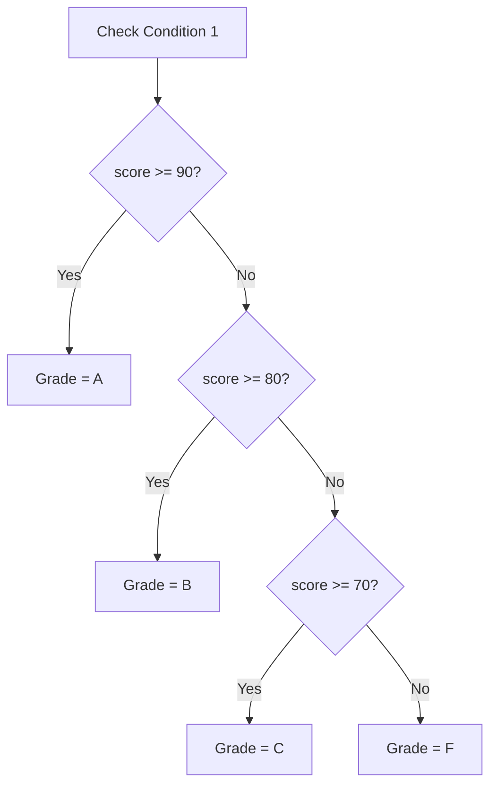

# Lesson 15 — Multi-Branch Decisions (`if - else if - else`)

> [!NOTE]
> **Academic Foundation:** This lesson synthesizes core concepts from **MIT 6.096 Lecture 02** ([`Lecture02_FlowOfControl.pdf`](../../files/mit6096/lectures/Lecture02_FlowOfControl.pdf)) and **Stanford CS106B Textbook Chapter 1** ([`CS106BX-Reader.pdf`](../../files/cs106b/textbook/CS106BX-Reader.pdf)).

---

## 🧭 Quick Navigation

- 📄 **Base Academic Lectures:**
  - 🏛️ [MIT 6.096 — Lecture 02: Multi-Way Conditional Chains](../../files/mit6096/lectures/Lecture02_FlowOfControl.pdf)
  - 🌲 [Stanford CS106B — Chapter 1: Cascading Conditions](../../files/cs106b/textbook/CS106BX-Reader.pdf)
- 💻 **Code Lab:** [`L15_IfElseIfElse.cpp`](../code/L15_IfElseIfElse.cpp)

---

## Learning Objectives

- [ ] Construct multi-way decision chains using `if`, `else if`, and `else`.
- [ ] Understand short-circuit branch evaluation order (top-to-bottom).
- [ ] Implement fallback handling using trailing `else` catch-alls.

---

## 1. Multi-Branch Evaluation Chains

When a scenario requires evaluating multiple distinct conditions sequentially, C++ chains `else if` statements:



```cpp
#include <iostream>

int main() {
    int score = 85;

    if (score >= 90) {
        cout << "Grade: A\n";
    } else if (score >= 80) {
        cout << "Grade: B\n";
    } else if (score >= 70) {
        cout << "Grade: C\n";
    } else {
        cout << "Grade: F\n";
    }

    return 0;
}
```

> [!IMPORTANT]
> **First-Match Short-Circuiting:**
> C++ evaluates conditions strictly from **top to bottom**. As soon as ONE condition evaluates to `true`, its corresponding block executes, and the compiler **skips all remaining `else if` and `else` branches immediately**.

---

## ❓ Self-Assessment Checkpoint #1 — Order of Conditions

What prints if `score = 95` and the conditions are ordered as follows?
```cpp
if (score >= 70) { cout << "C"; }
else if (score >= 90) { cout << "A"; }
```

<details>
<summary>🔍 <strong>View Explanation & Answer</strong></summary>

> [!WARNING]
> **Output:** `"C"`.
>
> **Explanation:**
> Because `score >= 70` is true for `95`, the first branch fires immediately. The second branch (`score >= 90`) is short-circuited and never evaluated. Multi-way branch conditions must be ordered from most specific to least specific!

</details>

---

## 📝 Summary & Key Takeaways

1. **`else if`:** Allows testing multiple sequential conditions.
2. **Short-Circuiting:** Stops evaluating as soon as the first matching condition succeeds.
3. **Ordering:** Always arrange range conditions from most strict to least strict.

---

<div align="center">

### 🧭 Navigation & Progression

| ⬅️ Previous Lesson | 🏠 Section Home | ➡️ Next Lesson |
|:------------------:|:--------------:|:--------------:|
| [**⬅️ L14 — Dual-Branch if-else**](L14_IfElse.md) | [**🏠 Basic Syntax**](../README.md) | [**L16 — Safe Float Comparisons ➡️**](L16_ComparingFloats.md) |

</div>


---

<div align="center">
  <sub>Maintained by <strong>MiniLux0</strong> · 2026</sub>
</div>