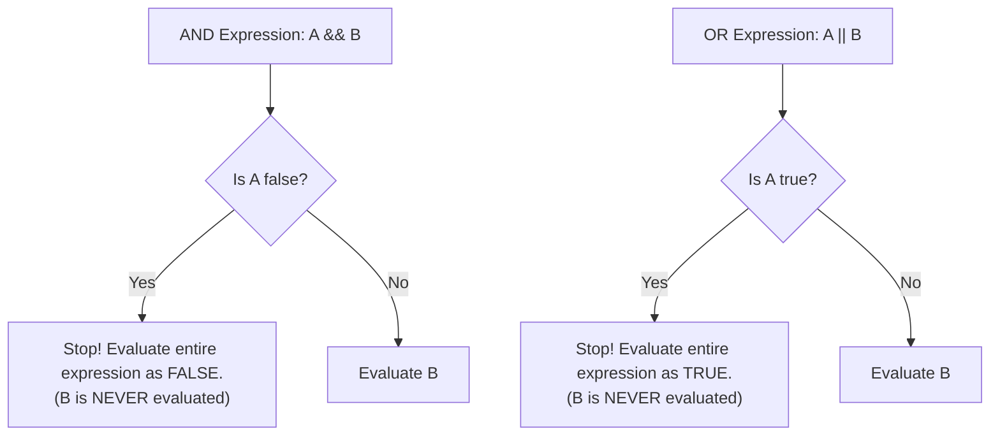

# Lesson 17 — Complex Conditions, Logical Operators & Short-Circuit Evaluation

> [!NOTE]
> **Academic Foundation:** This lesson synthesizes core concepts from **MIT 6.096 Lecture 02** ([`Lecture02_FlowOfControl.pdf`](../../files/mit6096/lectures/Lecture02_FlowOfControl.pdf)) and **Stanford CS106B Textbook Chapter 1** ([`CS106BX-Reader.pdf`](../../files/cs106b/textbook/CS106BX-Reader.pdf)).

---

## 🧭 Quick Navigation

- 📄 **Base Academic Lectures:**
  - 🏛️ [MIT 6.096 — Lecture 02: Logical Operators & Short-Circuiting](../../files/mit6096/lectures/Lecture02_FlowOfControl.pdf)
  - 🌲 [Stanford CS106B — Chapter 1: Boolean Logic & Guarding Expressions](../../files/cs106b/textbook/CS106BX-Reader.pdf)
- 💻 **Code Lab:** [`L17_Conditions.cpp`](../code/L17_Conditions.cpp)

---

## Learning Objectives

- [ ] Master logical AND (`&&`), OR (`||`), and NOT (`!`) operators.
- [ ] Understand C++ **Short-Circuit Evaluation** rules.
- [ ] Construct safe **Guard Clauses** to prevent Division by Zero and Null Pointer Dereferences.

---

## 1. Logical Operators (`&&`, `||`, `!`)

Complex conditions combine simple boolean expressions using logical operators:

| Operator | Logical Operation | Truth Condition |
| :---: | :--- | :--- |
| **`&&`** | Logical AND | Returns `true` only if **BOTH** operands are `true`. |
| **`\|\|`** | Logical OR | Returns `true` if **AT LEAST ONE** operand is `true`. |
| **`!`** | Logical NOT | Inverts a boolean value (`!true == false`). |

---

## 2. Short-Circuit Evaluation Rules

In C++, boolean expressions evaluate strictly from **left to right**. Evaluation stops immediately as soon as the overall result is guaranteed:



---

## 3. Crash Guarding with Short-Circuiting

Short-circuit evaluation is essential for writing safe C++ code that guards against runtime crashes:

```cpp
#include <iostream>

int main() {
    int divisor = 0;
    int number = 100;

    // Guard Clause: 'divisor != 0' evaluates to false.
    // 'number / divisor' is SHORT-CIRCUITED and NEVER executed!
    if (divisor != 0 && (number / divisor > 5)) {
        std::cout << "Valid division!\n";
    } else {
        std::cout << "Division by zero prevented safely!\n";
    }

    return 0;
}
```

---

## ❓ Self-Assessment Checkpoint #1 — Order of Guard Clauses

What happens if you swap the operands to `if ((100 / divisor > 5) && divisor != 0)` when `divisor = 0`?

<details>
<summary>🔍 <strong>View Explanation & Output</strong></summary>

> [!CAUTION]
> **Result:** **Floating Point Exception / Program Crash**.
>
> **Explanation:**
> Because evaluation proceeds left-to-right, `(100 / divisor > 5)` is evaluated first. Dividing 100 by zero immediately causes an unhandled CPU divide-by-zero hardware exception, crashing the process before `divisor != 0` is reached!

</details>

---

## 📝 Summary & Key Takeaways

1. **Short-Circuiting:** Operands on the right are skipped if the left operand determines the outcome.
2. **Guards:** Put safety checks (`ptr != nullptr` or `divisor != 0`) on the LEFT side of `&&`.

---

<div align="center">

### 🧭 Navigation & Progression

| ⬅️ Previous Lesson | 🏠 Section Home | ➡️ Next Lesson |
|:------------------:|:--------------:|:--------------:|
| [**⬅️ L16 — Safe Float Comparisons**](L16_ComparingFloats.md) | [**🏠 Basic Syntax**](../README.md) | [**L18 — Iteration: while Loops ➡️**](L18_WhileLoops.md) |

</div>

---
*MiniLux0 — Learning C++ Section 02*
