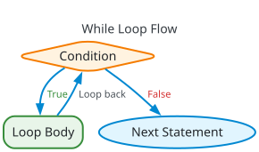

# Lesson 18 — Iteration: Pre-Test `while` Loops

> [!NOTE]
> **Academic Foundation:** This lesson synthesizes core concepts from **MIT 6.096 Lecture 02** ([`Lecture02_FlowOfControl.pdf`](../../files/mit6096/lectures/Lecture02_FlowOfControl.pdf)) and **Stanford CS106B Textbook Chapter 1** ([`CS106BX-Reader.pdf`](https://web.stanford.edu/class/cs106x/res/reader/CS106BX-Reader.pdf)).

---

## 🧭 Quick Navigation

- 📄 **Base Academic Lectures:**
  - 🏛️ [MIT 6.096 — Lecture 02: Iterative Statements & while Loops](../../files/mit6096/lectures/Lecture02_FlowOfControl.pdf)
  - 🌲 [Stanford CS106B — Chapter 1: Repetition Statements](https://web.stanford.edu/class/cs106x/res/reader/CS106BX-Reader.pdf)
- 💻 **Code Lab:** [`l18_while_loops.cpp`](../code/l18_while_loops.cpp)

---

## Learning Objectives

- [ ] Execute repetitive tasks using pre-test `while` loops.
- [ ] Maintain loop control variables and update conditions to prevent infinite loops.
- [ ] Understand pre-test evaluation behavior ($0 \dots N$ iteration guarantee).

---

## 1. Pre-Test `while` Loop Mechanics

A `while` loop repeatedly executes a block of code **as long as its boolean condition remains `true`**:



```cpp
#include <iostream>

int main() {
    int counter = 1; // 1. Initialization

    while (counter <= 5) { // 2. Condition Check
        cout << "Count: " << counter << "\n";
        counter++; // 3. State Update (Crucial!)
    }

    return 0;
}
```

> [!WARNING]
> **The Infinite Loop Hazard:**
> If you forget to update the loop control variable (`counter++`), the condition `counter <= 5` remains `true` forever. The CPU will execute the loop infinitely until the process is forcefully killed.

---

## ❓ Self-Assessment Checkpoint #1 — Pre-Test Behavior

How many times does the body of `while (x < 0)` execute if `x = 10` initially?

<details>
<summary>🔍 <strong>View Explanation & Answer</strong></summary>

> [!NOTE]
> **Answer:** 0 times.
>
> **Explanation:**
> Because `while` is a **pre-test loop**, the condition `10 < 0` is checked *before* entering the body. Since it evaluates to `false` immediately, the loop body is skipped entirely.

</details>

---

## 📝 Summary & Key Takeaways

1. **Pre-Test:** Condition is tested *before* executing the body (may execute $0$ times).
2. **Loop Control:** Always initialize, check, and update loop state variables.

---

<div align="center">

### 🧭 Navigation & Progression

| ⬅️ Previous Lesson | 🏠 Section Home | ➡️ Next Lesson |
|:------------------:|:--------------:|:--------------:|
| [**⬅️ L17 — Complex Conditions**](l17_conditions.md) | [**🏠 Basic Syntax**](../README.md) | [**L19 — Post-Test do-while Loops ➡️**](l19_do_while_loops.md) |

</div>


---

<div align="center">
  <sub>Maintained by <strong>MiniLux0</strong> · 2026</sub>
</div>