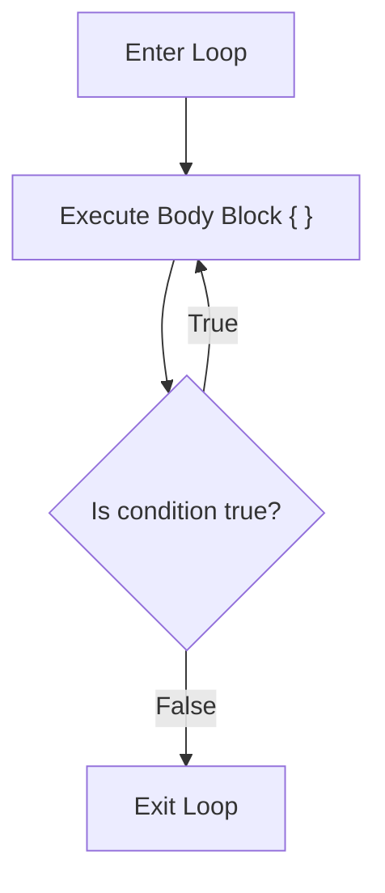

# Lesson 19 — Iteration: Post-Test `do-while` Loops

> [!NOTE]
> **Academic Foundation:** This lesson synthesizes core concepts from **MIT 6.096 Lecture 02** ([`Lecture02_FlowOfControl.pdf`](../../files/mit6096/lectures/Lecture02_FlowOfControl.pdf)) and **Stanford CS106B Textbook Chapter 1** ([`CS106BX-Reader.pdf`](../../files/cs106b/textbook/CS106BX-Reader.pdf)).

---

## 🧭 Quick Navigation

- 📄 **Base Academic Lectures:**
  - 🏛️ [MIT 6.096 — Lecture 02: Post-Test Iteration Loops](../../files/mit6096/lectures/Lecture02_FlowOfControl.pdf)
  - 🌲 [Stanford CS106B — Chapter 1: Interactive Menu Loops](../../files/cs106b/textbook/CS106BX-Reader.pdf)
- 💻 **Code Lab:** [`L19_DoWhileLoops.cpp`](../code/L19_DoWhileLoops.cpp)

---

## Learning Objectives

- [ ] Execute post-test iterative loops using `do-while`.
- [ ] Guarantee at least **one mandatory execution** of the loop body ($`1 \dots N`$ times).
- [ ] Implement interactive CLI menus and user input validation loops.

---

## 1. Post-Test `do-while` Loop Mechanics

Unlike pre-test `while` loops, a `do-while` loop executes its body block **first** and checks the continuation condition **at the bottom**:



```cpp
#include <iostream>

int main() {
    int choice;

    do {
        cout << "\n=== MAIN MENU ===\n";
        cout << "1. Play Game\n";
        cout << "2. Settings\n";
        cout << "3. Exit\n";
        cout << "Select option (1-3): ";
        cin >> choice;
    } while (choice != 3);

    cout << "Goodbye!\n";
    return 0;
}
```

> [!IMPORTANT]
> **Mandatory Semicolon Syntax:**
> Notice that `do-while` requires a closing semicolon `;` immediately after the trailing condition: `} while (condition);`. Omitting this semicolon results in a compile error.

---

## ❓ Self-Assessment Checkpoint #1 — Guaranteed Execution

How many times does a `do-while` loop execute if the continuation condition is `false` from the start?

<details>
<summary>🔍 <strong>View Explanation & Answer</strong></summary>

> [!NOTE]
> **Answer:** Exactly 1 time.
>
> **Explanation:**
> Because the condition check is at the bottom, execution flows unconditionally through the body block on the first pass before evaluating the test expression for the first time.

</details>

---

## 📝 Summary & Key Takeaways

1. **Post-Test:** Evaluates condition after running the body (guarantees at least 1 run).
2. **Use Case:** Ideal for interactive menus and re-prompting for valid user input.
3. **Syntax:** Must end with a semicolon `;` after `while (condition);`.

---

<div align="center">

### 🧭 Navigation & Progression

| ⬅️ Previous Lesson | 🏠 Section Home | ➡️ Next Lesson |
|:------------------:|:--------------:|:--------------:|
| [**⬅️ L18 — Pre-Test while Loops**](L18_WhileLoops.md) | [**🏠 Basic Syntax**](../README.md) | [**L20 — Count-Controlled for Loops ➡️**](L20_ForLoops.md) |

</div>


---

<div align="center">
  <sub>Maintained by <strong>MiniLux0</strong> · 2026</sub>
</div>