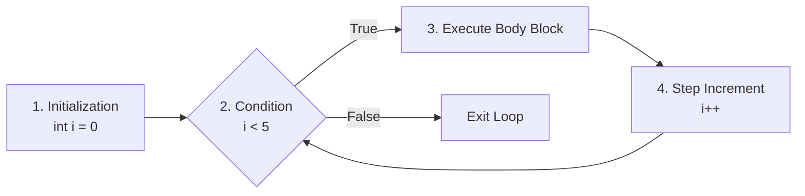

# Lesson 20 — Count-Controlled Iteration (`for` Loops)

> [!NOTE]
> **Academic Foundation:** This lesson synthesizes core concepts from **MIT 6.096 Lecture 02** ([`Lecture02_FlowOfControl.pdf`](../../files/mit6096/lectures/Lecture02_FlowOfControl.pdf)) and **Stanford CS106B Textbook Chapter 1** ([`CS106BX-Reader.pdf`](../../files/cs106b/textbook/CS106BX-Reader.pdf)).

---

## 🧭 Quick Navigation

- 📄 **Base Academic Lectures:**
  - �� [MIT 6.096 — Lecture 02: Count-Controlled Loop Structures](../../files/mit6096/lectures/Lecture02_FlowOfControl.pdf)
  - 🌲 [Stanford CS106B — Chapter 1: The for Loop Header](../../files/cs106b/textbook/CS106BX-Reader.pdf)
- 💻 **Code Lab:** [`L20_ForLoops.cpp`](../code/L20_ForLoops.cpp)

---

## Learning Objectives

- [ ] Consolidate initialization, condition check, and step increment in a single `for` loop header.
- [ ] Understand loop counter scope isolation inside `for(int i = 0; ...)`.
- [ ] Implement incremental, decremental, and custom step iteration patterns.

---

## 1. The Anatomy of a `for` Loop

When the exact number of iterations is known beforehand, the `for` loop combines all three loop control elements into a single header statement:



```cpp
#include <iostream>

int main() {
    // for (Init; Condition; Step)
    for (int i = 0; i < 5; i++) {
        cout << "Iteration i = " << i << "\n";
    }
    return 0;
}
```

> [!TIP]
> **Loop Variable Scope:**
> Declaring `int i` inside the `for` header isolates `i` to that loop's scope. Once the loop finishes, `i` is destroyed, allowing you to reuse `i` safely in subsequent loops without variable name conflicts.

---

## � Self-Assessment Checkpoint #1 — Decremental Counting

How do you write a `for` loop header that counts down from `10` to `1` inclusive?

<details>
<summary>� <strong>View Explanation & Header</strong></summary>

> [!NOTE]
> **Header:** `for (int i = 10; i >= 1; i--)`
>
> **Explanation:**
> `int i = 10` initializes the counter at 10. `i >= 1` keeps the loop active through 1. `i--` decrements the counter by 1 after each iteration pass.

</details>

---

## � Summary & Key Takeaways

1. **Header:** Combines `(Init; Condition; Step)` into a compact, readable line.
2. **Scope:** Counter variables declared inside the header exist only during loop execution.

---

<div align="center">

### 🧭 Navigation & Progression

| ⬅� Previous Lesson | � Section Home | �� Next Lesson |
|:------------------:|:--------------:|:--------------:|
| [**⬅� L19 — Post-Test do-while Loops**](L19_DoWhileLoops.md) | [**� Basic Syntax**](../README.md) | [**L21 — Loop Interruptions: break & continue ��**](L21_BreakAndContinue.md) |

</div>

---
*MiniLux0 — Learning C++ Section 02*

---

<div align="center">
  <sub>Maintained by <strong>MiniLux0</strong> · 2026</sub>
</div>