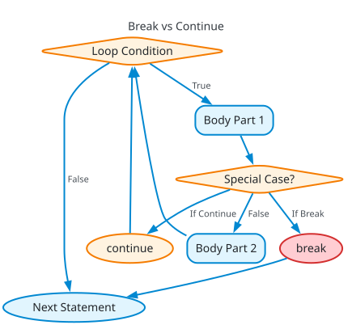

# Lesson 21 — Loop Interruption (`break` & `continue`)

> [!NOTE]
> **Academic Foundation:** This lesson synthesizes core concepts from **MIT 6.096 Lecture 02** ([`Lecture02_FlowOfControl.pdf`](../../files/mit6096/lectures/Lecture02_FlowOfControl.pdf)) and **Stanford CS106B Textbook Chapter 1** ([`CS106BX-Reader.pdf`](https://web.stanford.edu/class/cs106x/res/reader/CS106BX-Reader.pdf)).

---

## 🧭 Quick Navigation

- 📄 **Base Academic Lectures:**
  - 🏛️ [MIT 6.096 — Lecture 02: Early Loop Termination & Jump Statements](../../files/mit6096/lectures/Lecture02_FlowOfControl.pdf)
  - 🌲 [Stanford CS106B — Chapter 1: Managing Loop Iterations](https://web.stanford.edu/class/cs106x/res/reader/CS106BX-Reader.pdf)
- 💻 **Code Lab:** [`L21_BreakAndContinue.cpp`](../code/L21_BreakAndContinue.cpp)

---

## Learning Objectives

- [ ] Early terminate active loops using `break`.
- [ ] Skip the remainder of the current iteration using `continue`.
- [ ] Differentiate between `break` (exit loop) vs. `continue` (skip to next pass).

---

## 1. `break` vs. `continue` Mechanics



```cpp
#include <iostream>

int main() {
    cout << "--- Demo: continue (Skipping 3) ---\n";
    for (int i = 1; i <= 5; i++) {
        if (i == 3) continue; // Skips printing 3
        cout << i << " ";
    }

    cout << "\n\n--- Demo: break (Aborting at 3) ---\n";
    for (int i = 1; i <= 5; i++) {
        if (i == 3) break; // Terminates loop completely
        cout << i << " ";
    }
    cout << "\n";
    return 0;
}
```

> [!IMPORTANT]
> **Nested Loop Behavior:**
> When used inside nested loops, `break` or `continue` applies **ONLY to the innermost enclosing loop** where the statement appears. It does NOT break out of parent outer loops.

---

## ❓ Self-Assessment Checkpoint #1 — Output Prediction

What is printed by:
```cpp
for (int i = 1; i <= 4; i++) {
    if (i % 2 == 0) continue;
    cout << i << " ";
}
```

<details>
<summary>🔍 <strong>View Explanation & Output</strong></summary>

> [!NOTE]
> **Output:** `1 3 `.
>
> **Explanation:**
> When `i = 2` and `i = 4`, `i % 2 == 0` is `true`. `continue` fires, skipping `cout` and advancing directly to the step increment `i++`. Only odd values `1` and `3` are printed.

</details>

---

## 📝 Summary & Key Takeaways

1. **`break`:** Terminates the loop immediately and jumps to code following the loop.
2. **`continue`:** Skips the rest of the current iteration and jumps directly to the step increment.
3. **Scope:** Affects only the innermost enclosing loop block.

---

<div align="center">

### 🧭 Navigation & Progression

| ⬅️ Previous Lesson | 🏠 Section Home | ➡️ Next Lesson |
|:------------------:|:--------------:|:--------------:|
| [**⬅️ L20 — Count-Controlled for Loops**](L20_ForLoops.md) | [**🏠 Basic Syntax**](../README.md) | [**L22 — Multiway Branching: switch ➡️**](L22_Switch.md) |

</div>


---

<div align="center">
  <sub>Maintained by <strong>MiniLux0</strong> · 2026</sub>
</div>