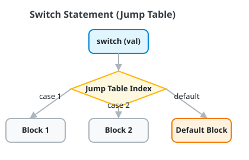

# Lesson 22 — Multiway Selection (`switch` Statements & Jump Tables)

> [!NOTE]
> **Academic Foundation:** This lesson synthesizes core concepts from **MIT 6.096 Lecture 02** ([`Lecture02_FlowOfControl.pdf`](../../files/mit6096/lectures/Lecture02_FlowOfControl.pdf)) and **Stanford CS106B Textbook Chapter 1** ([`CS106BX-Reader.pdf`](https://web.stanford.edu/class/cs106x/res/reader/CS106BX-Reader.pdf)).

---

## 🧭 Quick Navigation

- 📄 **Base Academic Lectures:**
  - 🏛️ [MIT 6.096 — Lecture 02: Switch Statements & Jump Table Optimization](../../files/mit6096/lectures/Lecture02_FlowOfControl.pdf)
  - 🌲 [Stanford CS106B — Chapter 1: Integral Choice Branching](https://web.stanford.edu/class/cs106x/res/reader/CS106BX-Reader.pdf)
- 💻 **Code Lab:** [`L22_Switch.cpp`](../code/L22_Switch.cpp)

---

## Learning Objectives

- [ ] Implement multiway integral value matching using `switch`.
- [ ] Prevent unintentional **Fallthrough** bugs using `break`.
- [ ] Handle unhandled cases using the `default:` label.
- [ ] Understand why `switch` evaluates faster than `if-else` chains ($O(1)$ Jump Table compilation).

---

## 1. `switch` Mechanics & Jump Tables

When testing an **integral expression** (`int`, `char`, `enum`) against multiple constant values, `switch` provides cleaner syntax and superior compiler optimization ($O(1)$ Jump Table dispatch):



```cpp
#include <iostream>

int main() {
    int day = 3;

    switch (day) {
        case 1: cout << "Monday\n"; break;
        case 2: cout << "Tuesday\n"; break;
        case 3: cout << "Wednesday\n"; break;
        case 4: cout << "Thursday\n"; break;
        case 5: cout << "Friday\n"; break;
        default: cout << "Weekend\n"; break;
    }

    return 0;
}
```

> [!CAUTION]
> **The Fallthrough Hazard:**
> Omitting `break;` at the end of a `case:` causes execution to "fall through" into subsequent cases regardless of whether their values match!

---

## ❓ Self-Assessment Checkpoint #1 — Allowed Types

Which of the following types CANNOT be used in a C++ `switch` statement?
`int`, `char`, `string`, `double`

<details>
<summary>🔍 <strong>View Explanation & Answer</strong></summary>

> [!WARNING]
> **Answer:** `string` and `double` are forbidden.
>
> **Explanation:**
> C++ `switch` statements require **integral or enumeration types** (`int`, `char`, `short`, `long`, `enum`) whose value can be evaluated at compile time to build an assembly jump table. Floating-point numbers (`double`) and dynamic objects (`string`) cannot be used inside `switch (x)`.

</details>

---

## 📝 Summary & Key Takeaways

1. **Integral Matching:** Works exclusively on integral types (`int`, `char`, `enum`).
2. **`break;`:** Mandatory at the end of each `case:` to prevent unwanted fallthrough.
3. **`default:`:** Acts as a catch-all for any unhandled case values.

---

<div align="center">

### 🧭 Navigation & Progression

| ⬅️ Previous Lesson | 🏠 Section Home | ➡️ Next Lesson |
|:------------------:|:--------------:|:--------------:|
| [**⬅️ L21 — Loop Interruptions**](L21_BreakAndContinue.md) | [**🏠 Basic Syntax**](../README.md) | [**Section 03: Subroutines ➡️**](../../03_Subroutines/README.md) |

</div>


---

<div align="center">
  <sub>Maintained by <strong>MiniLux0</strong> · 2026</sub>
</div>