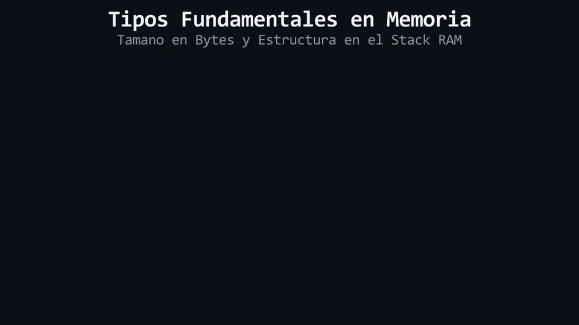

# L01 · Tipos primitivos y por qué importan

> **Módulo 02 — Fundamental Types**

---

## ¿Por qué la computadora necesita saber el "tipo" de un dato?

Imagina que miras directamente a la memoria RAM de tu computadora y ves esta secuencia: `01000001`. ¿Qué significa? ¿Es el número 65? ¿Es la letra 'A'? ¿Es un píxel de color rojo muy oscuro en una imagen?

La respuesta es que **la computadora no lo sabe**. Para la máquina, todo es una sopa interminable de ceros y unos. No hay etiquetas. 

Para que esos ceros y unos tengan sentido, la computadora necesita que le digas dos cosas fundamentales:
1. **Cuánto espacio** (cuántos ceros y unos) debe leer.
2. **Cómo debe interpretar** esa secuencia.

Ese es el trabajo de un **tipo de dato**. Cuando declaras una variable en C++, el tipo que eliges no es una formalidad del lenguaje; es una orden directa al hardware que define exactamente cuánto espacio físico reservar y bajo qué reglas leer lo que hay allí.

---

## Los 4 pilares: int, double, char y bool

C++ tiene muchos tipos, pero todo comienza con cuatro bloques de construcción fundamentales (llamados tipos "primitivos"). En C++ moderno, siempre los inicializamos usando llaves `{}`:

### 1. `int` (Enteros)
Se usa para números enteros (sin decimales), tanto positivos como negativos.
```cpp
int edad{25};
int temperatura{-5};
```

### 2. `double` (Punto flotante)
Se usa para números con decimales. Su nombre viene de "doble precisión" (ocupa el doble de memoria que un decimal normal, lo que le permite ser mucho más exacto).
```cpp
double precio{19.99};
double pi{3.14159265};
```

### 3. `bool` (Booleanos)
El tipo más simple posible. Solo puede tener dos valores: verdadero (`true`) o falso (`false`). Es la base de la lógica de programación.
```cpp
bool esta_encendido{true};
bool termino_el_juego{false};
```

### 4. `char` (Caracteres) y su secreto
Se usa para almacenar un solo carácter (una letra, un símbolo), y siempre se encierra en comillas simples:
```cpp
char inicial{'A'};
char simbolo{'?'};
```
**Algo crucial sobre `char`:** Podría parecer una excepción mágica a la regla de que las computadoras solo entienden números, pero no lo es. Internamente, un `char` guarda un **número pequeño**. Por convención (usando una tabla llamada ASCII), la computadora sabe que el número 65 debe mostrarse en pantalla como la letra `'A'`. Cuando guardas una `'A'`, la computadora solo está guardando el número 65.

---

## La prueba en la memoria: el operador sizeof

Hasta ahora hemos dicho que distintos tipos reservan distintas cantidades de espacio. En C++, la unidad básica de medida en la memoria es el **byte**. 

No tienes que confiar ciegamente en la teoría; C++ te da una herramienta llamada `sizeof` para que midas la memoria tú mismo. `sizeof` te devuelve exactamente cuántos bytes ocupa un tipo o una variable.

```cpp
#include <iostream>

int main() {
    std::cout << "Un int ocupa: " << sizeof(int) << " bytes\n";
    std::cout << "Un double ocupa: " << sizeof(double) << " bytes\n";
    return 0;
}
```

Si ejecutas esto en una computadora moderna, verás que un `int` suele ocupar 4 bytes, mientras que un `double` ocupa 8 bytes. Esta es la evidencia física de por qué un `double` puede guardar números decimales masivos con alta precisión y un `int` no: **el `double` literalmente tiene el doble de hardware reservado para él.**

Usar el tipo correcto no se trata de obedecer reglas gramaticales, se trata de administrar la memoria física de tu máquina con precisión.

<div align="center">
  
</div>

#### 🔍 Traducción Visual del Modelo de Memoria:
* **`bool` (1 Byte - Verde):** Ocupa 1 solo byte para representar `true` (`1`) o `false` (`0`).
* **`char` (1 Byte - Dorado):** Ocupa 1 byte codificando el valor ASCII del carácter (ej. `'Z'`).
* **`int` (4 Bytes - Cian):** Bloque contiguo de 4 bytes para enteros con signo de `[-2^31` a `2^31-1]`.
* **`double` (8 Bytes - Morado):** Bloque contiguo de 8 bytes (64 bits) bajo estándar IEEE 754 de doble precisión.

---

> 🧪 **Laboratorio:** Todo lo que acabamos de ver está listo para que lo compiles y compruebes los tamaños de memoria tú mismo. Abre el archivo [`../lab/L01_TiposPrimitivos.cpp`](../lab/L01_TiposPrimitivos.cpp).
> 
> 🏋️ **Ejercicio:** Pon a prueba lo que aprendiste midiendo la memoria de los distintos tipos. Atrévete con el reto en [`../exercise/E01_TiposYMemoria/E01_TiposYMemoria.cpp`](../exercise/E01_TiposYMemoria/E01_TiposYMemoria.cpp).

---

## ✦ Resumen

- La memoria RAM solo contiene ceros y unos. Un **tipo de dato** le dice al compilador cuánto espacio leer y cómo interpretar esos ceros y unos.
- Los 4 tipos primitivos base son `int` (enteros), `double` (decimales), `bool` (verdadero/falso) y `char` (un solo carácter).
- El tipo `char` no es mágico: almacena un número pequeño que la pantalla traduce visualmente a una letra por convención.
- En C++ moderno, inicializamos todas las variables usando llaves `{}`.
- El operador `sizeof` comprueba cuántos bytes físicos en memoria requiere un tipo de dato. Distintos tipos ocupan distinto espacio real.

---

## ✦ Preguntas de autochequeo

> [!WARNING]
> **Regla de oro:** Estas preguntas se pueden responder *solo* con lo que leíste en esta lección. No busques en internet — si no puedes responderlas de memoria, relee la sección correspondiente.

<details>
<summary><b>1. Si la memoria RAM es solo una secuencia interminable de ceros y unos, ¿qué dos datos fundamentales le aporta un "tipo" a la computadora para que pueda entender la información?</b></summary>

> Le dice a la computadora exactamente **cuánto espacio físico** (cuántos ceros y unos) debe leer y **cómo debe interpretar** esa secuencia (como un número entero, un decimal, un carácter, etc.).
</details>

<details>
<summary><b>2. ¿Por qué se dice que el tipo <code>char</code> no rompe la regla de que las computadoras solo procesan números?</b></summary>

> Porque internamente un `char` solo almacena un número pequeño (por ejemplo, el 65). Es la computadora la que, usando una convención como la tabla ASCII, sabe que debe mostrar ese número en pantalla como la letra 'A'.
</details>

<details>
<summary><b>3. Si un amigo te dice que "C++ es un lenguaje molesto porque no te deja meter decimales adentro de un <code>int</code>", ¿cómo le explicarías, usando la memoria física y <code>sizeof</code>, que no es un capricho del lenguaje?</b></summary>

> Le explicaría que distintos tipos ocupan distintas cantidades de espacio físico real en la memoria. Usando `sizeof` podemos comprobar que un `double` normalmente ocupa 8 bytes, el doble de hardware que un `int` (que suele ocupar 4 bytes). Por lo tanto, no es un capricho gramatical, sino una cuestión física: un decimal necesita más memoria para guardar su precisión y no cabe en el espacio asignado a un entero.
</details>

---

| ⬅️ [Anterior: Módulo 01](../../01_GettingStarted/README.md) | 📖 [Menú del Módulo](../README.md) | ➡️ [Siguiente: Inicialización uniforme](L02_InicializacionUniforme.md) |
|---|---|---|

---

<div align="center">
  <sub>Maintained by <strong>MiniLux0</strong> · 2026</sub>
</div>
