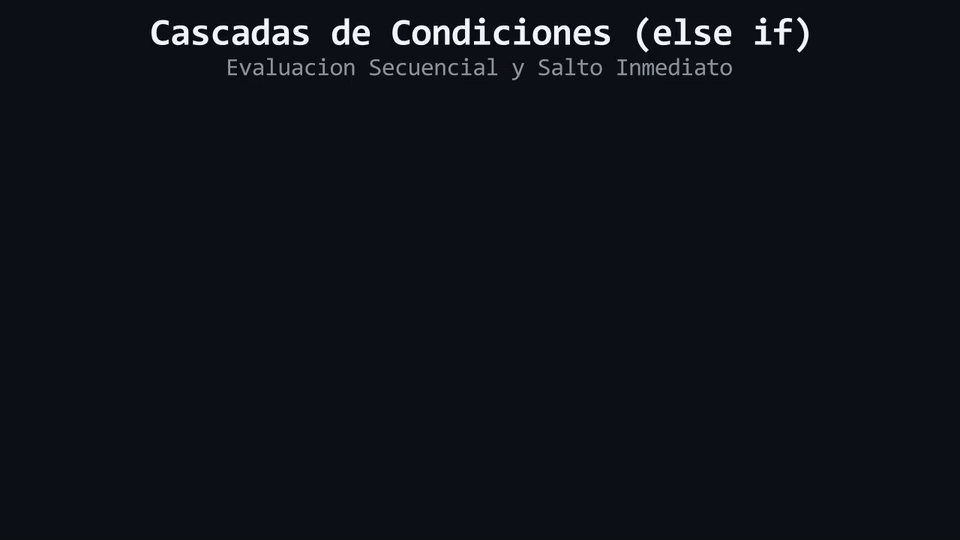

# Lección 02: Múltiples Caminos (`else if`)

En la lección anterior aprendimos a usar `if` (Plan A) y `else` (Plan B). Pero, ¿qué pasa cuando la vida no es blanco o negro? Imagina una máquina clasificadora de frutas: si la fruta es roja, es una manzana; si es amarilla, es un plátano; y si no es ninguna, va a la caja de "desconocidos". En C++, para manejar múltiples escenarios encadenados, usamos la estructura **`else if`**. A partir de ahora, dejaremos atrás las analogías de frutas y cajas para hablar con los términos reales: **Evaluación Secuencial** y **Mutuamente Excluyente**.

## Encadenando Decisiones

Podemos encadenar tantas estructuras `else if` como necesitemos entre un bloque `if` inicial y un bloque `else` de contingencia. El flujo de control evaluará las expresiones booleanas **de forma estrictamente secuencial** (de arriba hacia abajo) y se detendrá en la **primera** que devuelva `true`.

```cpp
int calificacion{85};

if (calificacion >= 90) {
    std::cout << "Excelente. Tienes una A.\n";
} else if (calificacion >= 80) {
    std::cout << "Muy bien. Tienes una B.\n";
} else if (calificacion >= 70) {
    std::cout << "Bien. Tienes una C.\n";
} else {
    std::cout << "Necesitas mejorar.\n";
}
```

### El Efecto Cascada (Evaluación Excluyente)
Lo más crítico que debes comprender de una cadena `else if` es su naturaleza mutuamente excluyente. Una vez que una condición se evalúa como `true`, se ejecuta su bloque de código y **el compilador ignora el resto de la estructura**, saltando directamente al final de la cadena entera. 

<div align="center">
  
</div>

#### 🔍 Traducción Visual de la Cascada Else-If:
* **Panel Izquierdo (`main.cpp`):** Código fuente con la escala de calificaciones (`nota >= 90`, `nota >= 80`, etc.).
* **Cascada de Evaluación (Derecha):** Evalúa la primera condición (`false`), baja a la segunda (`true` - MATCH).
* **Cortocircuito de Bloques:** Una vez encontrado el primer caso verdadero, el flujo ejecuta el bloque y **omite todas las ramas restantes**.

## El Peligro Silencioso: El Orden Importa (Unreachable Code)

Debido a que el control de flujo evalúa de forma secuencial y se detiene en el primer acierto, **colocar las condiciones en un orden lógico incorrecto corromperá el flujo del programa**. 

Observa este fallo de arquitectura:

```cpp
// ¡PELIGRO! Lógica de validación invertida
int calificacion{95};

if (calificacion >= 70) {
    std::cout << "Bien. Tienes una C.\n"; // ¡El flujo entra aquí y aborta el resto!
} else if (calificacion >= 90) {
    std::cout << "Excelente. Tienes una A.\n"; // Este bloque NUNCA se ejecutará.
}
```

En ciencias de la computación, a los bloques de código que son matemáticamente imposibles de ejecutar se les llama **Código Inalcanzable** (*Unreachable Code*). El compilador no detendrá la compilación porque tu sintaxis (la gramática de C++) es perfecta, pero tu lógica condicional está rota. Como 95 es mayor que 70, la evaluación en cascada se dispara en el primer `if` y el bloque del `90` queda huérfano.

> 🧪 **Laboratorio:** ¡Es hora de experimentar! Abre el archivo [`../lab/L02_ElseIf.cpp`](../lab/L02_ElseIf.cpp).
>
> 🐞 **Demo de Bug (Opcional):** Analiza el problema del *Unreachable Code*. Ejecuta la trampa en [`../lab/demos/D02_UnreachableCodeBug.cpp`](../lab/demos/D02_UnreachableCodeBug.cpp).
>
> 🏋️ **Ejercicio:** Demuestra tu dominio de la evaluación secuencial. Atrévete con el reto en [`../exercise/E02_CalculadoraDeRangos/E02_CalculadoraDeRangos.cpp`](../exercise/E02_CalculadoraDeRangos/E02_CalculadoraDeRangos.cpp).

> [!WARNING]
> **Regla de oro:** Estas preguntas se pueden responder *solo* con lo que leíste en esta lección. No busques respuestas en librerías avanzadas ni conceptos no vistos.

<details>
<summary><b>1. Si tengo un `if`, seguido de cinco `else if`, y el segundo `else if` resulta verdadero, ¿se evalúan las expresiones booleanas restantes?</b></summary>

> No. Una vez que se encuentra la primera condición verdadera, se ejecuta su bloque condicional y el flujo de control salta automáticamente hasta el final de toda la cadena estructural.
</details>

<details>
<summary><b>2. ¿Es estricto a nivel de sintaxis terminar siempre una cadena condicional con un bloque `else`?</b></summary>

> No. Si se omite el bloque `else` (el *fallback*) y ninguna de las expresiones resulta verdadera, el flujo de control simplemente ignorará toda la estructura. Sin embargo, en aplicaciones críticas, incluir el `else` es una buena práctica de contingencia.
</details>

---

| ⬅️ [Anterior: L01_IfElse.md](L01_IfElse.md) | 📖 [Menú del Módulo](../README.md) | ➡️ [Siguiente: L03_BlocksAndScope.md](L03_BlocksAndScope.md) |
|:---|:---:|---:|

---
<div align="center">
  <sub>Maintained by <strong>MiniLux0</strong> · 2026</sub>
</div>
