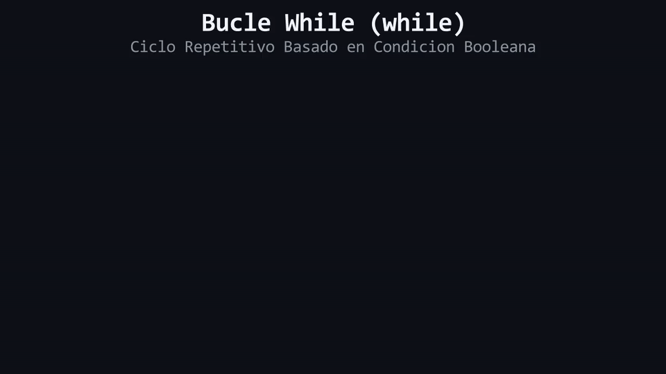

# Lección 05: Atrapados en el Tiempo (`while` y `do-while`)

Hasta ahora, nuestro código solo viaja hacia adelante. Incluso con el `switch` o los `if`, siempre avanzamos hacia el final del programa. Pero, ¿qué pasa si queremos que una acción se repita muchas veces? Imagina tener que escribir `std::cout << "Hola";` 100 veces a mano. Piensa en la solución como una máquina del tiempo que retrocede el código. A partir de aquí, abandonaremos las analogías de trenes y máquinas del tiempo para utilizar los términos de la industria: **Iteración**, **Estructuras de Repetición** y **Pre/Post-comprobación**.

## El bucle `while` (Pre-comprobación)

La estructura `while` es un ciclo de iteración condicional pura. Evalúa una expresión booleana *antes* de autorizar la entrada al bloque de código. Si la expresión es verdadera, ejecuta el bloque y luego fuerza al flujo de control a regresar al inicio para evaluar la expresión de nuevo.

```cpp
int contador{1};

while (contador <= 5) {
    std::cout << "Iteracion numero: " << contador << "\n";
    contador = contador + 1; // Mutacion del estado de la condicion
}
```

### Anatomía del `while`:
1. **Evaluación de Entrada:** `(contador <= 5)`. Es el filtro inicial. Si es falso desde el primer contacto, el bloque se ignora por completo (cero ejecuciones).
2. **El Bloque de Iteración:** Todo lo que está encapsulado dentro de `{ }` se ejecutará de forma secuencial.
3. **Salto de Flujo Inverso:** Al alcanzar la llave `}`, el flujo regresa incondicionalmente a la línea del `while` para volver a evaluar la condición.
4. **Mutación de Estado:** `contador = contador + 1;`. Es estrictamente necesario modificar la variable evaluada dentro del bloque para garantizar una eventual condición de salida (`false`).

## El Peligro Crítico: Bucle Infinito

Si omites la mutación de estado que altera la condición evaluada (en nuestro ejemplo, olvidar sumar 1 al `contador`), la expresión booleana jamás cambiará de valor. El flujo de control quedará atrapado en un ciclo eterno, disparando el uso de la CPU al máximo hasta que el sistema operativo o el usuario fuercen la terminación del proceso. A este defecto lógico se le conoce como **Bucle Infinito**.

<div align="center">
  
</div>

#### 🔍 Traducción Visual del Bucle While:
* **Panel Izquierdo (`main.cpp`):** Código fuente con `while (i < 3)` e incremento `++i`.
* **Mutación en Stack RAM (Derecha):** La celda de memoria `i` se actualiza secuencialmente (`0 ➔ 1 ➔ 2 ➔ 3`).
* **Condición de Terminación:** Al alcanzar `i = 3`, la condición evalúa a `false`, rompiendo el ciclo y evitando un bucle infinito.

## El bucle `do-while` (Post-comprobación)

A menudo, la arquitectura de un programa requiere que un bloque de código se ejecute **al menos una vez** para recolectar datos antes de saber si debe repetirse. Por ejemplo, presentar un menú interactivo.

La estructura `do-while` invierte la lógica: ejecuta el bloque de iteración primero a ciegas, y evalúa la expresión de continuación al **final**.

```cpp
int opcion{0};

do {
    std::cout << "--- SISTEMA INICIADO ---\n";
    std::cout << "1. Continuar operacion\n";
    std::cout << "2. Abortar sistema\n";
    std::cout << "Seleccione (1-2): ";
    std::cin >> opcion;
} while (opcion != 1 && opcion != 2); 
// ¡Sintaxis critica! El do-while SI exige un punto y coma al final.
```

En este modelo, el menú siempre se renderizará la primera vez independientemente del valor inicial de `opcion`. Si el usuario ingresa un `3`, la condición de continuación evalúa a `true` (3 no es ni 1 ni 2), y la iteración se repite.

> 🧪 **Laboratorio:** ¡Es hora de experimentar! Abre el archivo [`../lab/L05_WhileDoWhile.cpp`](../lab/L05_WhileDoWhile.cpp).
>
> 🐞 **Demo de Bug (Opcional):** Aprende de los errores comunes. Ejecuta la trampa en [`../lab/demos/D05_InfiniteLoopBug.cpp`](../lab/demos/D05_InfiniteLoopBug.cpp).
>
> 🏋️ **Ejercicio:** Pon a prueba lo aprendido. Atrévete con el reto en [`../exercise/E05_ContrasenaSegura/E05_ContrasenaSegura.cpp`](../exercise/E05_ContrasenaSegura/E05_ContrasenaSegura.cpp).

> [!WARNING]
> **Regla de oro:** Estas preguntas se pueden responder *solo* con lo que leíste...

<details>
<summary><b>1. Si la condición del `while` evalúa a falso desde el primer contacto, ¿cuántas veces se ejecuta el bloque de iteración?</b></summary>

> Cero veces. La estructura `while` opera mediante pre-comprobación. Si la condición inicial falla, el bloque entero es ignorado.
</details>

<details>
<summary><b>2. Si la condición del `do-while` evalúa a falso, ¿cuántas veces se ejecutó el bloque de iteración?</b></summary>

> Una vez. La estructura `do-while` opera mediante post-comprobación. Ejecuta el código a ciegas la primera vez, y luego revisa si debe volver a iterar.
</details>

---

| ⬅️ [Anterior: L04_Switch.md](L04_Switch.md) | 📖 [Menú del Módulo](../README.md) | ➡️ [Siguiente: L06_For.md](L06_For.md) |
|:---|:---:|---:|

---
<div align="center">
  <sub>Maintained by <strong>MiniLux0</strong> · 2026</sub>
</div>
