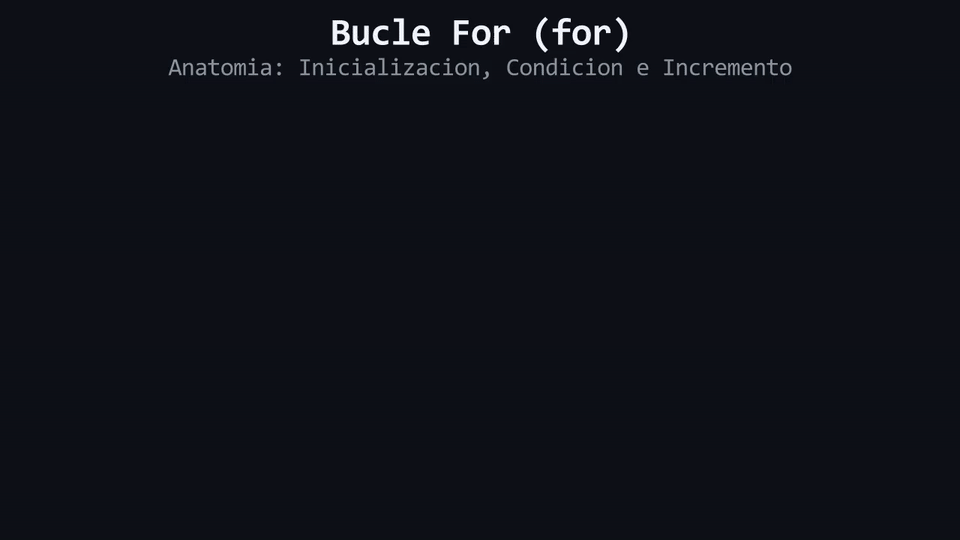

# Lección 06: Iteración Determinista (`for`)

El bucle `while` es indispensable cuando no sabes exactamente cuántas veces necesitas repetir una acción (por ejemplo, *mientras el usuario no adivine la contraseña*). Pero a menudo, **sí sabemos exactamente cuántas iteraciones necesitamos**. Si quisiéramos imprimir "Hola" 5 veces, podríamos construir una pista de carreras con un `while`: definir un corredor afuera, correr las vueltas y acordarnos de sumar 1 en la meta. Pero es fácil olvidar sumar y quedar atrapado en un bucle infinito. A partir de aquí, dejaremos los corredores y pistas de carreras para usar la terminología de ingeniería: **Iteración Determinista** y el bucle **`for`**.

## Anatomía de un bucle `for`

El bucle `for` mitiga los riesgos del `while` forzando al programador a agrupar la administración completa del ciclo de vida (inicialización, evaluación y mutación) en una sola línea compacta.

```cpp
//     1. Inicialización   2. Condición    4. Mutación (Incremento)
for (int i{1};             i <= 5;         i = i + 1) {
    // 3. Bloque de Ejecución (Cuerpo)
    std::cout << "Iteracion numero " << i << "\n";
}
```

### Mecánica de Ejecución:
1. **Inicialización (`int i{1};`):** Se ejecuta **una única vez** antes de iniciar el ciclo. Declara la variable de iteración (tradicionalmente llamada `i` por *índice*). Debido a las reglas estrictas de *Scope*, esta variable nace y muere exclusivamente para este bloque.
2. **Condición (`i <= 5;`):** Es la evaluación pre-comprobada. Si es `true`, el flujo entra al bloque. Si es `false`, el bucle se aborta.
3. **El Bloque `{...}`:** Se ejecuta el bloque de instrucciones de forma secuencial.
4. **Mutación (`i = i + 1`):** Al tocar la llave de cierre `}`, el flujo salta a esta instrucción para modificar la variable, y posteriormente redirige el control de nuevo al paso 2.

<div align="center">
  
</div>

#### 🔍 Traducción Visual de las Fases del Bucle For:
* **1. Inicialización (`int i{0}`):** Se ejecuta una única vez antes de comenzar las iteraciones.
* **2. Condición (`i < 3`):** Se evalúa antes de entrar al cuerpo del bucle en cada vuelta.
* **3. Incremento (`++i`):** Se ejecuta al final de cada iteración antes de volver a verificar la condición.

## La Trampa Arquitectónica: Off-By-One Bug

El error de lógica más recurrente a nivel global en iteraciones deterministas se documenta como el **Off-By-One Bug** (Error de desvío por uno). 

Este defecto lógico surge al confundir operadores relacionales estrictos (`<`) con operadores inclusivos (`<=`).

Si la arquitectura demanda exactamente 3 iteraciones, existen dos estándares matemáticos correctos:
- Base 1 inclusiva: `for (int i{1}; i <= 3; ...)` (Itera en 1, 2, 3).
- Base 0 estricta: `for (int i{0}; i < 3; ...)` (Itera en 0, 1, 2). Ambas entregan 3 iteraciones totales.

La catástrofe ocurre al mezclar las dos lógicas:
```cpp
// ¡PELIGRO! Defecto arquitectonico (Off-By-One)
for (int i{0}; i <= 3; i = i + 1) {
    std::cout << "Iteracion " << i << "\n";
}
```
El bucle ejecutará **4 iteraciones** (la 0, 1, 2 y 3). Un desvío por uno parece inofensivo, pero en la programación de bajo nivel, iterar un bloque de memoria más allá del límite permitido causará un colapso del sistema (*Buffer Overflow*).

> 🧪 **Laboratorio:** ¡Es hora de experimentar! Abre el archivo [`../lab/L06_For.cpp`](../lab/L06_For.cpp).
>
> 🐞 **Demo de Bug (Opcional):** Aprende de los errores comunes. Ejecuta la trampa en [`../lab/demos/D06_OffByOneBug.cpp`](../lab/demos/D06_OffByOneBug.cpp).
>
> 🏋️ **Ejercicio:** Pon a prueba tu manejo de iteraciones. Atrévete con el reto en [`../exercise/E06_CuentaRegresiva/E06_CuentaRegresiva.cpp`](../exercise/E06_CuentaRegresiva/E06_CuentaRegresiva.cpp).

> [!WARNING]
> **Regla de oro:** Estas preguntas se pueden responder *solo* con lo que leíste...

<details>
<summary><b>1. Si inicializo la variable `int i{1};` dentro de la estructura de un `for`, ¿es válido leer esa variable en la línea posterior al cierre del bucle?</b></summary>

> No. Al igual que el resto de estructuras de control, la declaración dentro del encabezado de un `for` crea una variable de *Scope Local* estricto. La memoria es liberada inmediatamente tras abortar el bucle.
</details>

<details>
<summary><b>2. ¿En qué momento exacto del ciclo de control se ejecuta la "Mutación" (paso 4)?</b></summary>

> Inmediatamente después de ejecutar todas las instrucciones del bloque de ejecución (al alcanzar la llave `}`), y justo antes de volver a evaluar la Condición de entrada.
</details>

---

| ⬅️ [Anterior: L05_WhileDoWhile.md](L05_WhileDoWhile.md) | 📖 [Menu del Modulo](../README.md) | ➡️ [Siguiente: L07_BreakContinue.md](L07_BreakContinue.md) |
|---|---|---|

---
<div align="center">
  <sub>Maintained by <strong>MiniLux0</strong> · 2026</sub>
</div>
