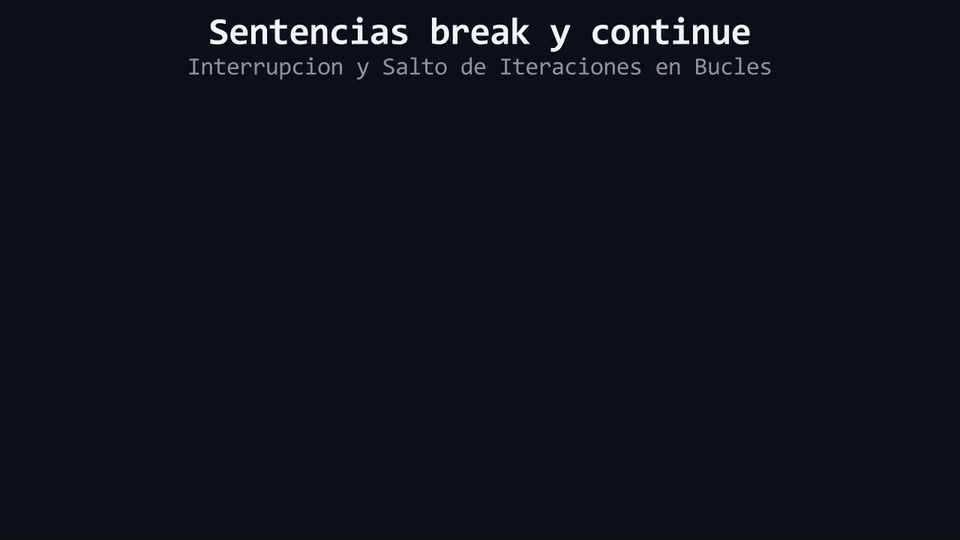

# Lección 07: Alteración Manual del Flujo (`break` y `continue`)

Cuando estás dentro de un bucle (`while` o `for`), el flujo normalmente sigue las reglas de la condición inicial. Pero a veces, durante el proceso, ocurre un evento crítico que requiere tomar control manual e ignorar las reglas programadas. Piensa en esto como una banda transportadora de una fábrica: si llega una caja defectuosa, la pateas fuera de la banda para seguir con la siguiente, pero si llega una bomba, presionas un botón de emergencia para apagar la fábrica entera. A partir de ahora, abandonaremos las analogías de fábricas para usar los términos formales: **Salto de Iteración** y **Terminación Prematura**.

Para implementar estas alteraciones, C++ nos provee las instrucciones **`break`** y **`continue`**.

## Terminación Prematura: `break`

La instrucción `break` altera el flujo destruyendo el bucle por completo. Tras su ejecución, el control salta inmediatamente a la primera instrucción que se encuentre fuera de la estructura de iteración, ignorando por completo si la condición de continuación aún era verdadera.

```cpp
for (int i{1}; i <= 100; i = i + 1) {
    std::cout << "Analizando dato " << i << "\n";
    
    if (i == 3) {
        std::cout << "¡Anomalia detectada! Abortando bucle.\n";
        break; // Terminacion prematura.
    }
}
// El flujo de control salta directo hasta aqui despues del break.
```
Aunque la arquitectura inicial demandaba 100 iteraciones, el bucle será destruido en la iteración 3.

## Salto de Iteración: `continue`

La instrucción `continue` es una alteración menos destructiva. Su función no es terminar el bucle, sino abortar **únicamente la iteración actual**. Cuando el flujo encuentra un `continue`, ignora el resto del código del bloque y salta directamente a evaluar la condición para iniciar la siguiente vuelta.

```cpp
for (int i{1}; i <= 5; i = i + 1) {
    if (i == 3) {
        std::cout << "Ignorando el sector 3.\n";
        continue; // Aborta esta iteracion, pero el bucle sigue vivo.
    }
    std::cout << "Procesando sector " << i << "\n";
}
```
Esto imprimirá los sectores 1, 2, (ignorará el 3), 4 y 5.

<div align="center">
  
</div>

#### 🔍 Traducción Visual de `break` y `continue`:
* **Salto con `continue` (Omitir Iteración):** Cuando el hilo de ejecución encuentra `continue`, aborta las instrucciones restantes del cuerpo y salta directamente al siguiente ciclo de evaluación.
* **Terminación con `break` (Salida Forzada):** Al encontrar `break`, el bucle se destruye instantáneamente y el flujo de control escapa fuera del bloque, transfiriendo la ejecución a la siguiente línea del programa.

## El Defecto Estructural del `continue` en un `while`

El `continue` dentro de un bucle `for` es arquitectónicamente seguro porque el `for` ejecutará automáticamente su sección de Mutación (paso 4) antes de iniciar la siguiente iteración.

Sin embargo, en un bucle `while`, el programador administra la mutación manualmente dentro del bloque. Si invocas un `continue` *antes* de modificar la variable que evalúa el bucle, el flujo retrocederá a la condición inmediatamente. Como la variable no fue alterada, la condición volverá a ser verdadera, volverá a disparar el `continue`, y crearás un **Bucle Infinito Silencioso**.

```cpp
int i{1};
while (i <= 5) {
    if (i == 3) {
        continue; // ¡PELIGRO! El flujo retrocede sin ejecutar la instruccion inferior.
                  // La variable 'i' jamas pasara de 3.
    }
    std::cout << i << "\n";
    i = i + 1; 
}
```

> 🧪 **Laboratorio:** ¡Es hora de experimentar! Abre el archivo [`../lab/L07_BreakContinue.cpp`](../lab/L07_BreakContinue.cpp).
>
> 🐞 **Demo de Bug (Opcional 1):** Trampa del continue en bucles while. Ejecuta el fallo en [`../lab/demos/D07_HiddenInfiniteLoopBug.cpp`](../lab/demos/D07_HiddenInfiniteLoopBug.cpp).
>
> 🐞 **Demo de Bug (Opcional 2):** Trampa de break en bucles anidados. Ejecuta el fallo en [`../lab/demos/D07_NestedBreakBug.cpp`](../lab/demos/D07_NestedBreakBug.cpp).
>
> 🏋️ **Ejercicio:** Pon a prueba lo aprendido. Atrévete con el reto en [`../exercise/E07_BuscadorDeArchivos/E07_BuscadorDeArchivos.cpp`](../exercise/E07_BuscadorDeArchivos/E07_BuscadorDeArchivos.cpp).

> [!WARNING]
> **Regla de oro:** Estas preguntas se pueden responder *solo* con lo que leíste en esta lección. No busques respuestas en librerías avanzadas ni conceptos no vistos.

<details>
<summary><b>1. Si tengo un bucle anidado (un bucle dentro de otro bucle), y ejecuto un `break` en el bucle interior, ¿se destruyen ambas estructuras?</b></summary>

> No. La instrucción `break` solo afecta a la estructura de iteración más cercana en la que se encuentra contenida. El bucle exterior continuará su flujo normalmente.
</details>

<details>
<summary><b>2. Si necesito que una condición termine la ejecución del programa completo inmediatamente (no solo de un bucle), ¿qué instrucción debo utilizar?</b></summary>

> En la Lección 02 vimos que la estructura `main` es una función. Si ejecutas `return 0;` en lugar de `break`, terminarás el bloque `main` por completo, forzando la salida inmediata del proceso ante el sistema operativo.
</details>

---

| ⬅️ [Anterior: L06_For.md](L06_For.md) | 📖 [Menú del Módulo](../README.md) | ➡️ [Siguiente: L08_ProyectoCajero.md](L08_ProyectoCajero.md) |
|:---|:---:|---:|

---
<div align="center">
  <sub>Maintained by <strong>MiniLux0</strong> · 2026</sub>
</div>
