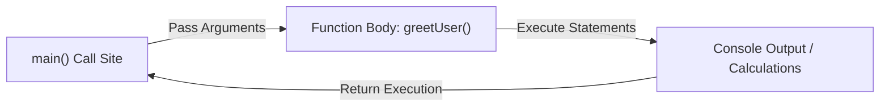

# Lesson 23 — Subroutines & Function Fundamentals

> [!NOTE]
> **Academic Foundation:** This lesson synthesizes core concepts from **MIT 6.096 Lecture 03** ([`Lecture03_Functions.pdf`](../../files/mit6096/lectures/Lecture03_Functions.pdf)) and **Stanford CS106B Textbook Chapter 2** ([`CS106BX-Reader.pdf`](../../files/cs106b/textbook/CS106BX-Reader.pdf)).

---

## 🧭 Quick Navigation

- 📄 **Base Academic Lectures:**
  - 🏛️ [MIT 6.096 — Lecture 03: Function Definitions & Call Stack Frames](../../files/mit6096/lectures/Lecture03_Functions.pdf)
  - 🌲 [Stanford CS106B — Chapter 2: Procedural Abstraction](../../files/cs106b/textbook/CS106BX-Reader.pdf)
- 💻 **Code Lab:** [`L23_Functions.cpp`](../code/L23_Functions.cpp)

---

## Learning Objectives

- [ ] Understand procedural abstraction and DRY (Don't Repeat Yourself) engineering principles.
- [ ] Define functions with return types, unique identifiers, and parameter lists.
- [ ] Understand `void` functions (subroutines without return values).
- [ ] Trace function call execution and memory stack frame push/pop operations.

---

## 1. What is a Function?

A **function** (or subroutine) is a reusable block of code that performs a specific task. Functions allow breaking complex monolithic code into modular, maintainable units.



```cpp
#include <iostream>

// Function definition
void showWelcomeBanner() {
    std::cout << "====================================\n";
    std::cout << "    C++ SUBROUTINES MODULE L23      \n";
    std::cout << "====================================\n";
}

int main() {
    showWelcomeBanner(); // Function call 1
    showWelcomeBanner(); // Function call 2
    return 0;
}
```

> [!TIP]
> **The DRY Principle:**
> **DRY** stands for *"Don't Repeat Yourself"*. If you copy-paste the same 5 lines of code in multiple places, encapsulate them inside a function instead!

---

## ❓ Self-Assessment Checkpoint #1 — Void Return Type

What does `void` mean when placed as the return type of a function definition (`void printHeader()`)?

<details>
<summary>🔍 <strong>View Explanation & Answer</strong></summary>

> [!NOTE]
> **Answer:** It indicates that the function returns NO value to the caller.
>
> **Explanation:**
> `void` tells the compiler that the subroutine performs side effects (such as printing output to the screen or modifying global state) without returning any computed data value back to `main()`.

</details>

---

## 📝 Summary & Key Takeaways

1. **Functions:** Modularize code into reusable, named subroutines.
2. **`void`:** Indicates that a function returns no value to its caller.
3. **Reusability:** Prevents duplicate code and simplifies testing.

---

<div align="center">

### 🧭 Navigation & Progression

| ⬅️ Previous Lesson | 🏠 Section Home | ➡️ Next Lesson |
|:------------------:|:--------------:|:--------------:|
| [**⬅️ Section 02 Capstone**](../../02_BasicSyntax/theory/L22_Switch.md) | [**🏠 Subroutines**](../README.md) | [**L24 — Return Values ➡️**](L24_ReturnValues.md) |

</div>

---
*MiniLux0 — Learning C++ Section 03*