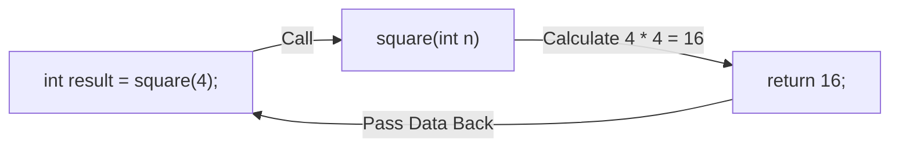

# Lesson 24 — Return Values & Data Flow

> [!NOTE]
> **Academic Foundation:** This lesson synthesizes core concepts from **MIT 6.096 Lecture 03** ([`Lecture03_Functions.pdf`](../../files/mit6096/lectures/Lecture03_Functions.pdf)) and **Stanford CS106B Textbook Chapter 2** ([`CS106BX-Reader.pdf`](../../files/cs106b/textbook/CS106BX-Reader.pdf)).

---

## 🧭 Quick Navigation

- 📄 **Base Academic Lectures:**
  - 🏛️ [MIT 6.096 — Lecture 03: Function Return Values & Type Matching](../../files/mit6096/lectures/Lecture03_Functions.pdf)
  - 🌲 [Stanford CS106B — Chapter 2: Functional Composition](../../files/cs106b/textbook/CS106BX-Reader.pdf)
- 💻 **Code Lab:** [`L24_ReturnValues.cpp`](../code/L24_ReturnValues.cpp)

---

## Learning Objectives

- [ ] Declare non-void return types (`int`, `double`, `std::string`, `bool`).
- [ ] Return computed data to callers using the `return` statement.
- [ ] Understand early function exit via conditional `return`.

---

## 1. Returning Computed Data to Callers

A function can compute a value and pass it back to the caller using the `return` keyword:



```cpp
#include <iostream>

// Returns an integer calculated value
int square(int number) {
    return number * number;
}

int main() {
    int val = 5;
    int result = square(val); // result receives 25
    std::cout << "Square of " << val << " is " << result << "\n";
    return 0;
}
```

> [!IMPORTANT]
> **Early Return Execution:**
> When the `return` statement executes, the function terminates **immediately**. Any statements located below the `return` line inside that function block are completely ignored.

---

## ❓ Self-Assessment Checkpoint #1 — Missing Return Warning

What happens if a non-void function (`int calculate()`) reaches the closing brace `}` without executing a `return` statement?

<details>
<summary>🔍 <strong>View Explanation & Answer</strong></summary>

> [!CAUTION]
> **Undefined Behavior (UB):**
> Failing to return a value from a non-void function results in Undefined Behavior in C++. The caller will receive garbage register data from RAM. Modern compilers will issue a warning (`warning: control reaches end of non-void function`).

</details>

---

## 📝 Summary & Key Takeaways

1. **Return Type:** Must match the type of value specified in the `return` expression.
2. **Immediate Termination:** `return` exits the function immediately.

---

<div align="center">

### 🧭 Navigation & Progression

| ⬅️ Previous Lesson | 🏠 Section Home | ➡️ Next Lesson |
|:------------------:|:--------------:|:--------------:|
| [**⬅️ L23 — Subroutines & Functions**](L23_Functions.md) | [**🏠 Subroutines**](../README.md) | [**L25 — Function Parameters & Pass by Reference ➡️**](L25_FunctionParameters.md) |

</div>

---
*MiniLux0 — Learning C++ Section 03*