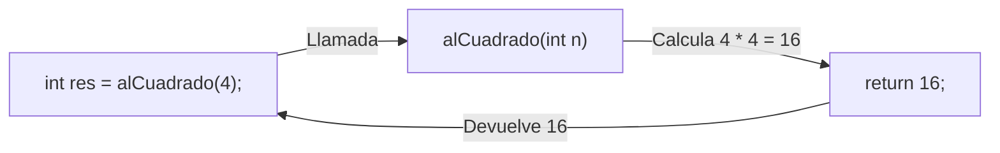

# L24 — Valores de Retorno y Flujo de Datos

> [!NOTE]
> **Fundamentación Académica:** Esta lección sintetiza los conceptos de la **Lectura 03** de MIT 6.096 ([`Lecture03_Functions.pdf`](../../files/mit6096/lectures/Lecture03_Functions.pdf)) y el **Capítulo 2 (*Functional Composition*)** del libro de Stanford CS106B (*Programming Abstractions in C++* por Eric Roberts).

---

## 🧭 Navegación Rápida

- 📄 **Lecturas Académicas Base:**
  - 🏛️ [MIT 6.096 — Lecture 03: Function Return Values & Type Matching](../../files/mit6096/lectures/Lecture03_Functions.pdf)
  - 🌲 [Stanford CS106B — Chapter 2: Functional Composition](https://web.stanford.edu/class/cs106x/res/reader/CS106BX-Reader.pdf)
- 💻 **Laboratorio de Código:** [`L24_ReturnValues.cpp`](../code/L24_ReturnValues.cpp)

---

## Objetivos de Aprendizaje

- [ ] Declarar tipos de retorno no nulos (`int`, `double`, `string`, `bool`).
- [ ] Retornar datos calculados hacia la función invocadora utilizando la palabra clave `return`.
- [ ] Implementar la salida temprana de funciones (*Early Return*) ante condiciones condicionales.
- [ ] Diagnosticar errores de comportamiento indefinido por falta de la sentencia `return`.

---

## 1. Retorno de Datos con la Sentencia `return`

Una función puede calcular un valor y transmitirlo de vuelta a la función invocadora mediante la sentencia `return`:



```cpp
#include <iostream>
using namespace std;

// Retorna un entero calculado
int alCuadrado(int numero) {
    return numero * numero;
}

int main() {
    int val = 5;
    int resultado = alCuadrado(val); // resultado recibe 25
    cout << "El cuadrado de " << val << " es " << resultado << endl;
    return 0;
}
```

> [!IMPORTANT]
> **Finalización Inmediata:**  
> Cuando se ejecuta la sentencia `return`, la función finaliza de manera **inmediata**. Cualquier instrucción ubicada debajo de `return` dentro del cuerpo de esa función será completamente ignorada.

---

## 2. Salida Temprana (*Early Return*)

```cpp
#include <iostream>
using namespace std;

int obtenerMaximo(int a, int b) {
    if (a > b) {
        return a; // Sale inmediatamente si a es mayor
    }
    return b; // De lo contrario retorna b
}
```

---

## ❓ Pregunta de Chequeo #1 — Omisión de `return`

¿Qué ocurre si una función declarada con un tipo de retorno no nulo (ejemplo: `int calcular()`) llega a la llave de cierre `}` sin ejecutar ninguna instrucción `return`?

<details>
<summary>🔍 <strong>Ver Explicación y Diagnóstico</strong></summary>

> [!CAUTION]
> **Comportamiento Indefinido (UB):**  
> En C++, no retornar un valor desde una función no-`void` causa Comportamiento Indefinido (*Undefined Behavior*). El invocador recibirá basura presente en los registros del sistema. Los compiladores modernos emitirán una advertencia (`warning: control reaches end of non-void function`).

</details>

---

## 📝 Resumen de L24

1. **Coincidencia de Tipos:** El tipo expresado en `return` debe coincidir con el tipo especificado en la firma de la función.
2. **Terminación Inmediata:** `return` interrumpe la función al instante.

---

<div align="center">

### 🧭 Navegación y Progresión

| ⬅️ Lección Anterior | 🏠 Inicio de Sección | ➡️ Siguiente Lección |
|:------------------:|:-------------------:|:------------------:|
| [**⬅️ L23 — Fundamentos de Funciones**](L23_Functions.md) | [**🏠 Subrutines**](../README.md) | [**L25 — Parámetros y Referencias ➡️**](L25_FunctionParameters.md) |

</div>

---

<div align="center">
  <sub>Maintained by <strong>MiniLux0</strong> · 2026</sub>
</div>