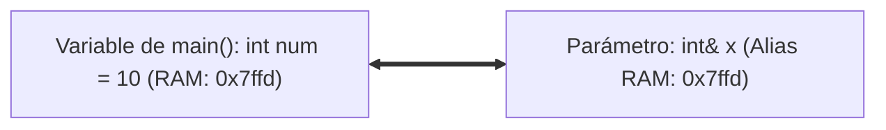

# L25 — Parámetros de Funciones: Paso por Valor vs. Paso por Referencia (`&`)

> [!NOTE]
> **Fundamentación Académica:** Esta lección sintetiza los conceptos de la **Lectura 03** de MIT 6.096 ([`Lecture03_Functions.pdf`](../../files/mit6096/lectures/Lecture03_Functions.pdf)) y el **Capítulo 2 (*Reference Parameters & Aliasing*)** del libro de Stanford CS106B (*Programming Abstractions in C++* por Eric Roberts).

---

## 🧭 Navegación Rápida

- 📄 **Lecturas Académicas Base:**
  - 🏛️ [MIT 6.096 — Lecture 03: Pass-by-Value vs. Reference Mechanics](../../files/mit6096/lectures/Lecture03_Functions.pdf)
  - 🌲 [Stanford CS106B — Chapter 2: Reference Parameters & Aliasing](../../files/cs106b/textbook/CS106BX-Reader.pdf)
- 💻 **Laboratorio de Código:** [`L25_FunctionParameters.cpp`](../code/L25_FunctionParameters.cpp)

---

## Objetivos de Aprendizaje

- [ ] Diferenciar entre **Paso por Valor** (copia de datos) y **Paso por Referencia (`&`)** (compartir dirección de memoria).
- [ ] Mutar variables de la función invocadora utilizando parámetros por referencia.
- [ ] Aplicar la referencia constante (**`const string&`**) para evitar copias costosas de memoria sin permitir modificaciones.

---

## 1. Paso por Valor (*Pass-by-Value*)

Por defecto, C++ pasa los argumentos por **valor**. El compilador crea una copia local e independiente dentro del marco de la pila de la función:

```cpp
#include <iostream>
using namespace std;

void intentarModificar(int x) { // x es una copia local independiente
    x = 99; // Modifica únicamente la copia local
}

int main() {
    int num = 10;
    intentarModificar(num);
    cout << num << endl; // Imprime 10 (¡El valor original NO cambió!)
    return 0;
}
```

---

## 2. Paso por Referencia (`&`)

Al añadir el ampersand `&` al tipo del parámetro (`int& x`), el parámetro se convierte en un **alias de referencia** que apunta directamente a la misma celda de memoria RAM que la variable del invocador:



```cpp
#include <iostream>
using namespace std;

void modificarDeVerdad(int& x) { // x es una referencia a la memoria original
    x = 99; // ¡Muta directamente la variable 'num' de main!
}

int main() {
    int num = 10;
    modificarDeVerdad(num);
    cout << num << endl; // ¡Imprime 99!
    return 0;
}
```

---

## 3. Paso por Referencia Constante (`const Type&`)

Copiar objetos grandes (como una cadena `string` de 1,000 caracteres) por valor requiere reservar memoria y copiar caracteres uno por uno. El uso de `const string&` pasa la dirección por referencia para máxima velocidad, mientras el compilador garantiza que el texto no sea modificado:

```cpp
#include <iostream>
#include <string>
using namespace std;

void imprimirCadenaGrande(const string& texto) {
    // ¡Eficiente! Cero copias en memoria y el compilador prohíbe modificar 'texto'
    cout << texto << endl;
}
```

---

## ❓ Pregunta de Chequeo #1 — Intercambio de Valores

¿Por qué una función `swap(int a, int b)` falla en intercambiar dos enteros en `main()` a menos que se declare como `swap(int& a, int& b)`?

<details>
<summary>🔍 <strong>Ver Explicación y Respuesta</strong></summary>

> [!NOTE]
> **Respuesta:** Porque sin `&`, `swap` solo intercambia copias temporales aisladas en su propia pila de llamadas.
>
> **Explicación:**  
> Al finalizar `swap(int a, int b)`, las copias locales son destruidas de la memoria RAM, dejando las variables originales en `main()` completamente intactas. Con `int& a, int& b`, se intercambian directamente los contenidos de las direcciones de memoria originales.

</details>

---

## 📝 Resumen de L25

1. **Paso por Valor (`int x`):** Crea una copia independiente; las modificaciones no afectan al invocador.
2. **Paso por Referencia (`int& x`):** Comparte la celda de memoria RAM del invocador; permite mutar la variable original.
3. **Referencia Constante (`const string&`):** Elimina el costo de copia en memoria garantizando seguridad de solo lectura.

---

<div align="center">

### 🧭 Navegación y Progresión

| ⬅️ Lección Anterior | 🏠 Inicio de Sección | ➡️ Siguiente Lección |
|:------------------:|:-------------------:|:------------------:|
| [**⬅️ L24 — Valores de Retorno**](L24_ReturnValues.md) | [**🏠 Subrutines**](../README.md) | [**L26 — Cabeceras y Prototipos ➡️**](L26_HeadersAndPrototypes.md) |

</div>

---
*MiniLux0 — Learning C++ Section 03*
---

<div align="center">
  <sub>Maintained by <strong>MiniLux0</strong> · 2026</sub>
</div>