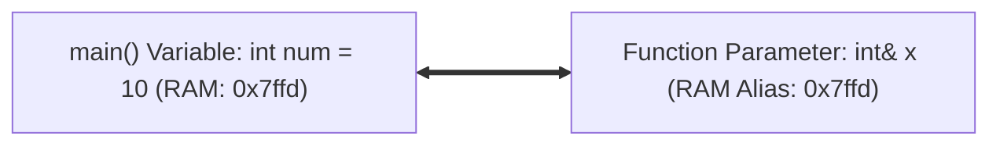

# Lesson 25 — Function Parameters: Pass-by-Value vs. Pass-by-Reference (`&`)

> [!NOTE]
> **Academic Foundation:** This lesson synthesizes core concepts from **MIT 6.096 Lecture 03** ([`Lecture03_Functions.pdf`](../../files/mit6096/lectures/Lecture03_Functions.pdf)) and **Stanford CS106B Textbook Chapter 2** ([`CS106BX-Reader.pdf`](../../files/cs106b/textbook/CS106BX-Reader.pdf)).

---

## 🧭 Quick Navigation

- 📄 **Base Academic Lectures:**
  - 🏛️ [MIT 6.096 — Lecture 03: Pass-by-Value vs. Reference Mechanics](../../files/mit6096/lectures/Lecture03_Functions.pdf)
  - 🌲 [Stanford CS106B — Chapter 2: Reference Parameters & Aliasing](../../files/cs106b/textbook/CS106BX-Reader.pdf)
- 💻 **Code Lab:** [`L25_FunctionParameters.cpp`](../code/L25_FunctionParameters.cpp)

---

## Learning Objectives

- [ ] Differentiate between **Pass-by-Value** (copying data) and **Pass-by-Reference (`&`)** (sharing memory address).
- [ ] Mutate caller variables inside subroutines using reference parameters.
- [ ] Use **`const` reference (`const std::string&`)** to prevent copying expensive objects efficiently.

---

## 1. Pass-by-Value (Default Copy Behavior)

By default, C++ passes arguments by **value**. The compiler creates an isolated local copy of the argument in the function's stack frame:

```cpp
void tryToModify(int x) { // x is an independent local copy
    x = 99; // Modifies only the copy!
}

int main() {
    int num = 10;
    tryToModify(num);
    // num is STILL 10!
    return 0;
}
```

---

## 2. Pass-by-Reference (`&`)

When you append an ampersand `&` to a parameter type (`int& x`), the parameter becomes a **reference alias** pointing to the exact same RAM memory address as the caller's variable:



```cpp
void modifyForReal(int& x) { // x is a reference to caller's memory
    x = 99; // Mutates caller's 'num' variable directly!
}

int main() {
    int num = 10;
    modifyForReal(num);
    // num is now 99!
    return 0;
}
```

---

## 3. Pass-by-Const-Reference (`const Type&`)

Copying large objects (like a 1,000-character `std::string`) pass-by-value allocates extra memory and slows performance. Using `const Type&` passes by reference for speed while preventing accidental modifications:

```cpp
void printLargeString(const std::string& text) {
    // Fast! Zero copying memory overhead, and compiler prevents 'text' from being modified.
    std::cout << text << "\n";
}
```

---

## ❓ Self-Assessment Checkpoint #1 — Swapping Values

Why does a standard `swap(int a, int b)` function fail to swap two integers in `main()` unless written as `swap(int& a, int& b)`?

<details>
<summary>🔍 <strong>View Explanation & Answer</strong></summary>

> [!NOTE]
> **Answer:** Pass-by-value copies local copies inside `swap()`.
>
> **Explanation:**
> Without `&`, `swap()` swaps only temporary local copies on its own call stack frame. As soon as `swap()` returns, those local copies are destroyed, leaving the original variables in `main()` completely unchanged.

</details>

---

## 📝 Summary & Key Takeaways

1. **Pass-by-Value (`int x`):** Creates an independent copy; modifications do not affect caller.
2. **Pass-by-Reference (`int& x`):** Shares caller's RAM address; modifications mutate caller variable.
3. **`const` Reference (`const std::string&`):** Eliminates copy overhead while guaranteeing read-only safety.

---

<div align="center">

### 🧭 Navigation & Progression

| ⬅️ Previous Lesson | 🏠 Section Home | ➡️ Next Lesson |
|:------------------:|:--------------:|:--------------:|
| [**⬅️ L24 — Return Values**](L24_ReturnValues.md) | [**🏠 Subroutines**](../README.md) | [**L26 — Headers & Prototypes ➡️**](L26_HeadersAndPrototypes.md) |

</div>

---
*MiniLux0 — Learning C++ Section 03*