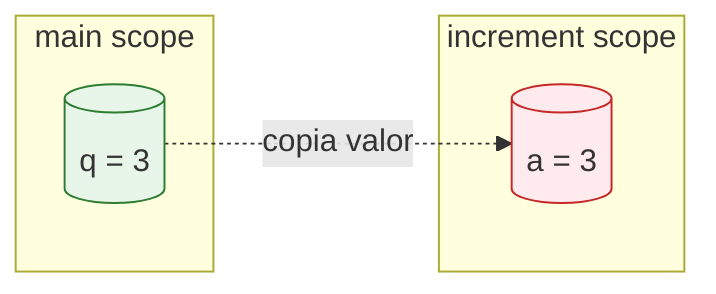
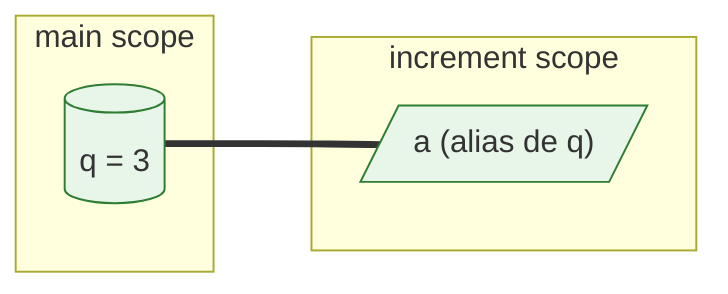
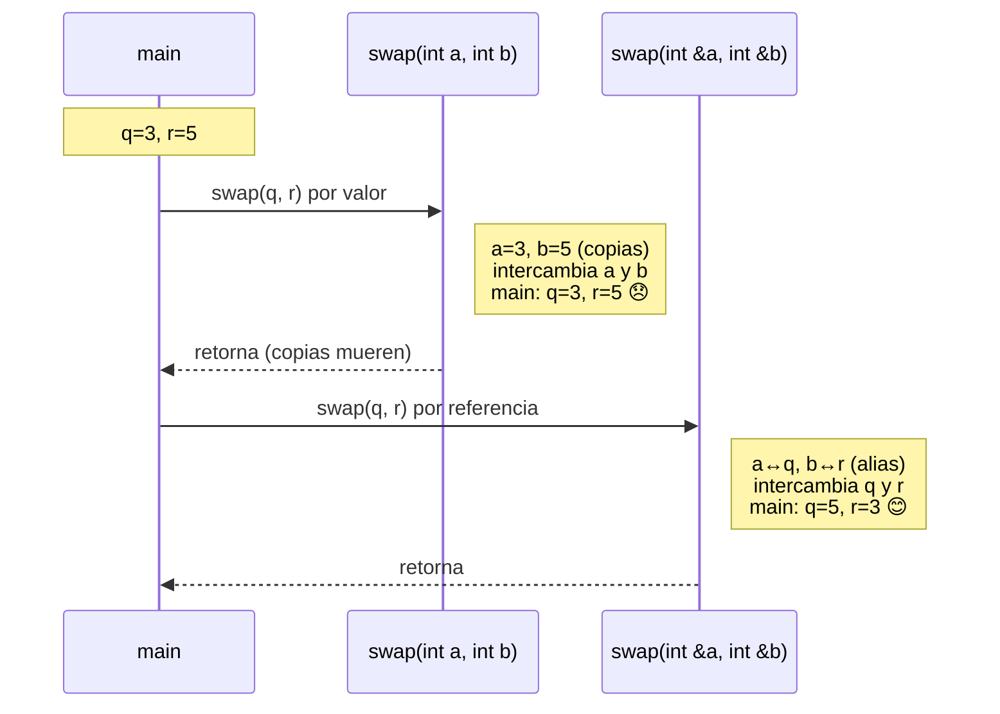

# L25 — Function Parameters: Pass by Value vs Pass by Reference

> **Concepto central**: Cómo C++ pasa argumentos a funciones — por **copia** (default) o por **referencia** (alias).

---

## 🎯 Objetivos de aprendizaje

- [ ] Entender la diferencia entre *pass by value* y *pass by reference*
- [ ] Saber cuándo usar cada uno
- [ ] Entender por qué `swap` **requiere** pass-by-reference
- [ ] Reconocer *output parameters* (parámetros de salida) con `&`
- [ ] Distinguir **referencia** (`int&`) de **puntero** (`int*`)

---

## 📦 Pass by Value (Por valor) — **Default en C++**

```cpp
void increment(int a) {  // a es una COPIA
    a = a + 1;
}
```

### Qué pasa en memoria



| Aspecto | Detalle |
|---------|---------|
| **Memoria** | `a` y `q` en **direcciones distintas** |
| **Modificación** | Cambiar `a` **NO afecta** a `q` |
| **Costo** | Copia el valor (barato para `int`, caro para `vector<string>`) |
| **Seguridad** | Función no puede romper variable del caller |

### Ejemplo ejecutado

```cpp
int q = 3;
increment(q);  // q pasa por valor
cout << q;     // 3  ← SIN CAMBIOS
```

---

## 🔗 Pass by Reference (Por referencia) — `&`

```cpp
void increment(int &a) {  // a es un ALIAS
    a = a + 1;
}
```

### Qué pasa en memoria



| Aspecto | Detalle |
|---------|---------|
| **Memoria** | `a` y `q` **misma dirección** |
| **Modificación** | Cambiar `a` **SÍ afecta** a `q` |
| **Costo** | Sin copia (solo pasa dirección implícita) |
| **Sintaxis** | Se usa **igual que variable normal** (sin `*`, sin `->`) |

### Ejemplo ejecutado

```cpp
int r = 3;
increment(r);  // r pasa por referencia
cout << r;     // 4  ← CAMBIÓ
```

---

### 🔄 Pass by Reference **con retorno** (`int` + `&`)

```cpp
int incrementByRef(int &a) {
    a = a + 1;
    return a;  // devuelve el valor modificado
}
```

**Uso:**
```cpp
int r = 3;
int resultado = incrementByRef(r);  // r = 4, resultado = 4
```

**¿Por qué funciona?**  
El paso por referencia (`int &a`) hace que `a` sea un **alias** de `r`. La función modifica `r` directamente y, **además**, usa `return` para devolver el valor final. Ambas cosas funcionan **al mismo tiempo** porque son mecanismos independientes:
- `&` → controla **cómo se pasa** el argumento (alias vs copia)
- `return` → controla **qué devuelve** la función

**Requisitos:**
1. Parámetro con `&` → para modificar la variable original
2. Tipo de retorno no-`void` (`int`, `double`, etc.) → para devolver valor
3. `return valor;` antes de salir de la función

---

## ⚔️ El caso clásico: `swap`

> **Imposible con pass-by-value**, trivial con pass-by-reference.

```cpp
// ❌ NO FUNCIONA - intercambia copias locales
void swap(int a, int b) { 
    int t = a; a = b; b = t; 
}

// ✅ FUNCIONA - intercambia las variables originales
void swap(int &a, int &b) { 
    int t = a; a = b; b = t; 
}
```

### Trace visual



---

## 📤 Output Parameters (Parámetros de salida)

Patrón: **una función "retorna" múltiples valores** — uno por `return`, otros por `&`.

```cpp
// Retorna cociente POR RETURN, resto POR REFERENCIA
int divide(int numerator, int denominator, int &remainder) {
    remainder = numerator % denominator;  // escribe en variable de main
    return numerator / denominator;       // retorna cociente
}

// Uso
int rem;
int quot = divide(14, 4, rem);  // quot=3, rem=2
```

### ¿Por qué `int &remainder` y NO `int remainder`?

| Sin `&` (pass by value) | Con `&` (pass by reference) |
|-------------------------|----------------------------|
| `remainder` es **copia local** | `remainder` es **alias de `rem`** |
| Escribe en la copia | Escribe **directamente en `rem`** |
| Copia muere al salir | `rem` queda con el valor |
| `rem` en main = **basura (sin inicializar)** | `rem` en main = **valor correcto** |

---

## 🧠 Referencia (`int&`) vs Puntero (`int*`) — **Distinción clave**

> En L29 usamos **referencias**. Los punteros vienen en **Lección 5**.

| Característica | `int& ref` (Referencia) | `int* ptr` (Puntero) |
|----------------|-------------------------|----------------------|
| **Concepto** | Alias (otro nombre) | Variable que guarda dirección |
| **Sintaxis uso** | `ref = 5` | `*ptr = 5` |
| **Puede ser nulo** | ❌ No | ✅ Sí (`nullptr`) |
| **Reasignable** | ❌ No (siempre alias del mismo) | ✅ Sí |
| **Arithmetic** | ❌ No | ✅ Sí (`ptr++`) |
| **Cuándo usar** | Parámetros de función, alias | Memoria dinámica, arrays, opcionales |

```cpp
// REFERENCIA - L29
void f(int &x) { x = 10; }  // se usa como variable normal
int a = 5; f(a);  // a = 10

// PUNTERO - Lección 5
void g(int *x) { *x = 10; } // necesita * para desreferenciar
int b = 5; g(&b); // b = 10 (pasa dirección con &)
```

---

## ✅ Checklist de cuándo usar cada uno

```mermaid
flowchart TD
    Start[¿Necesito modificar la variable original?] --> No[NO]
    Start --> Sí[SÍ]
    
    No --> Simple[¿Tipo simple?<br/>int, double, bool, char]
    Simple --> SíSimple[Sí] --> PassValue[Pass by VALUE<br/>void f(int x)]
    Simple --> NoSimple[No<br/>string, vector, struct grande] --> ConstRef[Pass by CONST REF<br/>void f(const string& s)]
    
    Sí --> OutParam[¿Es parámetro de SALIDA?<br/>(output parameter)]
    OutParam --> SíOut[Sí] --> PassRef[Pass by REFERENCE<br/>void f(int &out)]
    OutParam --> NoOut[No<br/>solo modificar entrada] --> PassRef
    
    style PassValue fill:#e3f2fd,stroke:#1565c0
    style ConstRef fill:#e8f5e9,stroke:#2e7d32
    style PassRef fill:#fff3e0,stroke:#ef6c00
```

### Resumen rápido

| Situación | Cómo pasar |
|-----------|------------|
| Leer `int`/`double`/`bool` | `void f(int x)` (value) |
| Leer `string`/`vector`/struct grande | `void f(const string& s)` (const ref) |
| Modificar variable del caller | `void f(int &x)` (ref) |
| Retornar 2+ valores (output param) | `void f(int in, int &out)` (ref) |
| `swap`, `sort` in-place | `void f(int &a, int &b)` (ref) |

---

## 🧪 Preguntas de autoevaluación

<details>
<summary>1. ¿Qué imprime este código?</summary>

```cpp
void f(int x) { x = 10; }
int main() { int a = 5; f(a); cout << a; }
```
<details><summary>Respuesta</summary><code>5</code> — pass by value, `x` es copia.</details>
</details>

<details>
<summary>2. ¿Y este?</summary>

```cpp
void f(int &x) { x = 10; }
int main() { int a = 5; f(a); cout << a; }
```
<details><summary>Respuesta</summary><code>10</code> — pass by reference, `x` es alias de `a`.</details>
</details>

<details>
<summary>3. `swap(int a, int b)` sin `&` — ¿funciona?</summary>
<details><summary>Respuesta</summary>**No**. Intercambia copias locales. Originales intactas.</details>
</details>

<details>
<summary>4. `void divide(int n, int d, int rem)` sin `&` — ¿qué pasa con `rem`?</summary>
<details><summary>Respuesta</summary>Queda **sin inicializar (basura)**. `rem` local muere al salir.</details>
</details>

<details>
<summary>5. Diferencia clave `int&` vs `int*`?</summary>
<details><summary>Respuesta</summary>Referencia = alias (sintaxis transparente, no nula). Puntero = variable con dirección (necesita `*`, puede ser `nullptr`).</details>
</details>

---

## 🔗 Archivos relacionados

- [`../L25_FunctionParameters.cpp`](../L25_FunctionParameters.cpp) — Implementación completa con ejemplos ejecutables

## 🔗 Navegación

| ← Anterior | Siguiente → |
|------------|-------------|
| [L24 — Return Values](L24_ReturnValues.md) | [L26 — Headers and Prototypes](L26_HeadersAndPrototypes.md) |