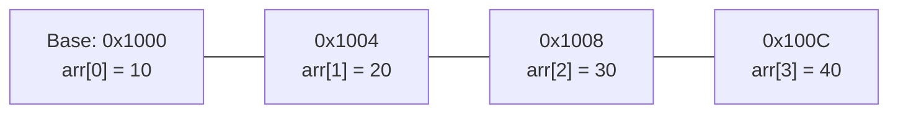

# L27 — 1D Static Arrays: RAM Memory Layout, Indexing & Boundaries

> [!NOTE]
> **Academic Grounding:** This lesson synthesizes concepts from **Chapter 11 (Sections 11.1–11.2: *The basic structure of an array*, pp. 493–501)** of the official Stanford CS106B textbook (*Programming Abstractions in C++* by Eric Roberts) and **Lecture 04** of MIT 6.096 ([`Lecture04_ArraysAndStrings.pdf`](../../files/mit6096/lectures/Lecture04_ArraysAndStrings.pdf)).

---

## üß≠ Quick Navigation

- 📄 **Base Academic Readings:**
  - 🌲 [Stanford CS106B Textbook — Ch 11.1–11.2: Static Arrays & Memory Allocation (pp. 493–501)](../../files/cs106b/textbook/CS106BX-Reader.pdf)
  - 🏛️ [MIT 6.096 — Lecture 04: Fixed-Size Array Allocation](../../files/mit6096/lectures/Lecture04_ArraysAndStrings.pdf)
- 💻 **Code Lab:** [`L27_ArrayBasics.cpp`](../code/L27_ArrayBasics.cpp)

---

## Learning Objectives

- [ ] Understand the structure of a static array as a contiguous, fixed-size block in RAM memory.
- [ ] Apply the mathematical memory address formula: $\text{Address}(i) = \text{BaseAddress} + i \times \text{sizeof}(\text{type})$.
- [ ] Declare and initialize static arrays using modern C++ uniform `{}` syntax.
- [ ] Diagnose and prevent Out-of-Bounds memory access and adjacent memory corruption.
- [ ] Calculate array length in its declaration scope via `sizeof(arr) / sizeof(arr[0])`.

---

## 1. Contiguous RAM Memory Layout

An **array** in C++ is an ordered collection of elements of the same type stored in **contiguous (consecutive)** RAM memory locations.



### Exact Memory Address Calculation

The memory address of the $i$-th element is calculated directly via arithmetic:

$$\text{Address}(i) = \text{Base Address} + (i \times \text{sizeof}(\text{type}))$$

> [!TIP]
> **Why do indices start at 0?**
> The index $i$ acts as an **offset multiplier** from the base address. Index `0` represents a zero offset ($0 \times \text{sizeof}(\text{type}) = 0$), pointing directly to the start of the data structure.

---

## 2. Declaration & Initialization in C++

```cpp
#include <iostream>
using namespace std;

int main() {
    // 1. Explicit size declaration & uniform initialization {}
    int grades[4]{10, 20, 30, 40};

    // 2. Zero initialization (all elements set to 0)
    int zeroes[5]{}; // {0, 0, 0, 0, 0}

    // 3. Partial initialization (remaining elements filled with 0)
    int partial[5]{10, 20}; // {10, 20, 0, 0, 0}

    // 4. Size automatically inferred by compiler
    double prices[]{19.99, 5.50, 42.0}; // Size = 3

    // 5. Array traversal
    for (int i = 0; i < 4; i++) {
        cout << "Element [" << i << "] = " << grades[i] << endl;
    }

    return 0;
}
```

> [!WARNING]
> **Memory Garbage from Uninitialized Local Arrays:**
> Local arrays declared without initialization (`int data[10];`) contain indeterminate values (*garbage values*) previously residing in the RAM memory cells allocated by the OS.

---

## 3. Out-of-Bounds Access

C++ prioritizes execution performance and **does not perform automatic bounds checking** on native arrays.

```cpp
int values[5]{1, 2, 3, 4, 5};
values[10] = 99; // ‚ùå DANGER: Writes to unreserved memory
```

> [!CAUTION]
> **Risks of Out-of-Bounds Access:**
> 1. **Neighboring Variable Overwrite:** Unintentionally modifies values of other variables on the Stack.
> 2. **Undefined Behavior (UB):** Produces unpredictable results across different compilers.
> 3. **Segmentation Fault:** If the requested address belongs to OS-protected memory, the process is immediately aborted.

---

## ‚ùì Checkpoint Questions & Active Retrieval

### Question #1 — Address Offset Calculation
An array `int table[8]` of type integer (`sizeof(int) == 4` bytes) starts at memory address `0x7FFF00`. What is the exact memory address of element `table[5]`?

<details>
<summary>üîç <strong>View Explanation & Calculation</strong></summary>

> [!NOTE]
> **Calculation:**  
> $$\text{Address} = \text{0x7FFF00} + (5 \times 4 \text{ bytes}) = \text{0x7FFF00} + 20 \text{ bytes (0x14 in hex)}$$  
> $$\text{Final Address} = \text{0x7FFF14}$$
>
> **Explanation:**  
> The processor multiplies index `5` by element size `4` bytes, yielding a 20-byte decimal offset (equivalent to `0x14` in base 16) added to the base address.

</details>

---

### Question #2 — Partial Initialization vs. Garbage Memory
Given declaration `int data[5]{10, 20};`, what value is stored in `data[3]` and why does it differ from `int garbage[5];`?

<details>
<summary>üîç <strong>View Explanation</strong></summary>

> [!NOTE]
> **Answer:** `data[3]` is `0`.  
>
> **Explanation:**  
> Providing a partial brace initialization list `{10, 20}` guarantees by C++ standard rules that all remaining unspecified elements are implicitly initialized to zero (`0`). In contrast, `int garbage[5];` lacks braces `{}` or initial values, leaving its 5 cells with uninitialized RAM garbage values.

</details>

---

## üìù L27 Summary

1. **Contiguous Structure:** Elements are placed consecutively without interruption in RAM memory.
2. **Fixed Static Size:** Native array size must be known at compile time and cannot be resized during runtime.
3. **O(1) Access:** Accessing any element `arr[i]` requires a single arithmetic operation in $O(1)$ time.
4. **Safety:** The programmer bears sole responsibility for ensuring indices stay within valid range $[0, N-1]$.

---

<div align="center">

### üß≠ Navigation & Progression

| ⬅️ Previous Lesson | 🏠 Section Home | ➡️ Next Lesson |
|:------------------:|:--------------:|:--------------:|
| [**⬅️ L26 — Headers & Prototypes**](../../03_Subroutines/theory/L26_HeadersAndPrototypes.md) | [**🏠 Arrays & Strings**](../README.md) | [**L28 — Arrays as Parameters ➡️**](L28_ArraysAsParameters.md) |

</div>

---
*MiniLux0 — Learning C++ Section 04*
---

<div align="center">
  <sub>Maintained by <strong>MiniLux0</strong> ∑ 2026</sub>
</div>