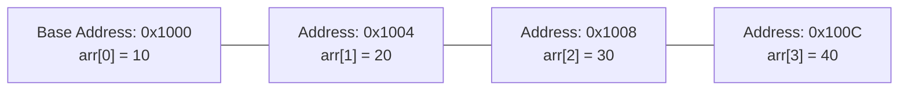

# Lesson 27 — Array Basics: Declaration, Contiguous Memory & Indexing

> [!NOTE]
> **Academic Foundation:** This lesson synthesizes core concepts from **Stanford CS106B Textbook Chapter 11** ([`CS106BX-Reader.pdf`](../../files/cs106b/textbook/CS106BX-Reader.pdf)) and **MIT 6.096 Lecture 04** ([`Lecture04_Arrays.pdf`](../../files/mit6096/lectures/Lecture04_Arrays.pdf)).

---

## 🧭 Quick Navigation

- 📄 **Base Academic Lectures:**
  - 🌲 [Stanford CS106B — Chapter 11: Arrays & Memory Allocation](../../files/cs106b/textbook/CS106BX-Reader.pdf)
  - 🏛️ [MIT 6.096 — Lecture 04: Fixed-Size Array Allocation](../../files/mit6096/lectures/Lecture04_Arrays.pdf)
- 💻 **Code Lab:** [`L27_ArrayBasics.cpp`](../code/L27_ArrayBasics.cpp)

---

## Learning Objectives

- [ ] Understand static arrays as fixed-size, contiguous blocks of RAM memory.
- [ ] Calculate memory offset formulas: $\text{address} = \text{base} + i \times \text{sizeof(type)}$.
- [ ] Declare and initialize native C++ fixed-size arrays (`int arr[5]`).
- [ ] Recognize and prevent Out-of-Bounds array indexing and memory corruption.

---

## 1. Contiguous RAM Memory Layout

An **array** is a collection of elements of the same data type stored in **contiguous (adjacent) RAM memory locations**:



$$\text{Element Address}(i) = \text{Base Address} + (i \times \text{sizeof}(\text{type}))$$

> [!TIP]
> **Why Indexing Starts at 0:**
> The index $i$ represents a **memory byte offset multiplier**. Index `0` means zero offset from the array's base memory address.

---

## 2. Declaration & Initialization

```cpp
#include <iostream>

int main() {
    // 1. Explicit Size & Uniform Brace Initialization
    int scores[4]{10, 20, 30, 40};

    // 2. Zero-Initialization
    int zeros[5]{}; // All 5 elements set to 0

    // 3. Array Traversal
    for (int i = 0; i < 4; i++) {
        std::cout << "Element [" << i << "] = " << scores[i] << "\n";
    }

    return 0;
}
```

> [!CAUTION]
> **Out-of-Bounds Memory Access:**
> C++ does NOT perform bounds checking on native arrays. Accessing `scores[10]` on a 4-element array accesses unreserved RAM memory, corrupting neighboring variables or causing a Segmentation Fault crash!

---

## ❓ Self-Assessment Checkpoint #1 — Memory Bounds Calculation

If an `int` array `arr[5]` starts at memory address `0x2000`, what is the RAM memory address of `arr[3]` assuming `sizeof(int) == 4` bytes?

<details>
<summary>🔍 <strong>View Explanation & Calculation</strong></summary>

> [!NOTE]
> **Calculation:** `0x2000` $+ (3 \times 4) =$ `0x2000` $+ 12$ bytes $=$ `0x200C`.
>
> **Explanation:**
> The CPU multiplies index `3` by `4` bytes (`sizeof(int)`), offsetting 12 bytes past the base address `0x2000` to arrive directly at `0x200C`.

</details>

---

## 📝 Summary & Key Takeaways

1. **Contiguous Storage:** Array elements are placed back-to-back in RAM.
2. **Fixed Size:** Native array size must be known at compile time and cannot be resized.
3. **Safety:** Always ensure indices remain within $[0, N-1]$.

---

<div align="center">

### 🧭 Navigation & Progression

| ⬅️ Previous Lesson | 🏠 Section Home | ➡️ Next Lesson |
|:------------------:|:--------------:|:--------------:|
| [**⬅️ L26 — Headers & Prototypes**](../../03_Subroutines/theory/L26_HeadersAndPrototypes.md) | [**🏠 Arrays & Strings**](../README.md) | [**L28 — Arrays as Parameters ➡️**](L28_ArraysAsParameters.md) |

</div>

---
*MiniLux0 — Learning C++ Section 04*