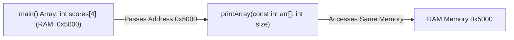

# Lesson 28 — Arrays as Parameters: Array Decay, Pass-by-Address & `const`

> [!NOTE]
> **Academic Foundation:** This lesson synthesizes core concepts from **Stanford CS106B Textbook Chapter 11** ([`CS106BX-Reader.pdf`](../../files/cs106b/textbook/CS106BX-Reader.pdf)) and **MIT 6.096 Lecture 04** ([`Lecture04_Arrays.pdf`](../../files/mit6096/lectures/Lecture04_Arrays.pdf)).

---

## 🧭 Quick Navigation

- 📄 **Base Academic Lectures:**
  - 🌲 [Stanford CS106B — Chapter 11: Array Parameters & Pointer Decay](../../files/cs106b/textbook/CS106BX-Reader.pdf)
  - 🏛️ [MIT 6.096 — Lecture 04: Passing Arrays to Functions](../../files/mit6096/lectures/Lecture04_Arrays.pdf)
- 💻 **Code Lab:** [`L28_ArraysAsParameters.cpp`](../code/L28_ArraysAsParameters.cpp)

---

## Learning Objectives

- [ ] Understand **Array Decay**: How arrays decay into pointers to their first element when passed to functions.
- [ ] Understand why array size must be passed explicitly as a separate parameter (`int size`).
- [ ] Protect array contents from accidental modification using `const int arr[]`.

---

## 1. Array Pointer Decay Mechanics

When an array is passed as a function argument, it is **NEVER copied**. Instead, the array name "decays" into a pointer holding the RAM memory address of its first element (`&arr[0]`):



```cpp
#include <iostream>

// arr decays to a pointer (const int* arr)
void printArray(const int arr[], int size) {
    for (int i = 0; i < size; i++) {
        std::cout << arr[i] << " ";
    }
    std::cout << "\n";
}

int main() {
    int data[3]{10, 20, 30};
    printArray(data, 3); // Passes memory address of data[0]
    return 0;
}
```

> [!IMPORTANT]
> **Why `sizeof(arr)` Fails inside Functions:**
> Inside `main()`, `sizeof(data)` returns $3 \times 4 = 12$ bytes. But inside `printArray()`, `sizeof(arr)` returns $8$ bytes (the size of a memory pointer on a 64-bit system!). This is why array size **MUST ALWAYS** be passed as a separate parameter.

---

## 2. Preventing Mutation with `const`

Because functions access original array elements in memory directly, omitting `const` allows the function to mutate `main()`'s array:

```cpp
void zeroOut(int arr[], int size) { // Modifies caller array!
    for (int i = 0; i < size; i++) arr[i] = 0;
}

void readOnly(const int arr[], int size) { // Read-only safety!
    // arr[0] = 5; // COMPILER ERROR! Forbidden write.
}
```

---

## ❓ Self-Assessment Checkpoint #1 — Pointer Decay

Why does passing a 1,000,000-element array to a function in C++ execute instantaneously with zero memory overhead?

<details>
<summary>🔍 <strong>View Explanation & Answer</strong></summary>

> [!NOTE]
> **Answer:** Array decay passes only an 8-byte memory address pointer.
>
> **Explanation:**
> C++ passes arrays by pointer address rather than copying element data. Passing a 1-element array vs. a 1,000,000-element array copies exactly 8 bytes of address data to the function's stack frame in $O(1)$ time.

</details>

---

## 📝 Summary & Key Takeaways

1. **Array Decay:** Arrays passed to functions decay into a pointer to element 0.
2. **Explicit Size:** Always pass array size explicitly (`int size`).
3. **Const Guard:** Use `const int arr[]` to protect read-only array parameters.

---

<div align="center">

### 🧭 Navigation & Progression

| ⬅️ Previous Lesson | 🏠 Section Home | ➡️ Next Lesson |
|:------------------:|:--------------:|:--------------:|
| [**⬅️ L27 — Array Basics**](L27_ArrayBasics.md) | [**🏠 Arrays & Strings**](../README.md) | [**L29 — Multidimensional Arrays ➡️**](L29_MultidimensionalArrays.md) |

</div>

---
*MiniLux0 — Learning C++ Section 04*
