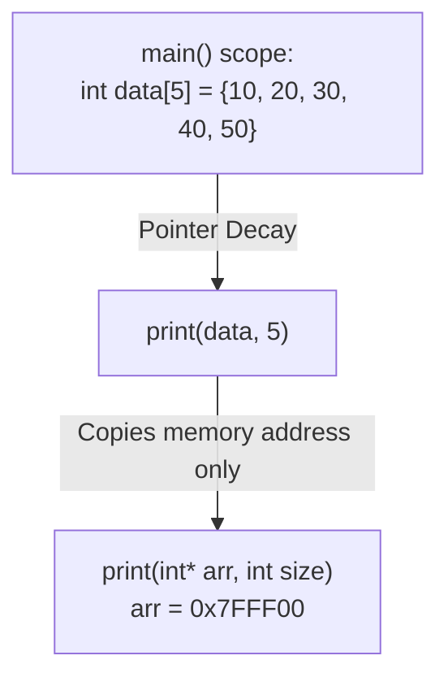

# L28 — Arrays as Parameters: Pointer Decay (*Array Decay*) & `const` Parameters

> [!NOTE]
> **Academic Grounding:** This lesson synthesizes concepts from **Chapter 11 (Section 11.3: *Passing arrays as parameters*, pp. 501–506)** of the official Stanford CS106B textbook (*Programming Abstractions in C++* by Eric Roberts) and **Lecture 04** of MIT 6.096 ([`Lecture04_ArraysAndStrings.pdf`](../../files/mit6096/lectures/Lecture04_ArraysAndStrings.pdf)).

---

## 🧭 Quick Navigation

- 📄 **Base Academic Readings:**
  - 🌲 [Stanford CS106B Textbook — Ch 11.3: Passing Arrays as Parameters (pp. 501–506)](../../files/cs106b/textbook/CS106BX-Reader.pdf)
  - 🏛️ [MIT 6.096 — Lecture 04: Fixed-Size Array Allocation](../../files/mit6096/lectures/Lecture04_ArraysAndStrings.pdf)
- 💻 **Code Lab:** [`L28_ArraysAsParameters.cpp`](../code/L28_ArraysAsParameters.cpp)

---

## Learning Objectives

- [ ] Understand **Pointer Decay (*Array Decay*)** when passing native arrays to functions.
- [ ] Explain why signatures `void func(int arr[])` and `void func(int* arr)` are completely identical to the compiler.
- [ ] Justify the **mandatory requirement** to pass array length as a separate integer parameter.
- [ ] Apply `const` qualifier to protect arrays against accidental modifications (*Read-Only Parameters*).
- [ ] Modify arrays *in-place* inside subroutines leveraging implicit pass-by-address semantics.

---

## 1. Pointer Decay (*Array Decay*)

When a native array is passed as an argument to a function in C++, **the array is not copied**. Instead, the variable automatically decays into a raw pointer holding the memory address of the first element (`&arr[0]`):



> [!NOTE]
> **💡 PEDAGOGICAL NOTE ON POINTERS (`int*`):**  
> In C++, passing an array transmits the starting memory address of its first element (technically called pointer decay `int*`). Do not worry if `int*` syntax looks new: pointers as a formal topic will be mastered in **Section 06 (`06_Pointers`)**. For now, simply understand that the function receives a direct alias to the original array's first RAM memory cell in `main()`.

> [!IMPORTANT]
> **Function Signature Equivalence:**  
> The following three function declarations are 100% identical to the C++ compiler:
> ```cpp
> void process(int arr[], int size);
> void process(int arr[100], int size); // Value 100 is completely ignored by compiler
> void process(int* arr, int size);
> ```

---

## 2. Loss of `sizeof` Operator in Functions

Within its original declaration scope, `sizeof(arr)` calculates the total size in bytes. However, inside a function where decay occurred, `sizeof(arr)` returns only the pointer size (4 or 8 bytes depending on 32-bit or 64-bit architecture):

```cpp
#include <iostream>
using namespace std;

void demonstrateDecay(int arr[]) {
    // ❌ ERROR: sizeof(arr) evaluates pointer size (8 bytes), NOT array size!
    // int count = sizeof(arr) / sizeof(arr[0]); 
}
```

> [!WARNING]
> **The Separate Dimension Rule:**  
> Because a receiving function receives only a raw memory address, **it is strictly mandatory to pass the element count (`int size`) as an independent parameter**.

---

## 3. In-Place Modification vs. `const` Protection

### 1. In-Place Modification (Read / Write)
Any element changes performed inside the function alter the original array memory in `main()` directly:

```cpp
#include <iostream>
using namespace std;

void doubleValues(int arr[], int size) {
    for (int i = 0; i < size; i++) {
        arr[i] *= 2; // Modifies original RAM memory
    }
}
```

### 2. `const` Protection (Read-Only)
To prevent an inspection function from accidentally modifying data, prefix the `const` qualifier:

```cpp
#include <iostream>
using namespace std;

void printArray(const int arr[], int size) {
    // arr[0] = 99; // ❌ COMPILE ERROR: Array is read-only
    for (int i = 0; i < size; i++) {
        cout << arr[i] << " ";
    }
    cout << endl;
}
```

---

## ❓ Checkpoint Questions & Active Retrieval

### Question #1 — `sizeof` & Pointer Decay Diagnostic
Analyze the execution of the following snippet on a 64-bit system (`sizeof(int*) == 8` bytes, `sizeof(int) == 4` bytes):

```cpp
#include <iostream>
using namespace std;

void compute(int data[]) {
    cout << sizeof(data) << endl;
}

int main() {
    int arr[10]{1, 2, 3};
    cout << sizeof(arr) << endl;
    compute(arr);
}
```

**What outputs are printed in `main` and inside `compute`?**

<details>
<summary>🔍 <strong>View Explanation & Answer</strong></summary>

> [!NOTE]
> **Answer:**  
> Output 1 (`main`): `40`  
> Output 2 (`compute`): `8`
>
> **Explanation:**  
> In `main()`, `arr` is an array of 10 integers, yielding $`10 \times 4 \text{ bytes} = 40`$ bytes.  
> When calling `compute(arr)`, the array decays into an `int*` pointer. Thus `sizeof(data)` prints the 64-bit pointer size, which is 8 bytes.

</details>

---

### Question #2 — `const` Parameter Safety
Given signature `void searchElem(const int arr[], int size, int target);`, what happens if a programmer writes `arr[0] = 0;` inside `searchElem`?

<details>
<summary>🔍 <strong>View Explanation</strong></summary>

> [!NOTE]
> **Answer:** An immediate compilation error is generated.
>
> **Explanation:**  
> Declaring the parameter as `const int arr[]` marks the memory block pointed to by `arr` as read-only. Attempting to modify any index causes a build failure during compilation, protecting original client data.

</details>

---

## 📝 L28 Summary

1. **Pointer Decay:** Passing an array transmits only the memory address of its first element.
2. **O(1) Efficiency:** No element copying occurs; argument passing takes constant $`O(1)`$ time regardless of whether the array holds 10 or 1,000,000 elements.
3. **Mandatory `size` Parameter:** Any function receiving a static native array must explicitly receive its length.
4. **Const-Correctness:** Use `const int arr[]` in read-only functions to guarantee immutability.

---

<div align="center">

### 🧭 Navigation & Progression

| ⬅️ Previous Lesson | 🏠 Section Home | ➡️ Next Lesson |
|:------------------:|:--------------:|:--------------:|
| [**⬅️ L27 — 1D Static Arrays**](L27_ArrayBasics.md) | [**🏠 Arrays & Strings**](../README.md) | [**L29 — Multidimensional Arrays ➡️**](L29_MultidimensionalArrays.md) |

</div>


---

<div align="center">
  <sub>Maintained by <strong>MiniLux0</strong> · 2026</sub>
</div>