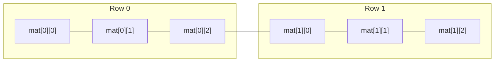

# L29 — Multidimensional Arrays: 2D Matrices & Row-Major Order Layout

> [!NOTE]
> **Academic Grounding:** This lesson synthesizes concepts from **Chapter 11 (Section 11.4: *Multidimensional arrays*, pp. 506–510)** of the official Stanford CS106B textbook (*Programming Abstractions in C++* by Eric Roberts) and **Lecture 04** of MIT 6.096 ([`Lecture04_ArraysAndStrings.pdf`](../../files/mit6096/lectures/Lecture04_ArraysAndStrings.pdf)).

---

## 🧭 Quick Navigation

- 📄 **Base Academic Readings:**
  - 🌲 [Stanford CS106B Textbook — Ch 11.4: Multidimensional Arrays (pp. 506–510)](../../files/cs106b/textbook/CS106BX-Reader.pdf)
  - 🏛️ [MIT 6.096 — Lecture 04: Matrix Memory Layout](../../files/mit6096/lectures/Lecture04_ArraysAndStrings.pdf)
- 💻 **Code Lab:** [`L29_MultidimensionalArrays.cpp`](../code/L29_MultidimensionalArrays.cpp)

---

## Learning Objectives

- [ ] Understand 2D matrix abstraction (`ROWS` $`\times`$ `COLS`) mapped onto linear RAM memory.
- [ ] Master storage layout in **Row-Major Order**.
- [ ] Apply the 2D-to-1D index flattening formula: $`\text{Offset} = (i \times \text{COLS}) + j`$.
- [ ] Declare multidimensional arrays in functions specifying secondary column dimensions mandatorily.
- [ ] Implement classic matrix algorithms (Sum, Transposition, Row/Column traversals).

---

## 1. RAM Memory Layout: Row-Major Order

Although we conceptually visualize a 2D matrix as a grid with rows and columns, physical RAM memory is strictly **unidimensional**.

In C and C++, matrices are stored in **Row-Major Order** (row 0 complete is placed first, followed consecutively by row 1 complete, and so on):



### 2D-to-1D Index Flattening Formula

To access cell at row $`i`$ and column $`j`$ in a matrix of size $`R \times C`$:
```math
\text{1D Flat Index} = (i \times C) + j
``````math
\text{Memory Address} = \text{Base} + [((i \times C) + j) \times \text{sizeof}(\text{type})]
```
---

## 2. Matrix Declaration & Initialization

```cpp
#include <iostream>
using namespace std;

const int ROWS = 3;
const int COLS = 4;

int main() {
    // Declaration and row-by-row initialization
    int matrix[ROWS][COLS]{
        { 1,  2,  3,  4},  // Row 0
        { 5,  6,  7,  8},  // Row 1
        { 9, 10, 11, 12}   // Row 2
    };

    // Nested traversal (Outer row loop, inner column loop)
    for (int i = 0; i < ROWS; i++) {
        for (int j = 0; j < COLS; j++) {
            cout << matrix[i][j] << "\t";
        }
        cout << endl;
    }

    return 0;
}
```

---

## 3. Matrices as Function Parameters

When passing a 2D matrix to a function, the compiler must know the column dimension to evaluate the memory address formula $`(i \times C) + j`$.

> [!IMPORTANT]
> **The Secondary Dimension Rule:**  
> Column dimension **MUST be explicitly declared** in function signatures. The first dimension (rows) can be omitted or passed as a separate variable:
> ```cpp
> // ✅ CORRECT: Compiler knows COLS for pointer arithmetic
> void processMatrix(int mat[][4], int rows);
> 
> // ❌ COMPILE ERROR: Missing column dimension
> // void processMatrix(int mat[][], int rows, int cols); 
> ```

---

## ❓ Checkpoint Questions & Active Retrieval

### Question #1 — 1D Flat Index Calculation
Given matrix `int grid[4][5]` (4 rows, 5 columns). If representing this matrix in an equivalent 1D array `int flat[20]`, what is the 1D flat index of cell `grid[2][3]`?

<details>
<summary>🔍 <strong>View Explanation & Calculation</strong></summary>

> [!NOTE]
> **Calculation:**  
```math
\text{Flat Index} = (i \times \text{COLS}) + j = (2 \times 5) + 3 = 10 + 3 = 13
```
>
> **Explanation:**  
> The first 2 rows (indices 0 and 1) occupy $`2 \times 5 = 10`$ elements. Adding 3 column offsets in row 2 ($`j = 3`$), the element sits at index `13` in the flattened array.

</details>

---

### Question #2 — Column Parameter Requirement
Why does the C++ compiler reject signature `void print(int mat[][], int r, int c)` while accepting `void print(int mat[][10], int r)`?

<details>
<summary>🔍 <strong>View Explanation</strong></summary>

> [!NOTE]
> **Answer:** Because it needs to know column count to calculate row stride in RAM memory.
>
> **Explanation:**  
> In Row-Major order, jumping from row `i` to row `i+1` requires advancing $`C \times \text{sizeof(type)}`$ bytes. If column count $`C`$ is unknown at compile time, the compiler cannot generate machine code to access `mat[i][j]`.

</details>

---

## 📝 L29 Summary

1. **Row-Major Order:** C++ stores matrices row by row consecutively in RAM memory.
2. **Cache Locality:** Traversing a matrix in row order (outer loop `i`, inner loop `j`) is significantly faster than column traversal due to continuous cache memory fetches.
3. **Mandatory Columns:** In 2D array parameters, column dimension is required at compile time.

---

<div align="center">

### 🧭 Navigation & Progression

| ⬅️ Previous Lesson | 🏠 Section Home | ➡️ Next Lesson |
|:------------------:|:--------------:|:--------------:|
| [**⬅️ L28 — Arrays as Parameters**](L28_ArraysAsParameters.md) | [**🏠 Arrays & Strings**](../README.md) | [**L30A — `<cstring>` Library ➡️**](L30A_CStrings.md) |

</div>


---

<div align="center">
  <sub>Maintained by <strong>MiniLux0</strong> · 2026</sub>
</div>