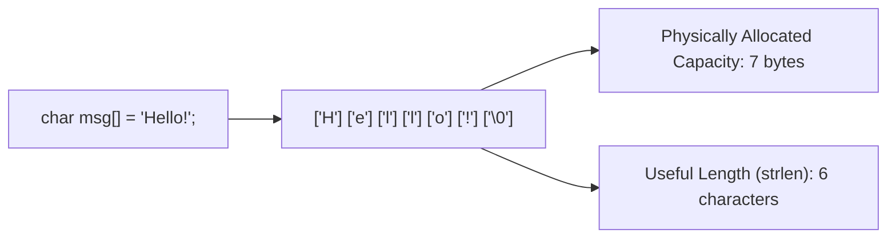

# L30A — `<cstring>` Library & Traditional C-Strings: `char[]` Arrays & Null Sentinel (`'\0'`)

> [!NOTE]
> **Academic Grounding:** This lesson synthesizes concepts from **Chapter 3 (Section 3.5: *The legacy of C-style strings*, pp. 140–141)** of the official Stanford CS106B textbook (*Programming Abstractions in C++* by Eric Roberts) and **Lecture 04** of MIT 6.096 ([`Lecture04_ArraysAndStrings.pdf`](../../files/mit6096/lectures/Lecture04_ArraysAndStrings.pdf)).

---

## 🧭 Quick Navigation

- 📄 **Base Academic Readings:**
  - 🌲 [Stanford CS106B Textbook — Ch 3.5: C-Style Strings (pp. 140–141)](https://web.stanford.edu/class/cs106x/res/reader/CS106BX-Reader.pdf)
  - 🏛️ [MIT 6.096 — Lecture 04: Character Arrays & Buffer Overflows](../../files/mit6096/lectures/Lecture04_ArraysAndStrings.pdf)
- 💻 **Code Lab:** [`L30A_CStrings.cpp`](../code/L30A_CStrings.cpp)

---

## Learning Objectives

- [ ] Understand C-style strings (*C-Strings*) as native `char[]` character arrays terminated with **`'\0'` null sentinel (ASCII 0)**.
- [ ] Differentiate between **physical array capacity** and **useful text length** ($`\text{Capacity} \ge \text{strlen} + 1`$).
- [ ] Master core functions from `#include <cstring>` (`strlen`, `strcpy`, `strcat`, `strcmp`, `strchr`).
- [ ] Prevent Buffer Overflow vulnerabilities and un-delimited memory reads.

---

## 1. The Null Sentinel Character (`'\0'`) in `#include <cstring>`

In legacy C and C++, a character string is a native `char[]` array whose useful content must be terminated with the **null sentinel `'\0'` (ASCII 0)**.



> [!CAUTION]
> **The Null Sentinel Rule (+1 Byte):**  
> An array storing a C-String of $`N`$ visible characters **MUST reserve at least $`N+1`$ bytes** in RAM to hold the `'\0'` character. Omitting the null sentinel causes functions like `strlen()` or `cout` to read past array boundaries into adjacent memory.

---

## 2. Full `#include <cstring>` Library Reference

```cpp
#include <iostream>
#include <cstring> // Classical C-String functions
using namespace std;

int main() {
    char src[] = "Hello";
    char buffer[20];

    // 1. Useful length (excludes '\0')
    cout << "strlen: " << strlen(src) << endl; // Returns 5

    // 2. Memory copy
    strcpy(buffer, src);

    // 3. Concatenation
    strcat(buffer, " C++");

    // 4. Lexicographical comparison (0 indicates exact match)
    if (strcmp(buffer, "Hello C++") == 0) {
        cout << "Strings match exactly!" << endl;
    }

    return 0;
}
```

### 📋 `#include <cstring>` Operations

| Function | Description | Complexity | Safety Notes |
| :--- | :--- | :---: | :--- |
| `strlen(str)` | Calculates character count before `'\0'`. | $`O(N)`$ | Requires `str` to contain `'\0'`. |
| `strcpy(dest, src)` | Copies characters from `src` to `dest`. | $`O(N)`$ | Risk of Buffer Overflow if `dest` is too small. |
| `strcat(dest, src)` | Appends `src` to end of `dest`. | $`O(N)`$ | Overwrites original `'\0'` of `dest`. |
| `strcmp(s1, s2)` | Compares lexicographical order ($`<0`$, $`0`$, $`>0`$). | $`O(N)`$ | Case-sensitive comparison. |
| `strchr(str, ch)` | Finds first occurrence of character `ch`. | $`O(N)`$ | Returns `char*` pointer to char or `nullptr`. |

---

## ❓ Checkpoint Questions & Active Retrieval

### Question #1 — Memory Capacity & Null Sentinel
What exact value is returned by `sizeof("C++")` when declared as a C-string literal, and why does it differ from `strlen("C++")`?

<details>
<summary>🔍 <strong>View Explanation & Answer</strong></summary>

> [!NOTE]
> **Answer:** `sizeof("C++")` returns `4` bytes, whereas `strlen("C++")` returns `3`.
>
> **Explanation:**  
> String literal `"C++"` contains 3 visible characters (`'C'`, `'+'`, `'+'`) plus 1 null sentinel character `'\0'` inserted implicitly by the compiler at the end, requiring 4 continuous bytes in memory. `strlen` measures only visible text length excluding `'\0'`.

</details>

---

### Question #2 — Buffer Overflow Risk with `strcpy`
Given `char dest[5];`, what danger occurs when executing `strcpy(dest, "Toolbox");`?

<details>
<summary>🔍 <strong>View Explanation</strong></summary>

> [!NOTE]
> **Answer:** It causes a Buffer Overflow.
>
> **Explanation:**  
> `"Toolbox"` requires 8 bytes (7 characters + `'\0'`). Copying it into `dest` (capacity of 5 bytes) causes `strcpy` to overwrite 3 adjacent RAM memory bytes, corrupting local variables or crashing the program.

</details>

---

## 📝 L30A Summary

1. **`<cstring>` Library:** Designed to operate on native `char[]` arrays from C language.
2. **Null Sentinel:** Every C-String relies on byte `'\0'` to delimit text boundary.
3. **Mandatory Capacity:** Always allocate at least $`\text{strlen}(s) + 1`$ bytes to store `'\0'`.

---

<div align="center">

### 🧭 Navigation & Progression

| ⬅️ Previous Lesson | 🏠 Section Home | ➡️ Next Lesson |
|:------------------:|:--------------:|:--------------:|
| [**⬅️ L29 — Multidimensional Arrays**](L29_MultidimensionalArrays.md) | [**🏠 Arrays & Strings**](../README.md) | [**L30B — `<string>` Library ➡️**](L30B_StdString.md) |

</div>


---

<div align="center">
  <sub>Maintained by <strong>MiniLux0</strong> · 2026</sub>
</div>