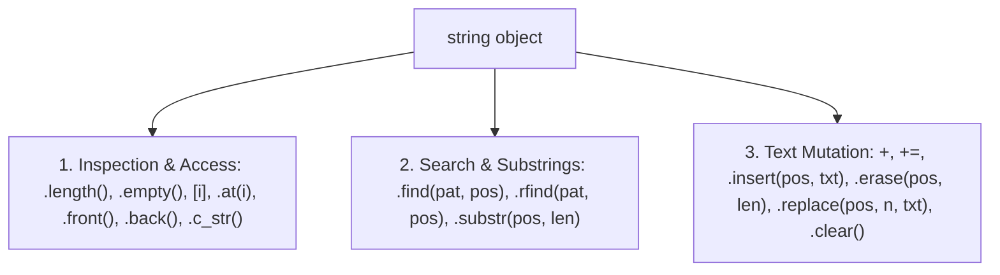

# L30B — `<string>` Library & Modern `string` Object: Initialization, Operations & Method Usage

> [!NOTE]
> **Academic Grounding:** This lesson synthesizes concepts from **Chapter 3 (Sections 3.1–3.4: *Using strings as abstract values*, *String operations*, *Modifying contents*, pp. 125–140)** of the official Stanford CS106B textbook (*Programming Abstractions in C++* by Eric Roberts) and **Stanford CS106L** lectures.

---

## 🧭 Quick Navigation

- 📄 **Base Academic Readings:**
  - 🌲 [Stanford CS106B Textbook — Ch 3.1–3.4: Strings (pp. 125–140)](../../files/cs106b/textbook/CS106BX-Reader.pdf)
- 💻 **Code Lab:** [`L30B_StdString.cpp`](../code/L30B_StdString.cpp)

---

## Learning Objectives

- [ ] Master all ways of declaring and **initializing `string` objects** in C++.
- [ ] Apply constant reference passing (`const string&`) to eliminate costly heap copying overhead.
- [ ] Utilize in real code **inspection and access** operations (`length`, `empty`, `[]`, `at`, `front`, `back`, `c_str`).
- [ ] Utilize in real code **search and extraction** operations (`find`, `rfind`, `string::npos`, `substr`).
- [ ] Utilize in real code **mutation** operations (`+`, `+=`, `insert`, `erase`, `replace`, `clear`).

---

## 1. How to Declare & Initialize `string` Objects?

In C++, the `string` object (included via `#include <string>`) offers multiple constructors to initialize text strings flexibly and safely:

```cpp
#include <iostream>
#include <string>
using namespace std;

int main() {
    // 1. Empty String (Length 0, no characters)
    string s1;

    // 2. Direct Initialization with Text Literal
    string s2 = "Hello C++";

    // 3. Uniform Initialization with Braces {} (C++11+)
    string s3{"World"};

    // 4. Fill Initialization (N copies of a character)
    string s4(5, '*'); // Produces "*****"

    // 5. Copy Initialization
    string s5 = s2; // s5 holds "Hello C++"

    // 6. Substring Initialization from another string (source, pos, len)
    string s6(s2, 0, 5); // Extracts "Hello" starting at index 0 with length 5

    cout << "s1: \"" << s1 << "\"" << endl;
    cout << "s2: \"" << s2 << "\"" << endl;
    cout << "s3: \"" << s3 << "\"" << endl;
    cout << "s4: \"" << s4 << "\"" << endl;
    cout << "s5: \"" << s5 << "\"" << endl;
    cout << "s6: \"" << s6 << "\"" << endl;

    return 0;
}
```

---

## 2. Abstract Strings vs. Traditional C-Strings

| Property | Traditional C-Strings (`char[]` from `<cstring>`) | Modern `string` Object (`#include <string>`) |
| :--- | :--- | :--- |
| **Memory Allocation** | Fixed size determined at compile time | Dynamic heap management with auto-resizing |
| **Null Sentinel** | Requires manual `'\0'` storage | Handled internally (compatible with `.c_str()`) |
| **Assignment & Copy** | Requires `strcpy(dest, src)` | Direct assignment with `=` operator |
| **Concatenation** | Requires `strcat(dest, src)` | Intuitive `str1 + str2` operator |
| **Comparison** | Requires `strcmp(s1, s2) == 0` | Direct relational operators `==`, `<`, `>` |
| **Parameter Passing** | Pointer decay `const char*` | Constant reference passing `const string&` |

> [!IMPORTANT]
> **The Constant Reference Rule (`const string&`):**  
> 
> - ❌ **Pass by Value (`void func(string s)`):** C++ requests additional RAM memory on the **Heap** and performs a **full copy of $N$ characters** ($O(N)$ time & space). Equivalent to printing a full physical photocopy of a 500-page document before handing it over.
> - ✅ **Pass by Constant Reference (`void func(const string& s)`):** The `&` operator transmits **only the memory address** of the original string (8 bytes on Stack), achieving constant **$O(1)$ instant transfer time**. The `const` keyword protects the original string from accidental modifications. Equivalent to sharing a read-only Google Doc link.

---

## 3. Method Reference Table & Code Examples



### 📋 `#include <string>` Method Reference

| Method / Operator | Detailed Description | Complexity | Result / Return |
| :--- | :--- | :---: | :--- |
| `str.length()` / `str.size()` | Returns number of useful characters in string. Both are 100% identical. | $O(1)$ | `size_t` |
| `str.empty()` | Checks if string is empty (`length() == 0`). Faster and cleaner than checking length vs 0. | $O(1)$ | `bool` |
| `str[i]` | Accesses character at index `i` **without bounds checking**. (Fast, but `i >= length()` causes Undefined Behavior). | $O(1)$ | `char&` / `const char&` |
| `str.at(i)` | Accesses character at index `i` **with bounds checking**. If out of range, throws `out_of_range` exception. | $O(1)$ | `char&` / `const char&` |
| `str.front()` / `str.back()` | Accesses first (`str[0]`) and last (`str[length()-1]`) character respectively. | $O(1)$ | `char&` / `const char&` |
| `str + target` | Concatenates two strings creating a **new `string` object** on the heap. Does not modify `str`. | $O(N+M)$ | `string` (new heap copy) |
| `str += target` | Appends characters to the end **modifying the original variable in-place**. Reuses capacity without heap copies. | $O(M)$ amortized | `string&` (mutable reference) |
| `str.substr(pos, len)` | Extracts substring starting at index `pos` with length `len`. If `len` is omitted, extracts to end. | $O(\text{len})$ | `string` (new heap substring) |
| `str.find(pat, pos)` | Searches for substring `pat` starting from index `pos` forward (`pos` defaults to `0`). Case-sensitive. | $O(N \cdot M)$ | `size_t` index (`string::npos` if not found) |
| `str.rfind(pat, pos)` | Searches for substring `pat` scanning backward from index `pos` (`pos` defaults to string end). | $O(N \cdot M)$ | `size_t` index (`string::npos` if not found) |
| `str.insert(pos, text)` | Inserts `text` before index `pos`, shifting subsequent characters right. Modifies in-place. | $O(N)$ | `string&` (mutable reference) |
| `str.erase(pos, len)` | Deletes `len` characters starting at `pos`. If `len` is omitted, deletes everything to string end. Modifies in-place. | $O(N)$ | `string&` (mutable reference) |
| `str.replace(pos, n, text)`| Deletes `n` characters at `pos` and inserts `text` in that position. Modifies original in-place. | $O(N)$ | `string&` (mutable reference) |
| `str.c_str()` | Returns read-only `const char*` pointer to internal null-terminated C-string. (Useful for legacy C APIs). | $O(1)$ | `const char*` |
| `str.clear()` | Deletes all characters leaving string empty (`length() == 0`). Preserves heap capacity. | $O(1)$ | `void` |

---

### 🔹 A) Inspection & Character Access Methods

```cpp
#include <iostream>
#include <string>
using namespace std;

int main() {
    string text = "Structures";

    // 1. Length and empty check
    cout << "Length: " << text.length() << endl; // 10
    cout << "Is empty? " << (text.empty() ? "YES" : "NO") << endl; // NO

    // 2. Unchecked [] vs Checked .at() index access
    cout << "First char [0]: " << text[0] << endl;        // 'S'
    cout << "Char at .at(3): " << text.at(3) << endl;      // 'u'

    // 3. Fast front and back access
    cout << "First (front): " << text.front() << endl;       // 'S'
    cout << "Last (back):    " << text.back() << endl;        // 's'

    // 4. Classical C-String conversion (const char*)
    const char* cstr = text.c_str();
    cout << "C-String Pointer: " << cstr << endl;

    return 0;
}
```

---

### 🔹 B) Search (`find`, `rfind`) & Substring (`substr`) Methods

```cpp
#include <iostream>
#include <string>
using namespace std;

int main() {
    string sentence = "The C++ language is a powerful language";

    // 1. Forward search: find(pattern, start_pos)
    size_t pos1 = sentence.find("language");    // Returns 8 (first occurrence)
    size_t pos2 = sentence.find("language", 9); // Returns 30 (second occurrence after index 9)

    cout << "First occurrence of 'language': " << pos1 << endl;
    cout << "Second occurrence of 'language': " << pos2 << endl;

    // 2. Searching for missing pattern (returns string::npos)
    size_t notFound = sentence.find("Python");
    if (notFound == string::npos) {
        cout << "'Python' was not found in string." << endl;
    }

    // 3. Extract substring: substr(start_pos, length)
    string sub1 = sentence.substr(8, 8); // Extracts "language" (8 chars from index 8)
    string sub2 = sentence.substr(30);   // Extracts "language" (from index 30 to end)

    cout << "Substring 1: \"" << sub1 << "\"" << endl;
    cout << "Substring 2: \"" << sub2 << "\"" << endl;

    return 0;
}
```

---

### 🔹 C) Mutation Methods (`+`, `+=`, `insert`, `erase`, `replace`, `clear`)

```cpp
#include <iostream>
#include <string>
using namespace std;

int main() {
    string msg = "Hello";

    // 1. Concatenation with += (Modifies in-place without copies)
    msg += " World"; // msg is "Hello World"

    // 2. Insertion: insert(pos, text)
    msg.insert(5, " Dear"); // Inserts at index 5 -> "Hello Dear World"
    cout << "After insert:  \"" << msg << "\"" << endl;

    // 3. Replacement: replace(start_pos, count_to_delete, new_text)
    msg.replace(6, 4, "Awesome"); // Deletes 4 chars ("Dear") and inserts "Awesome"
    cout << "After replace: \"" << msg << "\"" << endl; // "Hello Awesome World"

    // 4. Erasure: erase(start_pos, count)
    msg.erase(5, 8); // Deletes 8 chars starting at index 5 (" Awesome")
    cout << "After erase:   \"" << msg << "\"" << endl; // "Hello World"

    // 5. Clear string: clear()
    msg.clear();
    cout << "After clear(): Length = " << msg.length() << endl; // Length = 0

    return 0;
}
```

---

## ❓ Checkpoint Questions & Active Retrieval

### Question #1 — Substrings & Case Sensitivity
Given string `string s = "CS106B Programming";`, what is the result of `s.substr(2, 4)` and what does `s.find("programming")` return?

<details>
<summary>🔍 <strong>View Explanation & Answer</strong></summary>

> [!NOTE]
> **Answer:**  
> - `s.substr(2, 4)` $\rightarrow$ `"106B"` (starts at index 2 and takes 4 characters).  
> - `s.find("programming")` $\rightarrow$ `string::npos` (special constant meaning *"not found"*).
>
> **Explanation:**  
> Searching with `.find()` in C++ is **strictly case-sensitive**. Searching `"programming"` with lowercase `'p'` fails because string `s` contains `"Programming"` with uppercase `'P'`. Since there is no exact match, `.find()` returns `string::npos`.

</details>

---

### Question #2 — Access Safety: `.at()` vs. `operator[]`
What difference occurs when executing `s[100]` versus `s.at(100)` if `s.length() == 18`?

<details>
<summary>🔍 <strong>View Explanation</strong></summary>

> [!NOTE]
> **Answer:**  
> - `s[100]` causes Out-of-Bounds Access (Undefined Behavior).  
> - `s.at(100)` safely throws an `out_of_range` exception.
>
> **Explanation:**  
> `operator[]` performs direct unchecked memory access for speed. `.at()` verifies if index lies in $[0, \text{length}-1]$, throwing a safe exception that can be caught with `try/catch`.

</details>

---

### Question #3 — String Mutation (`insert`, `erase`, `replace`)
Given string `string msg = "Hello World";`, what is the content of `msg` after executing `msg.replace(6, 5, "C++");`?

<details>
<summary>🔍 <strong>View Explanation</strong></summary>

> [!NOTE]
> **Answer:** `"Hello C++"`
>
> **Explanation:**  
> Method `msg.replace(6, 5, "C++")` takes the 5-character substring starting at index 6 (`"World"`) and replaces it with `"C++"`, reducing `msg` length from 11 to 9 characters.

</details>

---

## 📝 L30B Summary

1. **Initialization Forms:** Direct `=`, uniform `{}`, fill `string(n, ch)`, or substring `string(s, pos, len)`.
2. **Automatic Management:** Dynamically allocates and resizes its memory on the heap.
3. **Efficient Passing:** Always use `const string&` in read-only functions to avoid $O(N)$ heap copies.
4. **Searching & Mutation:** Validate matches against `string::npos`. Methods like `insert`, `erase`, and `replace` modify string *in-place*.

---

<div align="center">

### 🧭 Navigation & Progression

| ⬅️ Previous Lesson | 🏠 Section Home | ➡️ Next Lesson |
|:------------------:|:--------------:|:--------------:|
| [**⬅️ L30A — `<cstring>` Library**](L30A_CStrings.md) | [**🏠 Arrays & Strings**](../README.md) | [**L30C — `<cctype>` Library ➡️**](L30C_CCtype.md) |

</div>

---
*MiniLux0 — Learning C++ Section 04*