# L30C — `<cctype>` Library: Character Inspection, Classification & Transformation

> [!NOTE]
> **Academic Grounding:** This lesson synthesizes concepts from the C++ standard library `#include <cctype>` (inherited from C header `<ctype.h>`) described in **Chapter 3 (Section 3.3: *The `<cctype>` library*, pp. 137–138)** of the official Stanford CS106B textbook (*Programming Abstractions in C++* by Eric Roberts).

---

## 🧭 Quick Navigation

- 📄 **Base Academic Readings:**
  - 🌲 [Stanford CS106B Textbook — Ch 3.3: The cctype library (pp. 137–138)](https://web.stanford.edu/class/cs106x/res/reader/CS106BX-Reader.pdf)
- 💻 **Code Lab:** [`L30C_CCtype.cpp`](../code/L30C_CCtype.cpp)

---

## Learning Objectives

- [ ] Understand the purpose of `#include <cctype>` for inspecting individual `char` elements.
- [ ] Apply boolean inspection functions (`isalpha`, `isdigit`, `isalnum`, `islower`, `isupper`, `isspace`, `ispunct`).
- [ ] Apply case conversion functions (`tolower`, `toupper`).
- [ ] Implement safe casting using `static_cast<unsigned char>(ch)` to prevent Undefined Behavior with signed character values (*signed char*).

---

## 1. Purpose & Independence of `#include <cctype>`

Unlike `#include <string>` (which manages full string objects) or `#include <cstring>` (which manages `char[]` arrays), **`#include <cctype>` is designed exclusively to inspect and transform individual characters (`char`)**.



---

## 2. Full `#include <cctype>` Function Reference

```cpp
#include <iostream>
#include <cctype> // Character inspection library
using namespace std;

int main() {
    char c = 'a';

    if (isalpha(static_cast<unsigned char>(c))) {
        cout << "'" << c << "' is an alphabetic letter." << endl;
    }

    char upper = static_cast<char>(toupper(static_cast<unsigned char>(c)));
    cout << "Uppercase: " << upper << endl; // Prints 'A'

    return 0;
}
```

### 📋 `#include <cctype>` Operations

| Function | Evaluated Condition / Operation | True Examples / Result |
| :--- | :--- | :--- |
| `isalpha(ch)` | Checks if `ch` is an alphabetic letter ( $A-Z, a-z$ ). | `'a'`, `'Z'` |
| `isdigit(ch)` | Checks if `ch` is a numeric digit ( $0-9$ ). | `'0'`, `'9'` |
| `isalnum(ch)` | Checks if `ch` is alphanumeric (`isalpha` or `isdigit`). | `'a'`, `'5'` |
| `islower(ch)` | Checks if `ch` is a lowercase letter ( $a-z$ ). | `'e'`, `'z'` |
| `isupper(ch)` | Checks if `ch` is an uppercase letter ( $A-Z$ ). | `'A'`, `'M'` |
| `isspace(ch)` | Checks if `ch` is a whitespace character (`' '`, `'\t'`, `'\n'`). | `' '`, `'\n'` |
| `ispunct(ch)` | Checks if `ch` is a punctuation mark (`!`, `,`, `.`). | `'!'`, `'.'` |
| `tolower(ch)` | Converts `ch` to its lowercase equivalent. | `tolower('A')` $\rightarrow$ `'a'` |
| `toupper(ch)` | Converts `ch` to its uppercase equivalent. | `toupper('b')` $\rightarrow$ `'B'` |

---

## 3. Safety Rule: Casting to `unsigned char`

> [!WARNING]
> **Mandatory Cast to `unsigned char`:**  
> `<cctype>` functions accept an `int` parameter whose value must be representable as an `unsigned char` or `EOF`. On platforms where `char` is signed (*signed char*), non-ASCII characters above 127 evaluate to negative numbers, causing Undefined Behavior or segmentation faults when indexing internal tables.
> 
> **Recommended Portable Syntax:**
> ```cpp
> bool isLetter = isalpha(static_cast<unsigned char>(c));
> char upper    = static_cast<char>(toupper(static_cast<unsigned char>(c)));
> ```

---

## ❓ Checkpoint Questions & Active Retrieval

### Question #1 — Character Classification
Given character `char c = '9';`, what are the boolean results of `isalpha(c)`, `isdigit(c)`, and `isalnum(c)`?

<details>
<summary>🔍 <strong>View Explanation & Answer</strong></summary>

> [!NOTE]
> **Answer:**  
> - `isalpha('9')` $\rightarrow$ `false` (not an alphabetic letter).  
> - `isdigit('9')` $\rightarrow$ `true` (is a numeric digit between 0 and 9).  
> - `isalnum('9')` $\rightarrow$ `true` (is alphanumeric because it is a digit).

</details>

---

### Question #2 — Safe Transformation with `toupper`
What occurs when executing `toupper('5')` or `toupper('!')`?

<details>
<summary>🔍 <strong>View Explanation</strong></summary>

> [!NOTE]
> **Answer:** Returns the original character untouched (`'5'` and `'!'`).
>
> **Explanation:**  
> If the character passed to `toupper` or `tolower` is not a convertible alphabetic letter, the function returns the input character without modification.

</details>

---

## 📝 L30C Summary

1. **`<cctype>` Library:** Designed for individual `char` inspection and transformation.
2. **Useful Predicates:** Allows checking letters, digits, spaces, and punctuation without writing manual ASCII comparisons.
3. **Safe Casting:** Prefix `static_cast<unsigned char>(c)` to guarantee cross-platform portability.

---

<div align="center">

### 🧭 Navigation & Progression

| ⬅️ Previous Lesson | 🏠 Section Home | ➡️ Next Lesson |
|:------------------:|:--------------:|:--------------:|
| [**⬅️ L30B — `<string>` Library**](L30B_StdString.md) | [**🏠 Arrays & Strings**](../README.md) | [**L30D — String Applications ➡️**](L30D_StringApplications.md) |

</div>


---

<div align="center">
  <sub>Maintained by <strong>MiniLux0</strong> · 2026</sub>
</div>