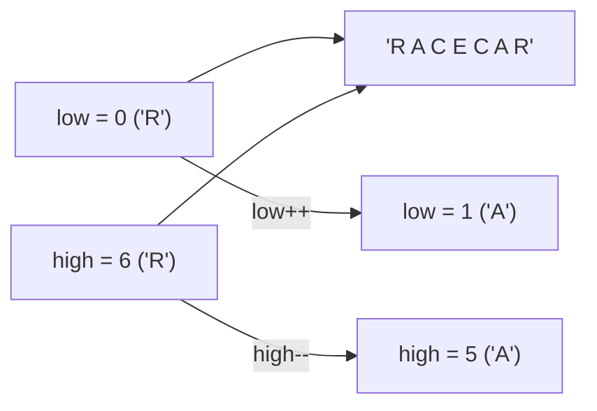

# L30D — String Processing Algorithms & CS106B Applications

> [!NOTE]
> **Academic Grounding:** This lesson synthesizes concepts from **Chapter 3 (Sections 3.6–3.7: *Writing string applications*, *The strlib.h library*, pp. 141–146)** of the official Stanford CS106B textbook (*Programming Abstractions in C++* by Eric Roberts).

---

## 🧭 Quick Navigation

- 📄 **Base Academic Readings:**
  - 🌲 [Stanford CS106B Textbook — Ch 3.6 & 3.7: Applications & strlib (pp. 141–146)](../../files/cs106b/textbook/CS106BX-Reader.pdf)
- 💻 **Code Lab:** [`L30D_StringApplications.cpp`](../code/L30D_StringApplications.cpp)

---

## Learning Objectives

- [ ] Analyze Palindrome verification complexity: Compare inefficient $O(N^2)$ `substr()` approach versus efficient $O(N)$ two-pointer frontier index approach (`low` and `high`).
- [ ] Implement Pig Latin translation algorithm integrating `#include <string>` and `#include <cctype>`.
- [ ] Build Acronym generators and substitution ciphers (Caesar Cipher).
- [ ] Implement standard abstractions from Stanford's `strlib.h` library (`startsWith`, `endsWith`, `trim`, `split`).

---

## 1. Palindrome Verification & Complexity Analysis

A **palindrome** is a string that reads identically forwards and backwards (examples: `"racecar"`, `"radar"`, `"madam"`).

### ❌ 1.1 Inefficient `substr()` Approach ($O(N^2)$ Time & Memory)

```cpp
#include <iostream>
#include <string>
using namespace std;

// ❌ INEFFICIENT: O(N²) Time and Heap Allocation
bool isPalindromeBad(string str) {
    if (str.length() <= 1) return true;
    if (str.front() != str.back()) return false;
    // substr() allocates heap memory & copies N-2 characters at EVERY recursive step!
    return isPalindromeBad(str.substr(1, str.length() - 2));
}
```

- **Why is it $O(N^2)$?**  
  Every recursive call invokes `str.substr(1, len - 2)`, allocating a **new `string` object on the heap** and copying $O(N)$ characters.
  $$\text{Total Operations} = (N - 2) + (N - 4) + \dots + 2 = \sum_{k=1}^{N/2} 2k = O(N^2)$$

### ✅ 1.2 Efficient Frontier Index Approach ($O(N)$ Time, $O(1)$ Extra Space)

Instead of creating substrings in RAM memory, pass original string by constant reference (`const string&`) and shift two numerical frontier index markers (`low` and `high`):



```cpp
#include <iostream>
#include <string>
using namespace std;

// Recursive Helper (O(N) Time, O(N) Call Stack)
bool isPalindromeHelper(const string& str, int low, int high) {
    if (low >= high) return true;            // Base case: 0 or 1 character remaining
    if (str[low] != str[high]) return false; // Early mismatch exit
    return isPalindromeHelper(str, low + 1, high - 1);
}

// Iterative Version (O(N) Time, O(1) Total Auxiliary Space)
bool isPalindromeIterative(const string& str) {
    int low = 0;
    int high = static_cast<int>(str.length()) - 1;
    while (low < high) {
        if (str[low] != str[high]) return false;
        low++;
        high--;
    }
    return true;
}
```

---

## 2. Pig Latin Translation Algorithm

Pig Latin is a classic text transformation algorithm used in CS106B to illustrate string decomposition and rule evaluation.

### Rules:
1. **Word starts with a Vowel** (`a, e, i, o, u`): Append suffix `"way"` to the end (example: `"apple"` $\rightarrow$ `"appleway"`).
2. **Word starts with Consonants**: Find index `i` of first vowel. Divide word into consonant prefix `str.substr(0, i)` and remainder `str.substr(i)`. Result is `remainder + prefix + "ay"` (example: `"trash"` $\rightarrow$ `"ashtrashay"`).

```cpp
#include <iostream>
#include <string>
#include <cctype> // Uses isalpha() and tolower()
using namespace std;

bool isVowel(char ch) {
    ch = static_cast<char>(tolower(static_cast<unsigned char>(ch)));
    return (ch == 'a' || ch == 'e' || ch == 'i' || ch == 'o' || ch == 'u');
}

string wordToPigLatin(const string& word) {
    if (word.empty()) return "";
    
    if (isVowel(word[0])) {
        return word + "way";
    }
    
    size_t firstVowelIdx = string::npos;
    for (size_t i = 0; i < word.length(); i++) {
        if (isVowel(word[i])) {
            firstVowelIdx = i;
            break;
        }
    }
    
    if (firstVowelIdx == string::npos) {
        return word + "ay";
    }
    
    string prefix = word.substr(0, firstVowelIdx);
    string remainder = word.substr(firstVowelIdx);
    return remainder + prefix + "ay";
}
```

---

## 3. Caesar Cipher ($k$-Shift)

Shifts each alphabetic character $k$ positions within the 26-letter alphabet:

$$\text{Encrypt}(c, k) = 'A' + ((c - 'A' + k) \pmod{26})$$

```cpp
#include <iostream>
#include <string>
#include <cctype> // Uses isupper() and islower()
using namespace std;

string caesarCipher(const string& str, int shift) {
    string result = "";
    shift = (shift % 26 + 26) % 26; // Normalize shift to positive range [0, 25]
    
    for (char ch : str) {
        if (isupper(static_cast<unsigned char>(ch))) {
            result += static_cast<char>('A' + (ch - 'A' + shift) % 26);
        } else if (islower(static_cast<unsigned char>(ch))) {
            result += static_cast<char>('a' + (ch - 'a' + shift) % 26);
        } else {
            result += ch; // Preserves punctuation untouched
        }
    }
    return result;
}
```

---

## 4. Stanford `strlib.h` Library Abstractions

```cpp
#include <iostream>
#include <string>
#include <cctype> // Uses isspace()
using namespace std;

bool startsWith(const string& str, const string& prefix) {
    if (prefix.length() > str.length()) return false;
    return str.substr(0, prefix.length()) == prefix;
}

bool endsWith(const string& str, const string& suffix) {
    if (suffix.length() > str.length()) return false;
    return str.substr(str.length() - suffix.length()) == suffix;
}

string trim(const string& str) {
    size_t start = 0;
    while (start < str.length() && isspace(static_cast<unsigned char>(str[start]))) {
        start++;
    }
    size_t end = str.length();
    while (end > start && isspace(static_cast<unsigned char>(str[end - 1]))) {
        end--;
    }
    return str.substr(start, end - start);
}
```

---

## ❓ Checkpoint Questions & Active Retrieval

### Question #1 — Pig Latin Translation
What are the outputs of `wordToPigLatin("scram")` and `wordToPigLatin("art")`?

<details>
<summary>🔍 <strong>View Explanation & Answer</strong></summary>

> [!NOTE]
> **Answer:**  
> - `wordToPigLatin("scram")` $\rightarrow$ `"amscray"` (consonant prefix `"scr"`, remainder `"am"`).  
> - `wordToPigLatin("art")` $\rightarrow$ `"artway"` (starts with vowel `'a'`).

</details>

---

### Question #2 — Palindrome Complexity: `substr()` vs. `low`/`high` Indices
Why does recursive palindrome verification using `substr(1, len-2)` operate at $O(N^2)$ time and space, while `low` and `high` version operates at $O(N)$ time and $O(1)$ auxiliary space?

<details>
<summary>🔍 <strong>View Explanation</strong></summary>

> [!NOTE]
> **Answer:**  
> In the `substr()` version, every recursive call performs an $O(N)$ string copy reserving new heap memory. Summing $N/2$ calls yields an $O(N^2)$ series. The `low` and `high` version keeps string intact by `const string&` reference and compares only 2 characters per step.

</details>

---

### Question #3 — Modular Arithmetic in Caesar Cipher
Why is formula `(shift % 26 + 26) % 26` applied at the start of `caesarCipher`?

<details>
<summary>🔍 <strong>View Explanation</strong></summary>

> [!NOTE]
> **Answer:** To guarantee negative shifts (like decrypting with `-3`) wrap safely into an equivalent positive shift range in $[0, 25]$.
>
> **Explanation:**  
> In C++, modulo operator `%` on negative integers can return negative results (e.g. `-3 % 26` is `-3`). Adding `26` and taking `% 26` again wraps `-3` into positive `23` (equivalent forward shift in a 26-letter circular alphabet).

</details>

---

## 📝 L30D Summary

1. **Library Integration:** String algorithms integrate `#include <string>` (for storage) and `#include <cctype>` (for character inspection).
2. **Palindrome Efficiency:** Use `low` and `high` indices to avoid $O(N^2)$ `substr()` heap copies.
3. **Cipher Arithmetic:** Modulo arithmetic $\pmod{26}$ enables continuous circular alphabet rotations.

---

<div align="center">

### 🧭 Navigation & Progression

| ⬅️ Previous Lesson | 🏠 Section Home | ➡️ Next Section |
|:------------------:|:--------------:|:---------------:|
| [**⬅️ L30C — `<cctype>` Library**](L30C_CCtype.md) | [**🏠 Arrays & Strings**](../README.md) | [**Section 05: Recursion & Algorithms ➡️**](../../05_RecursionAlgorithms/theory/L31_ThinkingRecursively.md) |

</div>

---
*MiniLux0 — Learning C++ Section 04 Capstone*
