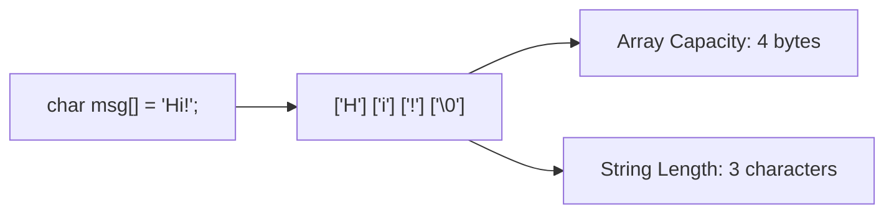

# Lesson 30 — C-Strings: Character Arrays & Null Terminator (`'\0'`)

> [!NOTE]
> **Academic Foundation:** This lesson synthesizes core concepts from **Stanford CS106B Textbook Chapter 3 & 11** ([`CS106BX-Reader.pdf`](../../files/cs106b/textbook/CS106BX-Reader.pdf)) and **MIT 6.096 Lecture 04** ([`Lecture04_Arrays.pdf`](../../files/mit6096/lectures/Lecture04_Arrays.pdf)).

---

## 🧭 Quick Navigation

- 📄 **Base Academic Lectures:**
  - 🌲 [Stanford CS106B — Chapter 3 & 11: C-Style Null-Terminated Strings](../../files/cs106b/textbook/CS106BX-Reader.pdf)
  - 🏛️ [MIT 6.096 — Lecture 04: Character Arrays & Buffer Overflows](../../files/mit6096/lectures/Lecture04_Arrays.pdf)
- 💻 **Code Lab:** [`L30_CStrings.cpp`](../code/L30_CStrings.cpp)

---

## Learning Objectives

- [ ] Understand legacy C-strings as null-terminated `char` arrays ending with `'\0'`.
- [ ] Differentiate between **Array Dimension** vs. **Useful String Length** ($\text{Capacity} \ge \text{strlen} + 1$).
- [ ] Use `<cstring>` functions (`strlen`, `strcpy`, `strcat`, `strcmp`) safely.
- [ ] Use `<cctype>` character inspection utilities (`isalpha`, `isdigit`, `toupper`, `tolower`).

---

## 1. The Null Terminator (`'\0'`)

In C and standard C++, a C-string is a `char[]` array whose end is explicitly marked by the special sentinel character **null `'\0'` (ASCII 0)**:



> [!CAUTION]
> **The Null Terminator Rule:**
> An array holding a C-string of $N$ characters **MUST reserve at least $N+1$ bytes** of memory to fit the trailing `'\0'` sentinel character. Omitting `'\0'` causes functions like `strlen()` or `cout` to scan past the end of the array into unreserved RAM memory!

---

## 2. Standard C-String Functions (`<cstring>`)

```cpp
#include <iostream>
#include <cstring> // C-String functions

int main() {
    char source[] = "Hello";
    char buffer[20];

    // 1. Length (excluding '\0')
    std::cout << "Length: " << std::strlen(source) << "\n"; // Outputs 5

    // 2. Safe Copy
    std::strcpy(buffer, source);

    // 3. Comparison (0 means identical)
    if (std::strcmp(buffer, "Hello") == 0) {
        std::cout << "Strings match!\n";
    }

    return 0;
}
```

---

## ❓ Self-Assessment Checkpoint #1 — Memory Capacity

What is `sizeof("C++")` in bytes when declared as a literal C-string?

<details>
<summary>🔍 <strong>View Explanation & Answer</strong></summary>

> [!NOTE]
> **Answer:** 4 bytes.
>
> **Explanation:**
> The string literal `"C++"` contains 3 visible characters (`'C'`, `'+'`, `'+'`) plus 1 invisible trailing null terminator `'\0'`, requiring 4 bytes of memory allocation.

</details>

---

## 📝 Summary & Key Takeaways

1. **Null Sentinel:** C-strings rely on `'\0'` to mark the end of readable text.
2. **Capacity Rule:** Always allocate at least $\text{strlen} + 1$ bytes.
3. **Libraries:** Use `#include <cstring>` for string operations and `#include <cctype>` for character tests.

---

<div align="center">

### 🧭 Navigation & Progression

| ⬅️ Previous Lesson | 🏠 Section Home | ➡️ Next Lesson |
|:------------------:|:--------------:|:--------------:|
| [**⬅️ L29 — Multidimensional Arrays**](L29_MultidimensionalArrays.md) | [**🏠 Arrays & Strings**](../README.md) | [**Section 05: Recursion & Algorithms ➡️**](../../05_RecursionAlgorithms/theory/L31_ThinkingRecursively.md) |

</div>

---
*MiniLux0 — Learning C++ Section 04 Capstone*
