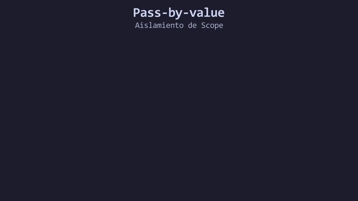

# L04: Parámetros y la asignación Pass-by-value

Para que las funciones procesen información dinámica, necesitan recibir datos de entrada desde el exterior. A estos canales de entrada los llamamos **Parámetros**.
Sin embargo, existe una regla arquitectónica fundamental sobre cómo viajan estos datos desde el bloque invocador (como el `main()`) hacia el Scope (cuerpo) de la función.

Imagina que tienes la receta original de un restaurante. Cuando le encargas a un cocinero que prepare el platillo, no le entregas tu único documento original arriesgándote a que lo manche; le sacas una **fotocopia** y le entregas la copia.

Este es el concepto abstracto de protección de datos. A partir de este momento, soltaremos la analogía y hablaremos técnicamente de **Aislamiento de Scope**, **Clonación de Memoria** y el modelo **Pass-by-value (Paso por valor)**.

En C++, cuando inyectas una variable como argumento hacia una función, el sistema no traslada la variable original. En su lugar, el compilador **reserva una nueva dirección de memoria y clona (copia exactamente) el valor original**.

---

## Modificación Local (Aislamiento)

Dado que la función recibe un clon en una dirección de memoria completamente nueva, cualquier reasignación u operación matemática que le aplique a esa variable local **no afectará en lo absoluto** a la variable original que reside segura en el `main()`.

```cpp
void procesarCalculo(int variable_aislada) {
    // Se modifica la variable local (el clon), no el original.
    variable_aislada = 999; 
    
    // Al alcanzar la llave de cierre, este clon se destruye (Fin del Scope local).
}

int main() {
    int dato_original{5};
    
    // Le inyectamos una copia del 5 a la rutina.
    procesarCalculo(dato_original);
    
    // Nuestra variable sigue intacta, porque su memoria nunca fue tocada.
    std::cout << dato_original; // Imprimirá 5
}
```

<div align="center">
  
</div>

#### 🔍 Traducción Visual del Modelo Pass-by-value:
* **Panel Izquierdo (`copia.cpp`):** Código fuente donde `main()` invoca a `procesar(orig)`.
* **Direcciones Físicas en Stack RAM (Derecha):** `orig` reside protegida en `0x7FFEE0` y `copia` nace en una dirección independiente `0x7FFEE8`.
* **Clonación de Memoria:** Al invocar la función, el compilador duplica el valor (`5`) y lo transporta al nuevo espacio físico.
* **Mutación Aislada:** La reasignación `copia = 999` modifica exclusivamente `0x7FFEE8`.
* **Destrucción y Estado Intacto:** Al salir de `}`, el clon local desaparece y `orig` en `0x7FFEE0` conserva intacto su valor original `5`.

---

## El Bug de la Reasignación Perdida

Un error arquitectónico muy común en desarrolladores junior es intentar modificar el estado de un sistema creyendo que están afectando a las variables reales:

```cpp
void recibirGolpe(int vida_personaje) {
    vida_personaje = vida_personaje - 1; // 🐞 TRAMPA: ¡Solo mutaste la copia local!
}
```
Si llamas a `recibirGolpe(vida_original)`, el personaje de tu `main()` jamás perderá salud, porque la rutina aplicó el cálculo matemático sobre una dirección de memoria temporal que fue destruida milisegundos después.

**¿Cómo lo solucionamos usando la arquitectura actual?**
Aprovechando lo que aprendimos en la L02: ¡La Firma de Retorno! La función debe aplicar el cálculo sobre su copia local y **retornar explícitamente** el nuevo valor, para que el `main()` sobreescriba a la variable original.

```cpp
int recibirGolpe(int vida_personaje) {
    int nueva_vida{vida_personaje - 1};
    return nueva_vida; // Inyecta el resultado de vuelta
}

// En el main:
// vida_original = recibirGolpe(vida_original);
```
*(Nota de ingeniería: Más adelante, en el Módulo 05 y 08, aprenderemos a inyectar directamente la dirección de memoria original usando `Referencias (&)` y `Punteros (*)` para evitar la clonación y ahorrar RAM, pero la arquitectura por defecto de C++ es estrictamente Pass-by-value).*

---

> 🧪 **Laboratorio:** Observa cómo las variables están aisladas en sus propias direcciones de memoria. Abre el archivo [`../lab/L04_Parameters.cpp`](../lab/L04_Parameters.cpp).
>
> 🐞 **Demo de Bug:** Verifica el aislamiento de Scope intentando restar vida a un jefe y fracasando. Ejecuta la trampa en [`../lab/demos/D04_PassByValueBug.cpp`](../lab/demos/D04_PassByValueBug.cpp).
>
> 🏋️ **Ejercicio:** El conversor de temperatura del sistema biológico está mutando copias locales en lugar de transferir los cálculos correctos. Atrévete con el reto en [`../exercise/E04_ConversorDeTemperaturas/E04_ConversorDeTemperaturas.cpp`](../exercise/E04_ConversorDeTemperaturas/E04_ConversorDeTemperaturas.cpp).

---

| ⬅️ [Anterior: Funciones void](L03_Void.md) | 📖 [Menú del Módulo](../README.md) | ➡️ [Siguiente: Ámbito local (Scope)](L05_ScopeInFunctions.md) |
|---|---|---|

---
<div align="center">
  <sub>Maintained by <strong>MiniLux0</strong> · 2026</sub>
</div>
