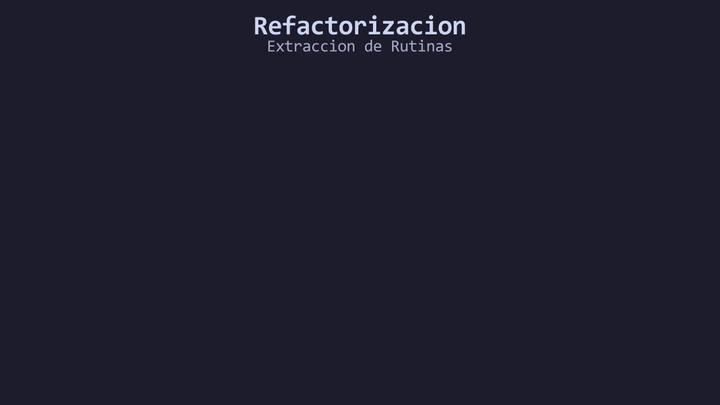

# L06: Modularidad y el Arte del Refactoring

Hasta ahora hemos aprendido la mecánica de las funciones: cómo definirlas, cómo inyectarles parámetros y cómo extraer sus valores de retorno. Pero la verdadera utilidad de las funciones no radica exclusivamente en el cálculo matemático, sino en la **Arquitectura de Software**.

Imagina a un director de orquesta. El director no toca el violín, luego corre a tocar el tambor, y después salta a soplar la trompeta. Si hiciera eso, la orquesta sería un caos. El trabajo del director es simplemente **coordinar a los expertos**. En C++, tu `main()` debe comportarse exactamente igual.

A partir de este momento, dejaremos la analogía del director musical para hablar de **Modularidad**, **Separación de Responsabilidades (Separation of Concerns)** y **Refactorización (Refactoring)**.

Un `main()` bien estructurado no debe ejecutar la lógica pesada; debe leerse como un índice limpio que orquesta el flujo de llamadas a sub-rutinas especializadas.

---

## La Metodología del Refactoring

*Refactorizar* significa reestructurar y reescribir un código fuente existente para mejorar su legibilidad y reducir su complejidad arquitectónica, **sin alterar su comportamiento externo**.

Cuando te enfrentas a una rutina monolítica (un `main()` de decenas o cientos de líneas), debes aplicar el proceso de **Extracción de Rutinas**:
1. **Identifica (Profiling visual):** Busca bloques lógicos acoplados (ej. un ciclo que imprime un menú, o una serie de condicionales que calculan un descuento).
2. **Extrae (Extraction):** Corta ese bloque y aíslalo dentro de una nueva función con un identificador (nombre) estrictamente descriptivo.
3. **Delega (Delegation):** En el `main()`, reemplaza las líneas de código crudo por una simple invocación a tu nueva función delegada.

```cpp
// ANTES: Código Monolítico (Acoplado y denso)
int main() {
    // 20 líneas de std::cout dibujando gráficos ASCII...
    // 15 líneas procesando inputs del usuario...
    // 30 líneas calculando el resultado matemático...
}

// DESPUÉS: Arquitectura Modular (Separation of Concerns)
int main() {
    dibujarMenuPrincipal();
    int opcion_elegida{obtenerOpcionUsuario()};
    procesarOpcion(opcion_elegida);
    
    return 0; // El flujo se vuelve auto-documentado.
}
```

<div align="center">
  
</div>

#### 🔍 Traducción Visual del Proceso de Refactorización:
* **Panel Izquierdo (`monolito.cpp`):** Código acoplado y denso con múltiples responsabilidades concentradas en `main()`.
* **Escaneo y Extracción:** Se identifican bloques especializados (dibujar menús, validar entradas, procesar cálculos).
* **Panel Derecho (`modular.cpp`):** Arquitectura desacoplada (*Separation of Concerns*) donde `main()` actúa como un orquestador de alto nivel auto-documentado.
* **Principio DRY:** Delegación limpia que facilita el mantenimiento, las pruebas unitarias y la reutilización.

---

## ¿Cuándo debes aplicar Extracción de Rutinas?

* **Principio DRY (Don't Repeat Yourself):** Si escribes el mismo bloque de código dos veces en tu programa, es una falla arquitectónica. Debes extraer ese bloque a una función e invocarla dos veces.
* **Sobrecarga de Scope:** Si el `main()` no cabe en la pantalla de tu monitor, estás violando la Separación de Responsabilidades. Es imperativo modularizar.
* **El síntoma del Comentario Explicativo:** Si sientes la necesidad de escribir un comentario largo para explicar qué hace un bloque de 10 líneas, ese bloque debería ser extraído. El identificador de la nueva función debe reemplazar la necesidad de ese comentario (Ej. en lugar de `// Aquí auditamos la base de datos`, invoca a `auditarBaseDeDatos()`).

---

> 🧪 **Laboratorio:** Observa un programa diseñado correctamente aplicando el patrón arquitectónico de delegación. Abre el archivo [`../lab/L06_Refactoring.cpp`](../lab/L06_Refactoring.cpp).
>
> 🏋️ **Ejercicio:** El código de transacciones del RPG es un bloque monolítico acoplado. Tu misión es aplicar Extracción de Rutinas para modularizarlo. Atrévete con el reto en [`../exercise/E06_RefactorizacionDelMenu/E06_RefactorizacionDelMenu.cpp`](../exercise/E06_RefactorizacionDelMenu/E06_RefactorizacionDelMenu.cpp).

---

| ⬅️ [Anterior: Ámbito local (Scope)](L05_ScopeInFunctions.md) | 📖 [Menú del Módulo](../README.md) | ➡️ [Siguiente: Números Aleatorios Modernos](L07_Random.md) |
|---|---|---|

---
<div align="center">
  <sub>Maintained by <strong>MiniLux0</strong> · 2026</sub>
</div>
