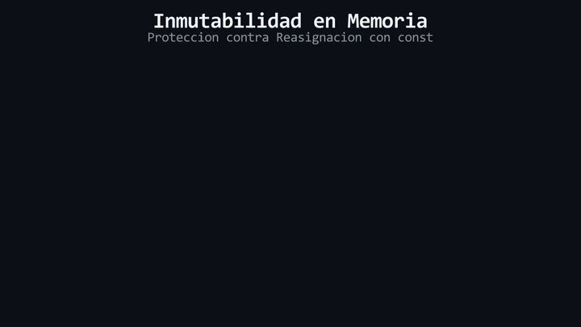

# L01: Inmutabilidad (`const`)

Imagina que las variables son como **cajas** donde guardamos información. Hasta ahora, todas las cajas que hemos creado están abiertas; cualquier parte del programa puede llegar y cambiar lo que hay dentro. Si le ponemos un **candado** a la caja, garantizamos que su contenido jamás sea alterado accidentalmente. A partir de aquí, dejaremos los candados y las cajas y usaremos los términos técnicos de la industria: **Mutabilidad** e **Inmutabilidad**.

Hasta ahora hemos trabajado con variables **mutables**. Sin embargo, hay valores en nuestro programa que por diseño *nunca* deberían cambiar (por ejemplo, los días de una semana o la gravedad de la Tierra). Si dejamos esas variables mutables, un error lógico podría reasignar ese valor, provocando bugs catastróficos.

## El Modificador `const`

Para volver una variable estrictamente inmutable, C++ provee la palabra clave `const`. Cuando se utiliza, el compilador bloquea esa dirección de memoria, transformándola en memoria de solo lectura (*read-only*).

<div align="center">
  
</div>

#### 🔍 Traducción Visual del Modelo de Memoria:
* **Celda con borde cian (`0x7FFEE4`):** Dirección física de la variable `vidas` reservada en la memoria Stack.
* **Marco dorado con sello `[READ-ONLY]`:** Bloqueo de inmutabilidad activado por la palabra clave `const`.
* **Proyectil rojo rebotando (`= 0`):** Intento de reasignación ilegal rechazado en tiempo de compilación.
* **Alerta inferior del compilador:** El compilador aborta la compilación (`assignment of read-only variable`) impidiendo generar el binario defectuoso con **cero costo de rendimiento en tiempo de ejecución**.

### ¿Cómo se usa?

Agrega `const` antes del tipo de dato. Dado que la variable se vuelve inmutable al instante, **es estrictamente obligatorio inicializarla en la misma línea de su declaración**. Si omites la inicialización, el compilador arrojará un error.

```cpp
// Variable Mutable (Peligroso para valores que deben ser fijos)
int diasPorSemana{7};

// Variable Inmutable (100% Segura - Read-only)
const int diasPorSemana{7};
```

Cualquier intento posterior de reasignar `diasPorSemana` será bloqueado por el compilador, abortando la compilación del programa. Esta práctica de volver inmutable todo aquello que no necesita cambiar se conoce como **Const Correctness**.

> [!TIP]
> **Regla de Oro:** Por defecto, declara todas tus variables como `const`. Solo remueve el modificador cuando tengas una necesidad técnica justificada de reasignar o mutar el valor de esa variable más adelante en el flujo.

---

> 🧪 **Laboratorio:** Observa la aplicación de *Const Correctness* en código real y el rechazo del compilador. Abre el archivo [`../lab/L01_Const.cpp`](../lab/L01_Const.cpp).
>
> 🏋️ **Ejercicio:** Un servidor colapsó debido a variables mutables que debieron ser *read-only*. Atrévete con el reto en [`../exercise/E01_AsegurandoInventario/E01_AsegurandoInventario.cpp`](../exercise/E01_AsegurandoInventario/E01_AsegurandoInventario.cpp).

---

> [!WARNING]
> **Regla de oro:** Estas preguntas se pueden responder *solo* con lo que leíste en esta lección. No busques respuestas en librerías avanzadas ni conceptos no vistos.

<details>
<summary><b>1. ¿Qué ocurre si intentas reasignar el valor de una variable declarada con `const`?</b></summary>

> El compilador detectará el intento de escritura en una dirección de memoria bloqueada (*read-only*) y abortará el proceso de compilación inmediatamente.
</details>

<details>
<summary><b>2. ¿Por qué es obligatorio inicializar una variable `const` en la misma línea que se declara?</b></summary>

> Porque su estado pasa a ser inmutable de forma instantánea. Si se declara sin valor, C++ le asignaría basura de la RAM que quedaría bloqueada para siempre, lo cual se previene con un error de compilación.
</details>

---

| ⬅️ [Anterior: README.md](../README.md) | 📖 [Menú del Módulo](../README.md) | ➡️ [Siguiente: Eval. en Compilación (constexpr)](L02_Constexpr.md) |
|---|---|---|

---
<div align="center">
  <sub>Maintained by <strong>MiniLux0</strong> · 2026</sub>
</div>
