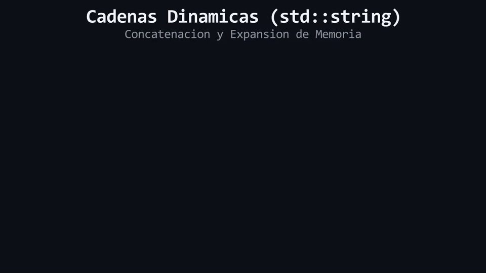

# Lección 03: Cadenas de Texto Dinámicas (`std::string`)

Hasta ahora hemos trabajado con números (`int`). Pero, ¿qué pasa si queremos guardar texto, como el nombre de un jugador? 

En C++, el texto escrito literalmente entre comillas dobles (ej. `"Hola"`) se conoce como **literal de texto estático** o *C-string*. Es un bloque de memoria primitivo, rígido y peligroso de manipular manualmente. Para trabajar de manera moderna y segura, utilizamos una estructura de datos dinámica llamada `std::string`.

Para romper el hielo, imagina que un `std::string` es como un **objeto dinámico**. A diferencia de un bloque de madera rígido (literal estático), este tren administra su propia memoria RAM: puede crecer y encogerse automáticamente si le añades o quitas "vagones" (caracteres).

Para invocar a esta estructura, necesitas incluir la cabecera `#include <string>`.

## Concatenación de Textos

Unir dos fragmentos de texto se conoce como **concatenación**. En C++ Moderno, puedes concatenar objetos dinámicos `std::string` utilizando el operador `+`.

```cpp
#include <iostream>
#include <string> // ¡Cabecera obligatoria!

int main() {
    std::string nombre{"Link"};
    
    // Concatenamos un literal estático con nuestro objeto dinámico 'nombre'
    std::string saludo{"Bienvenido, " + nombre}; 
    
    std::cout << saludo; // Imprime: Bienvenido, Link
}
```

<div align="center">
  
</div>

#### 🔍 Traducción Visual del Modelo de Memoria:
* **Celdas iniciales (`Size: 4 bytes`):** `std::string` reserva un bloque contiguo en RAM para almacenar `"Hola"`.
* **Expansión automática (`Size: 10 bytes`):** Al aplicar el operador `+ " Mundo"`, `std::string` reasigna memoria en el Stack/Heap y añade las celdas contiguas necesarias sin intervención manual.
* **Insignia `Buffer Auto-Administrado`:** A diferencia de los arreglos estáticos de C, `std::string` encapsula el puntero y la capacidad, previniendo desbordamientos de memoria (*Buffer Overflow*).

## La Trampa de los Literales Estáticos

El operador `+` funciona a la perfección porque el objeto `std::string` posee métodos internos (el "motor" del tren) para reservar memoria y unirse a otros textos. Sin embargo, si intentas sumar dos literales estáticos directamente, el programa se estrellará. Los *C-strings* primitivos carecen de la lógica para concatenarse por sí mismos.

```cpp
// ❌ ERROR: "Hola " y "Mundo" son literales estáticos. No poseen lógica de concatenación.
std::string mensaje = "Hola " + "Mundo"; 

// ✅ CORRECTO: Si la operación inicia con un std::string, este gestiona la memoria del resto.
std::string palabra{"Hola "};
std::string mensaje = palabra + "Mundo"; 
```

---

> 🧪 **Laboratorio:** ¡Vamos a manipular trenes de letras! Abre [`../lab/L03_String.cpp`](../lab/L03_String.cpp).
>
> 🐞 **Demo de Bug:** Experimenta el choque de trenes intentando sumar textos inanimados. Ejecuta la trampa en [`../lab/demos/D03_LiteralConcatBug.cpp`](../lab/demos/D03_LiteralConcatBug.cpp).
>
> 🏋️ **Ejercicio:** El sistema de perfiles del juego RPG está roto. Atrévete con el reto en [`../exercise/E03_FormateadorDeNombres/E03_FormateadorDeNombres.cpp`](../exercise/E03_FormateadorDeNombres/E03_FormateadorDeNombres.cpp).

---

> [!WARNING]
> **Regla de oro:** Estas preguntas se pueden responder *solo* con lo que leíste. No intentes adivinar con conocimientos externos.

<details>
<summary><b>1. ¿Por qué el código <code>std::string x = "A" + "B";</code> genera un error de compilación?</b></summary>

> Porque `"A"` y `"B"` son literales estáticos (C-strings), los cuales son estructuras de bajo nivel que no poseen métodos nativos para concatenarse entre sí con el operador `+`.
</details>

<details>
<summary><b>2. ¿Qué ventaja tiene usar <code>std::string</code> frente a los literales estáticos (C-strings)?</b></summary>

> `std::string` gestiona su propia memoria de forma dinámica. Se encarga de expandirse y contraerse automáticamente en la RAM cuando realizas modificaciones o concatenaciones, evitando bugs críticos.
</details>

---

| ⬅️ [Anterior: L02_Constexpr.md](L02_Constexpr.md) | 📖 [Menú del Módulo](../README.md) | ➡️ [Siguiente: L04_StringView.md](L04_StringView.md) |
|---|---|---|

---
<div align="center">
  <sub>Maintained by <strong>MiniLux0</strong> · 2026</sub>
</div>
