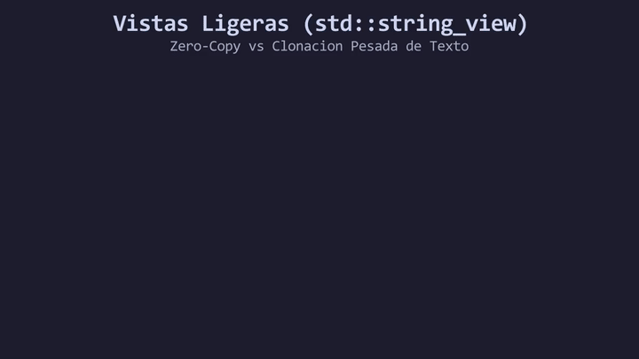

# Lección 04: Referencias Ligeras de Texto (`std::string_view`)

En la lección anterior vimos que `std::string` es una estructura dinámica que maneja su propia memoria. Es seguro y fácil de usar, pero tiene un precio arquitectónico: **es pesado de clonar**.

Imagina que tienes un objeto `std::string` alojando el texto completo de un libro de 500 páginas. Si pasas ese texto a una función para contar sus palabras, el comportamiento por defecto en C++ provocará que **se clone (copie)** la estructura entera en un nuevo bloque de la memoria RAM. Esto es un desperdicio crítico de procesamiento y recursos.

Aquí es donde entra la solución de C++17: `std::string_view`.

Para entender su función, imagina que `std::string_view` actúa como unos **binoculares**. No construye una estructura nueva ni copia datos; simplemente es un observador ultraligero que apunta a un bloque de texto que ya existe en la memoria.

Para utilizar estas referencias, debes incluir la cabecera `#include <string_view>`.

<div align="center">
  
</div>

#### 🔍 Traducción Visual del Modelo de Memoria:
* **Memoria original (`0x7FFEE0`):** El texto pesado reside intacto en su dirección de memoria original.
* **Puntero `std::string_view` (`[ptr | len]`):** En lugar de duplicar bytes, `std::string_view` transfiere únicamente la dirección física y el tamaño de la cadena (16 bytes en Stack).
* **Insignia `Zero-Copy`:** Al pasar cadenas a funciones de solo lectura, la memoria RAM no sufre clonaciones masivas ni sobrecarga de asignaciones dinámicas.

### ¿Cómo se usa?

La regla de oro de la industria en C++ Moderno es: **Si tu función o variable solo necesita "leer" el texto y no modificarlo (mutarlo), utiliza SIEMPRE `std::string_view`.**

```cpp
#include <iostream>
#include <string>
#include <string_view> // Cabecera obligatoria

// Al usar string_view, garantizamos que NO habrá copias pesadas.
// Solo pasamos una referencia de solo lectura a la memoria original.
void leerEtiqueta(std::string_view texto) {
    std::cout << texto << '\n';
}

int main() {
    std::string libroGigante{"Habia una vez..."};
    
    // Pasamos la vista ligera sin clonar el objeto
    leerEtiqueta(libroGigante); 
    
    // ¡Funciona instantáneamente con literales estáticos (C-strings)!
    leerEtiqueta("Texto estatico directo"); 
}
```

### El Peligro: Referencias Colgantes (Dangling View)

Dado que `std::string_view` no es dueño de la memoria (solo la observa), debes tener sumo cuidado con el ciclo de vida del texto original. Si el objeto `std::string` es destruido en la memoria RAM, tu `std::string_view` quedará apuntando a un espacio liberado o lleno de basura. Intentar leerlo provocará un comportamiento indefinido (*Undefined Behavior*). Este error crítico se conoce como **Dangling View**.

---

> 🧪 **Laboratorio:** ¡Practica el arte de no clonar memoria! Abre [`../lab/L04_StringView.cpp`](../lab/L04_StringView.cpp).
>
> 🐞 **Demo de Bug:** Mira qué pasa cuando apuntas los binoculares a un tren destruido. Ejecuta la trampa en [`../lab/demos/D04_DanglingViewBug.cpp`](../lab/demos/D04_DanglingViewBug.cpp).
>
> 🏋️ **Ejercicio:** Los servidores de la enciclopedia galáctica se están quedando sin RAM. Atrévete con el reto en [`../exercise/E04_LectorEficiente/E04_LectorEficiente.cpp`](../exercise/E04_LectorEficiente/E04_LectorEficiente.cpp).

---

> [!WARNING]
> **Regla de oro:** Estas preguntas se pueden responder *solo* con lo que leíste. No intentes adivinar con conocimientos externos.

<details>
<summary><b>1. Si necesitas añadir una nueva palabra a un texto recibido en una función, ¿el parámetro debe ser <code>std::string</code> o <code>std::string_view</code>?</b></summary>

> Debe ser `std::string`. Las vistas `std::string_view` son estrictamente de **solo lectura**. Al no ser dueñas de la memoria, carecen de métodos para expandir, modificar o reasignar el bloque original.
</details>

---

| ⬅️ [Anterior: L03_String.md](L03_String.md) | 📖 [Menu del Modulo](../README.md) | ➡️ [Siguiente: L05_CinValidation.md](L05_CinValidation.md) |
|---|---|---|

---
<div align="center">
  <sub>Maintained by <strong>MiniLux0</strong> · 2026</sub>
</div>
