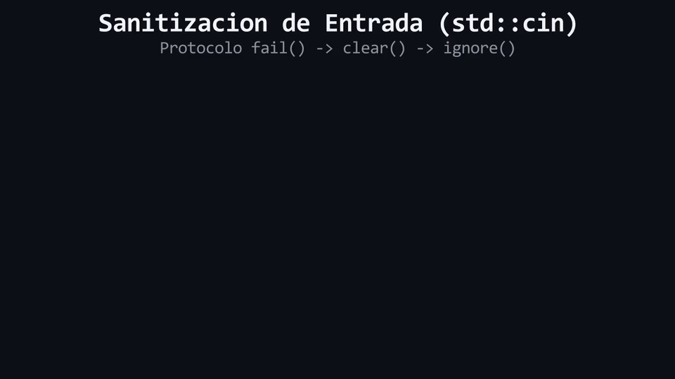

# Lección 05: El Escudo Anti-Trolls (Validando `std::cin`)

Hasta ahora hemos asumido que el usuario de nuestro programa es disciplinado. Si le pedimos un número (`int`), asumimos que tecleará un `15`. 

Pero, ¿qué pasa si el usuario es un *troll* y escribe `"Quince"` con letras?

Para visualizar lo que ocurre, imagina que `std::cin` funciona como una **tubería de envíos**. Si tu programa espera un paquete cuadrado (`int`) y el usuario envía uno triangular (letras), la pieza se atascará y bloqueará la tubería.

En jerga técnica, `std::cin` es el **Flujo de Entrada Estándar (*Input Stream*)**. Cuando intentas extraer un tipo de dato pero el usuario introduce un tipo incompatible, ocurren tres cosas:
1. Sucede una **Falla de Extracción (*Extraction Failure*)**.
2. El flujo `std::cin` levanta una bandera de error interno (`fail()`) y se bloquea temporalmente.
3. Los caracteres inválidos se quedan "atascados" en la memoria intermedia (el **Buffer**).
¡Mientras el flujo esté bloqueado, el programa ignorará cualquier nuevo intento de lectura!

<div align="center">
  
</div>

#### 🔍 Traducción Visual del Modelo de Memoria:
* **Caracteres rojos atascados (`['a']['b']['c']`):** Entrada incompatible que colisiona con el tipo `int` y bloquea el canal con la bandera `fail()`.
* **Paso 1 (`std::cin.clear()`):** Reactiva la tubería de entrada cambiando el estado interno a `good()`.
* **Paso 2 (`std::cin.ignore()`):** Barre y purga los caracteres remanentes del buffer hasta encontrar el salto de línea `\n`.
* **Insignia `Protocolo Defensivo`:** Garantiza que el flujo `std::cin` quede 100% operativo sin caer en bucles infinitos de lectura.

## El Protocolo de Limpieza

Para evitar que nuestro programa colapse o entre en un bucle infinito, debemos aplicar un protocolo defensivo de tres pasos cada vez que detectemos una entrada inválida:

1. **Detectar el error:** Comprobamos si el flujo colapsó utilizando `std::cin.fail()`.
2. **Restablecer el estado:** Usamos `std::cin.clear()` para apagar la bandera de error y reactivar el flujo.
3. **Purgar el Buffer:** Usamos `std::cin.ignore(10000, '\n')` para ordenar: *"Descarta todo lo que esté atascado en el buffer (hasta 10000 caracteres o hasta encontrar un 'Enter') para empezar de cero"*.

```cpp
#include <iostream>

int main() {
    int edad{0};
    std::cout << "Ingresa edad: ";
    std::cin >> edad;

    if (std::cin.fail()) {
        std::cin.clear();             // Paso 2: Apagar alarma
        std::cin.ignore(10000, '\n'); // Paso 3: Destapar tubería
        std::cout << "Por favor, ingresa numeros, no letras.";
    }
}
```

---

> 🧪 **Laboratorio:** ¡Conviértete en un fontanero defensivo! Abre [`../lab/L05_CinValidation.cpp`](../lab/L05_CinValidation.cpp).
>
> 🐞 **Demo de Bug:** Observa un desastre en tiempo real. Ejecuta el temible bucle infinito en [`../lab/demos/D05_CinInfiniteLoopBug.cpp`](../lab/demos/D05_CinInfiniteLoopBug.cpp).
>
> 🏋️ **Ejercicio:** El cajero automático del banco está sufriendo ataques troll. Atrévete con el reto en [`../exercise/E05_EscudoAntiTrolls/E05_EscudoAntiTrolls.cpp`](../exercise/E05_EscudoAntiTrolls/E05_EscudoAntiTrolls.cpp).

---

> [!WARNING]
> **Regla de oro:** Estas preguntas se pueden responder *solo* con lo que leíste. No intentes adivinar con conocimientos externos.

<details>
<summary><b>1. Si omites el paso de <code>std::cin.ignore()</code>, ¿qué sucederá la próxima vez que intentes leer datos?</b></summary>

> El *Buffer* seguirá físicamente contaminado con los caracteres inválidos del intento anterior. Como la basura no se purgó, el programa volverá a fallar silenciosamente en la siguiente iteración sin permitirle al usuario escribir de nuevo, causando un bucle infinito.
</details>

---

| ⬅️ [Anterior: L04_StringView.md](L04_StringView.md) | 📖 [Menu del Modulo](../README.md) | ➡️ [Siguiente: L06_MiniProject.md](L06_MiniProject.md) |
|---|---|---|

---
<div align="center">
  <sub>Maintained by <strong>MiniLux0</strong> · 2026</sub>
</div>
