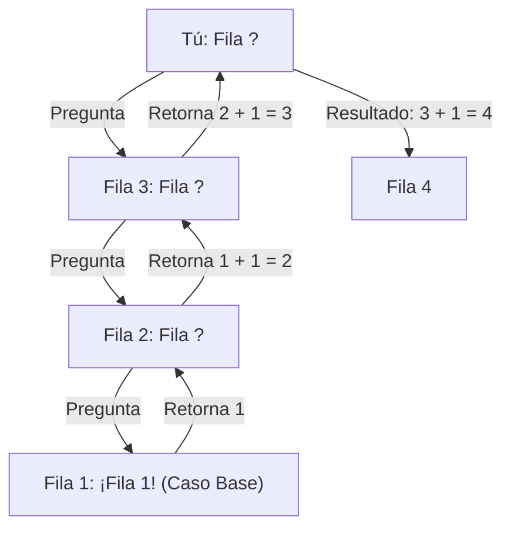
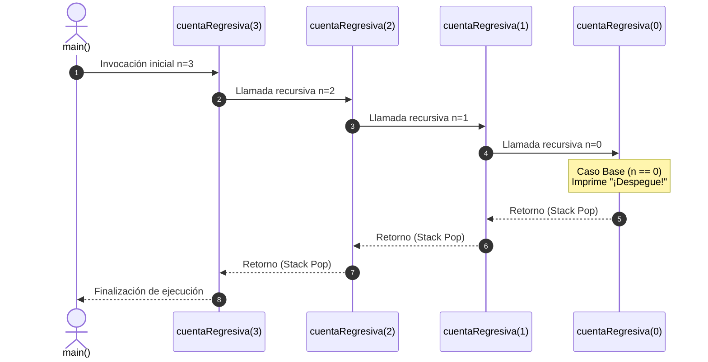

# L31 — Pensar Recursivamente: Caso Base, Paso Recursivo y la Pila de Llamadas (*Call Stack*)

> [!NOTE]
> **Fundamentación Académica:** Esta lección sintetiza los conceptos del **Capítulo 7 (*Introduction to Recursion*)** del libro oficial de Stanford CS106B ([`CS106BX-Reader.pdf`](../../files/cs106b/textbook/CS106BX-Reader.pdf)) y la **Lectura 05** de MIT 6.096 ([`Lecture05_Pointers.pdf`](../../files/mit6096/lectures/Lecture05_Pointers.pdf)).

---

## 🧭 Navegación Rápida

- 📄 **Lecturas Académicas Base:**
  - 🌲 [Stanford CS106B Textbook (Ch 7, pp. 285–320)](../../files/cs106b/textbook/CS106BX-Reader.pdf)
  - 🏛️ [MIT 6.096 — Lecture 05: Stack Allocation & Memory](../../files/mit6096/lectures/Lecture05_Pointers.pdf)
- 💻 **Laboratorio de Código:** [`L31_ThinkingRecursively.cpp`](../code/L31_ThinkingRecursively.cpp)

---

## Objetivos de Aprendizaje

- [ ] Comprender qué es la recursividad y cómo se compara con el enfoque iterativo (`for`/`while`).
- [ ] Dominar la **Estructura Fundamental de 2 Partes**: Caso Base (*Base Case*) y Paso Recursivo (*Recursive Step*).
- [ ] Entender la **Pila de Llamadas (*Call Stack*)** y los Registros de Activación (*Stack Frames*).
- [ ] Prevenir el desbordamiento de pila (**Stack Overflow**).
- [ ] Aplicar la **Fe Inductiva (*Recursive Leap of Faith*)** para diseñar soluciones recursivas limpias.

---

## 1. ¿Qué es realmente la Recursividad?

En matemática y computación, la recursividad no es un "truco especial de C++", sino una técnica para resolver un problema **expresándolo en términos de instancias más pequeñas de sí mismo**.

> [!TIP]
> **La Analogía de la Fila del Cine:**
> Imagina que estás en un cine a oscuras y quieres saber en qué número de fila estás sentado:
> - **Enfoque Iterativo:** Te levantas, caminas hasta la primera fila ($1$) y cuentas fila por fila hacia atrás hasta llegar a tu asiento.
> - **Enfoque Recursivo:** Le preguntas a la persona **directamente delante de ti**: *"¿En qué fila estás tú?"*.
>   - Esa persona le pregunta a la persona delante de ella.
>   - La pregunta avanza hasta llegar a la persona de la **Fila 1**.
>   - La persona de la Fila 1 responde: *"¡Estoy en la fila 1!"* (**Caso Base**).
>   - La persona detrás responde: *"Entonces yo estoy en la $1 + 1 = 2$"*.
>   - La respuesta regresa hasta ti: tu fila es $\text{fila delante} + 1$.



---

## 2. La Estructura Obligatoria de Toda Función Recursiva

Toda función recursiva correcta consta de **dos partes esenciales**:

```cpp
void funcionRecursiva(int n) {
    // 1. CASO BASE (Base Case) — Condición de parada directa sin llamada a sí misma
    if (n == 0) {
        // Resolver problema trivialmente
        return;
    }

    // 2. PASO RECURSIVO (Recursive Step) — Llamada a sí misma con un problema MÁS PEQUEÑO
    funcionRecursiva(n - 1);
}
```

> [!WARNING]
> **Las 2 Reglas de Oro de la Recursividad:**
> 1. Si no hay **Caso Base**, la función se llamará infinitamente hasta agotar la memoria RAM (**Stack Overflow**).
> 2. En el **Paso Recursivo**, los parámetros **deben avanzar hacia el caso base** (por ejemplo, reducir $n \to n - 1$).

---

## 3. Funcionamiento Interno en Memoria: La Pila de Llamadas (*Call Stack*)

Cada vez que se invoca una función en C++, el sistema operativo reserva un bloque de memoria en la pila llamado **Marco de Activación (*Stack Frame*)** que almacena:
- Parámetros recibidos.
- Variables locales.
- Dirección de retorno (a dónde volver cuando la función termine).

### Ejemplo Práctico: Conteo Regresivo Recursivo

```cpp
#include <iostream>
using namespace std;

void cuentaRegresiva(int n) {
    if (n == 0) { // Caso Base
        cout << "¡Despegue!" << endl;
        return;
    }

    cout << n << " ... " << endl;
    cuentaRegresiva(n - 1); // Paso Recursivo
}

int main() {
    cuentaRegresiva(3);
    return 0;
}
```

#### Diagrama de Secuencia de la Pila de Memoria:



---

## 4. Comparación: Recursividad vs. Iteración

| Criterio | Iteración (`for` / `while`) | Recursividad |
| :--- | :--- | :--- |
| **Mecanismo de control** | Bucles y contadores explícitos. | Llamadas a funciones sobre la pila RAM. |
| **Uso de memoria** | $O(1)$ constante (solo variables de contador). | $O(N)$ proporcional a la profundidad de llamadas. |
| **Riesgo de error** | Bucle infinito (no rompe la memoria RAM). | **Stack Overflow** (Cuelga o invalida el programa). |
| **Legibilidad** | Ideal para problemas lineales simples. | Elegante para problemas autosimilares (árboles, grafos, fractales, divide y vencerás). |

---

## ❓ Pregunta de Chequeo #1 — El Peligro del Stack Overflow

Analiza la siguiente función recursiva:

```cpp
void contarInfinito(int n) {
    if (n == 100) return;
    cout << n << endl;
    contarInfinito(n); // ¿Qué ocurre aquí?
}
```

**¿Qué ocurre al ejecutar `contarInfinito(1)` y por qué?**

<details>
<summary>🔍 <strong>Ver Explicación y Diagnóstico</strong></summary>

> [!CAUTION]
> **Diagnóstico:** Provoca un **Stack Overflow (Desbordamiento de Pila)**.
>
> **Explicación:**
> En el paso recursivo se pasa `n` sin modificar (`contarInfinito(n)`), en lugar de modificarlo hacia la condición de parada (como `n + 1`).
> Dado que `n` siempre vale `1`, nunca alcanzará la condición del caso base (`n == 100`). La pila de llamadas acumulará marcos de memoria infinitamente hasta agotar el espacio asignado en la memoria RAM del proceso (usualmente 1 MB a 8 MB), resultando en un *Segmentation Fault* o crash.

</details>

---

## 📝 Resumen Resumido de L31

1. **Definición:** La recursividad resuelve un problema expresándolo en términos de instancias más pequeñas de sí mismo.
2. **Estructura de 2 partes:**
   - **Caso Base:** Resuelve el caso más simple e interrumpe las llamadas recursivas.
   - **Paso Recursivo:** Reduce el problema y llama a la misma función con argumentos más pequeños.
3. **Pila de Memoria (Call Stack):** Cada llamada recursiva consume memoria reservando un *Stack Frame*.
4. **Fe Inductiva (*Leap of Faith*):** Al diseñar algoritmos recursivos, asume que la llamada con $(n-1)$ funciona correctamente y enfócate en cómo usar ese resultado para resolver el caso $n$.

---

## Archivos Relacionados

- 💻 [`L31_ThinkingRecursively.cpp`](../code/L31_ThinkingRecursively.cpp) — Código ejecutable con trazas de la pila
- 📘 [`L32_RecursiveProblems.md`](L32_RecursiveProblems.md) — Siguiente lección: Problemas Clásicos Recursivos

---
*MiniLux0 — Learning C++ Section 05*
