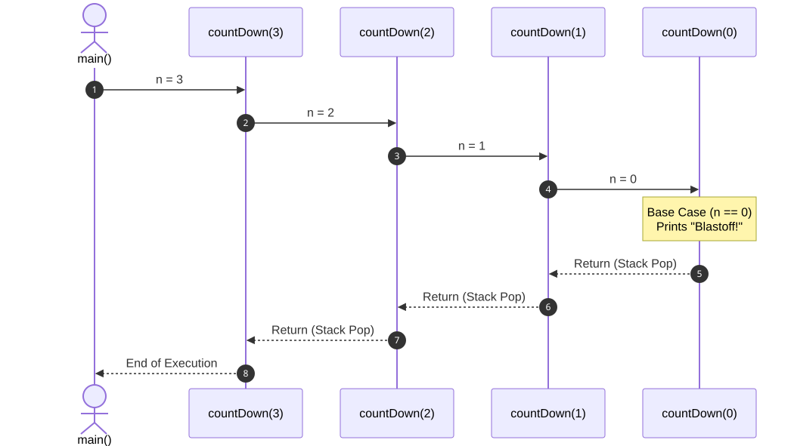

# L31 — Pensar Recursivamente: Caso Base, Paso Recursivo, Recursión Mutua e Inducción

> [!NOTE]
> **Fundamentación Académica:** Esta lección sintetiza los conceptos del **Capítulo 7 (*Introduction to Recursion*, pp. 315–348)** y **Capítulo 10.6 (*Mathematical Induction*, p. 458)** del libro oficial de Stanford CS106B (*Programming Abstractions in C++* por Eric Roberts) y la **Lectura 05** de MIT 6.096 ([`Lecture05_Pointers.pdf`](../../files/mit6096/lectures/Lecture05_Pointers.pdf)).
> 
> *“And often enough, our faith beforehand in a certain result is the only thing that makes the result come true.”*  
> — **William James**, *The Will to Believe*, 1897

---

## 🧭 Navegación Rápida

- 📄 **Lecturas Académicas Base:**
  - 🌲 [Stanford CS106B Textbook — Ch 7 (pp. 315–348) & Ch 10.6 (p. 458)](https://web.stanford.edu/class/cs106x/res/reader/CS106BX-Reader.pdf)
  - 🏛️ [MIT 6.096 — Lecture 05: Stack Allocation & Memory](../../files/mit6096/lectures/Lecture05_Pointers.pdf)
- 💻 **Laboratorio de Código:** [`L31_ThinkingRecursively.cpp`](../code/L31_ThinkingRecursively.cpp)

---

## Objetivos de Aprendizaje

- [ ] Comprender la esencia de la **recursividad** y cómo se diferencia de la solución iterativa (`for`/`while`).
- [ ] Dominar la **Estructura de 2 Partes**: **Caso Base** (*Base Case*) y **Paso Recursivo** (*Recursive Step*).
- [ ] Visualizar el **Marco de Activación (*Stack Frame*)** en la **Pila de Llamadas (*Call Stack*)**.
- [ ] Aplicar la **Fe Inductiva Recursiva (*Recursive Leap of Faith*)** y el método de 3 pasos para diseño recursivo.
- [ ] Implementar **Recursión Mutua (*Mutual Recursion*)** resolviendo dependencias de prototipos en C++.
- [ ] Conectar la estructura de la recursividad con la **Inducción Matemática** (Sección 10.6).

---

## 1. ¿Qué es realmente la Recursividad? (Sección 7.1)

En ciencias de la computación, la **recursividad** es la técnica de resolver un problema dividiéndolo en instancias más pequeñas y autosimilares de sí mismo.

> [!TIP]
> **Analogía 1: La Delegación del Fondo de Recaudación ($1,000,000 — Sec. 7.1)**
> Imagina una organización caritativa que necesita recaudar **$1,000,000**:
> - **Enfoque Iterativo:** Un solo gerente llama a 1,000,000 de personas para solicitar $1 a cada una.
> - **Enfoque Recursivo (Delegación):**
>   1. El Director General asigna a **10 coordinadores regionales** la tarea de recaudar **$100,000** cada uno.
>   2. Cada coordinador regional asigna a **10 capitanes locales** la tarea de recaudar **$10,000** cada uno.
>   3. Cada capitán asigna a **10 voluntarios** la tarea de recaudar **$1,000** cada uno.
>   4. Cada voluntario pide a **10 amigos** $100 cada uno (**Caso Base: solicitud directa**).
>   5. El dinero recolectado fluye hacia arriba sumándose recursivamente hasta completar el $1,000,000.

> [!TIP]
> **Analogía 2: La Fila del Cine**
> - Para saber en qué fila estás en un cine a oscuras: le preguntas a la persona **directamente delante de ti**: *“¿En qué fila estás?”*.
> - La pregunta viaja hacia adelante hasta la **Fila 1** (Caso Base: contesta *“¡Estoy en la fila 1!”*).
> - La respuesta regresa desapilándose: tu fila es $\text{fila delante} + 1$.



---

## 2. La Estructura Obligatoria de Toda Función Recursiva

Toda función recursiva correcta consta de **dos elementos indispensables**:

```cpp
void funcionRecursiva(int n) {
    // 1. CASO BASE (Base Case) — Condición de parada trivial sin llamadas recursivas
    if (n == 0) {
        return;
    }

    // 2. PASO RECURSIVO (Recursive Step) — Llamada a sí misma avanzando hacia el caso base
    funcionRecursiva(n - 1);
}
```

> [!WARNING]
> **Las 2 Reglas de Oro de la Recursividad:**
> 1. **Existencia del Caso Base:** Debe existir al menos una condición trivial que detenga la recursión.
> 2. **Garantía de Progreso:** Cada llamada en el paso recursivo debe simplificar el problema y acercar los parámetros al caso base.

---

## 3. Funcionamiento Interno en Memoria: La Pila de Llamadas (*Call Stack*)

Cada llamada a función crea un **Marco de Activación (*Stack Frame*)** en la memoria RAM con:
- Parámetros formales y variables locales.
- Dirección de retorno (*Return Address*).

### Ejemplo: Conteo Regresivo Recursivo (`cuentaRegresiva(3)`)

```cpp
#include <iostream>
using namespace std;

void cuentaRegresiva(int n) {
    if (n == 0) { // Caso Base
        cout << "¡Despegue!" << endl;
        return;
    }
    cout << "Entrando: " << n << endl;
    cuentaRegresiva(n - 1); // Paso Recursivo
    cout << "Saliendo: " << n << endl;
}
```

#### Diagrama de Secuencia y Desapilado:



---

## 4. El Salto de Fe Recursivo (*The Recursive Leap of Faith* — Sección 7.7)

El mayor obstáculo mental al aprender recursividad es intentar seguir el flujo de ejecución completo en la cabeza expandiendo mentalmente cada sub-llamada.

> [!IMPORTANT]
> **El Método de 3 Pasos para Diseñar Algoritmos Recursivos:**
> 1. **Identificar los Casos Simples (Casos Base):** Resolver directamente las instancias triviales del problema.
> 2. **Buscar la Descomposición Recursiva:** Determinar cómo resolver el problema de tamaño $N$ combinando una operación con la solución del problema de tamaño $N-1$ (o subproblemas más pequeños).
> 3. **Aplicar el Salto de Fe (*Leap of Faith*):** **Asume con confianza** que la llamada recursiva para $N-1$ devuelve la respuesta correcta. No traces su ejecución interna; concéntrate únicamente en cómo usar ese resultado para construir la solución de $N$.

---

## 5. Recursión Mutua / Cruzada (*Mutual Recursion* — Sección 7.6)

La **Recursión Mutua** ocurre cuando dos o más funciones se invocan recíprocamente en una cadena circular de llamadas.

### Ejemplo Clásico: Determinación de Paridad (`esPar` y `esImpar`)

En C++, para implementar recursión mutua es **obligatorio incluir prototipos de función** antes de sus definiciones, ya que la primera función necesita conocer la existencia y firma de la segunda antes de que esté definida.

```cpp
// 1. PROTOTIPO OBLIGATORIO para resolver la dependencia circular en C++
bool esImpar(int n);

// 2. Definición de esPar (invoca a esImpar)
bool esPar(int n) {
    if (n == 0) return true; // Caso Base
    return esImpar(n - 1);   // Paso Recursivo Mutuo
}

// 3. Definición de esImpar (invoca a esPar)
bool esImpar(int n) {
    if (n == 0) return false; // Caso Base
    return esPar(n - 1);       // Paso Recursivo Mutuo
}
```

---

## 6. Inducción Matemática y Recursividad (Sección 10.6)

Existe un isomorfismo estructural perfecto entre la **Inducción Matemática** y la **Recursividad**:

| Inducción Matemática | Programación Recursiva |
| :--- | :--- |
| **Base Inductiva ( $P(0)$ o $P(1)$ )** | **Caso Base** (`if (n == 0) return ...;`) |
| **Hipótesis Inductiva (Asumir cierta $P(k)$)** | **Salto de Fe Recursivo** (Asumir que `f(k)` funciona) |
| **Paso Inductivo ( $P(k) \Rightarrow P(k+1)$ )** | **Paso Recursivo** (`return n + f(n - 1);`) |

---

## 7. Comparación: Recursividad vs. Iteración

| Criterio | Iteración (`for` / `while`) | Recursividad |
| :--- | :--- | :--- |
| **Mecanismo de control** | Bucles y contadores explícitos. | Llamadas a funciones sobre la pila RAM. |
| **Uso de memoria** | $O(1)$ constante (solo variables de contador). | $O(N)$ proporcional a la profundidad de llamadas. |
| **Riesgo de error** | Bucle infinito (no agota la memoria). | **Stack Overflow** (Cuelga el programa). |
| **Aplicación ideal** | Procesamiento de arreglos y contadores simples. | Estructuras de datos jerárquicas (árboles, grafos, fractales, divide y vencerás). |

---

## ❓ Pregunta de Chequeo #1 — El Peligro del Stack Overflow

Analiza la siguiente función recursiva:

```cpp
void contarInfinito(int n) {
    if (n == 100) return;
    cout << n << endl;
    contarInfinito(n); // ¿Qué ocurre aquí?
}
```

**¿Qué ocurre al ejecutar `contarInfinito(1)` y por qué?**

<details>
<summary>🔍 <strong>Ver Explicación y Diagnóstico</strong></summary>

> [!CAUTION]
> **Diagnóstico:** Provoca un **Stack Overflow (Desbordamiento de Pila)**.
>
> **Explicación:**
> En el paso recursivo se pasa `n` sin modificar (`contarInfinito(n)`), violando la Segunda Regla de Oro (avanzar hacia el caso base).
> Dado que `n` siempre vale `1`, nunca alcanzará el caso base (`n == 100`). La pila de llamadas acumulará marcos de memoria infinitamente hasta agotar el espacio asignado en la memoria RAM del proceso (usualmente 1 MB a 8 MB), resultando en un *Segmentation Fault* o crash.

</details>

---

## 📝 Resumen de L31

1. **Definición:** Resolver un problema expresándolo en términos de instancias más pequeñas de sí mismo.
2. **Estructura de 2 partes:**
   - **Caso Base:** Interrumpe la recursión resolviendo el problema trivialmente.
   - **Paso Recursivo:** Reduce el problema y llama a la función avanzando hacia el caso base.
3. **Salto de Fe Recursivo:** Diseña asumiendo que la llamada $(N-1)$ funciona correctamente.
4. **Recursión Mutua:** Funciones que se invocan circularmente (`esPar` / `esImpar`), requiriendo prototipos o declaraciones previas en C++.
5. **Inducción:** La recursividad es la implementación en software del principio de Inducción Matemática (Sección 10.6).

---

<div align="center">

### 🧭 Navegación y Progresión

| ⬅️ Lección Anterior | 🏠 Inicio de Sección | ➡️ Siguiente Lección |
|:------------------:|:-------------------:|:------------------:|
| [**⬅️ L30D — Aplicaciones de Cadenas**](../../04_ArraysStrings/theory/L30D_StringApplications.md) | [**🏠 Recursión y Algoritmos**](../README.md) | [**L32 — Problemas Recursivos ➡️**](L32_RecursiveProblems.md) |

</div>

---

<div align="center">
  <sub>Maintained by <strong>MiniLux0</strong> · 2026</sub>
</div>