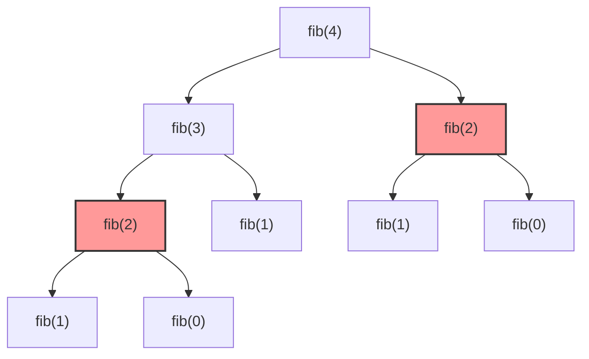

# L32 — Problemas Clásicos Recursivos: Matemáticos, Cadenas y Árboles de Llamadas

> [!NOTE]
> **Fundamentación Académica:** Esta lección sintetiza los conceptos del **Capítulo 8 (*Recursive Procedures*)** del libro oficial de Stanford CS106B ([`CS106BX-Reader.pdf`](../../files/cs106b/textbook/CS106BX-Reader.pdf)) y **Stanford CS106X Handouts**.

---

## 🧭 Navegación Rápida

- 📄 **Lecturas Académicas Base:**
  - 🌲 [Stanford CS106B Textbook (Ch 8, pp. 321–360)](../../files/cs106b/textbook/CS106BX-Reader.pdf)
  - ⚡ [Stanford CS106X — Recursive Problem Solving](../../files/cs106x/README.md)
- 💻 **Laboratorio de Código:** [`L32_RecursiveProblems.cpp`](../code/L32_RecursiveProblems.cpp)

---

## Objetivos de Aprendizaje

- [ ] Implementar funciones recursivas matemáticas clásicas: Factorial, Fibonacci y Potencia.
- [ ] Analizar el **Árbol de Llamadas (*Call Tree*)** y entender el problema de la redundancia en Fibonacci.
- [ ] Procesar cadenas de texto C-strings de forma recursiva.
- [ ] Identificar múltiples casos base cuando el problema lo requiera.

---

## 1. Problema 1: Factorial ($n!$)

El factorial de un número entero no negativo $n$ se define matemáticamente como:
$$n! = n \times (n-1) \times (n-2) \times \dots \times 1$$

Con las definiciones límite:
- $0! = 1$ (Caso Base)
- $n! = n \times (n-1)!$ (Definición Recursiva para $n > 0$)

### Implementación en C++

```cpp
#include <iostream>
using namespace std;

long long factorial(int n) {
    // 1. Caso Base
    if (n <= 1) {
        return 1;
    }
    // 2. Paso Recursivo
    return n * factorial(n - 1);
}
```

#### Traza de Ejecución para `factorial(4)`:
```text
factorial(4) = 4 * factorial(3)
  factorial(3) = 3 * factorial(2)
    factorial(2) = 2 * factorial(1)
      factorial(1) = 1 (Caso Base)
    factorial(2) = 2 * 1 = 2
  factorial(3) = 3 * 2 = 6
factorial(4) = 4 * 6 = 24
```

---

## 2. Problema 2: Serie de Fibonacci ($F_n$)

La sucesión de Fibonacci se define por la regla donde cada elemento es la suma de los dos anteriores:
- $F_0 = 0$ (Caso Base 1)
- $F_1 = 1$ (Caso Base 2)
- $F_n = F_{n-1} + F_{n-2}$ para $n \ge 2$ (Paso Recursivo)

### Implementación en C++

```cpp
long long fibonacci(int n) {
    // Casos Base Múltiples
    if (n == 0) return 0;
    if (n == 1) return 1;

    // Paso Recursivo Múltiple
    return fibonacci(n - 1) + fibonacci(n - 2);
}
```

### ⚠️ El Árbol de Llamadas y la Ineficiencia de Fibonacci Recursivo

A diferencia del factorial (que hace $N$ llamadas en una sola línea), Fibonacci genera un **árbol binario de llamadas**:



> [!WARNING]
> **Problema de Rendimiento (Llamadas Duplicadas):**
> Observa cómo `fib(2)` se calcula **dos veces desde cero** (nodos en rojo). Para valores grandes de $n$, la cantidad de llamadas crece de forma **exponencial** ($O(2^n)$). Un valor como `fibonacci(50)` tomaría minutos en ejecutarse sin optimizaciones (programación dinámica / memoización).

---

## 3. Problema 3: Potencia ($a^b$)

Calcula $a^b$ ($a$ elevado a la potencia $b$):
- Caso Base: $a^0 = 1$
- Paso Recursivo: $a^b = a \times a^{b-1}$

```cpp
double potencia(double base, int exp) {
    if (exp == 0) return 1.0; // Caso Base
    if (exp < 0) return 1.0 / potencia(base, -exp); // Manejo de exponentes negativos
    
    return base * potencia(base, exp - 1); // Paso Recursivo
}
```

---

## 4. Problema 4: Impresión e Inversión Recursiva de C-Strings

Podemos recorrer una C-string carácter a carácter usando aritmética de punteros o sub-índices de forma recursiva.

```cpp
#include <iostream>
using namespace std;

// Imprime una C-string en orden inverso usando la pila de llamadas
void imprimirReverso(const char s[]) {
    // Caso Base: llegamos al caracter nulo '\0'
    if (s[0] == '\0') {
        return;
    }

    // Paso Recursivo: avanzamos al siguiente caracter (s + 1)
    imprimirReverso(s + 1);

    // Al regresar del desapilamiento, imprimimos el caracter actual
    cout << s[0];
}

int main() {
    char texto[] = "Hola";
    cout << "Original: " << texto << endl;
    cout << "Reverso: ";
    imprimirReverso(texto); // Salida: aloH
    cout << endl;
    return 0;
}
```

> [!TIP]
> **Traza de la Pila para `"Hola"`:**
> 1. `imprimirReverso("Hola")` $\to$ llama a `imprimirReverso("ola")`
> 2. `imprimirReverso("ola")` $\to$ llama a `imprimirReverso("la")`
> 3. `imprimirReverso("la")` $\to$ llama a `imprimirReverso("a")`
> 4. `imprimirReverso("a")` $\to$ llama a `imprimirReverso("")`
> 5. `imprimirReverso("")` ve `'\0'` y hace `return` (Caso Base).
> 6. **Desapilamiento en reversa:** Imprime `'a'`, luego `'l'`, luego `'o'`, luego `'H'`.

---

## ❓ Pregunta de Chequeo #1 — Complejidad de Llamadas

Dada la función recursiva de Fibonacci:
```cpp
int fib(int n) {
    if (n <= 1) return n;
    return fib(n - 1) + fib(n - 2);
}
```
**¿Cuántas llamadas a función en total se realizan al ejecutar `fib(4)`?**

<details>
<summary>🔍 <strong>Ver Explicación y Conteo del Árbol</strong></summary>

**Respuesta:** Se realizan **9 llamadas a función** en total.

**Desglose:**
1. `fib(4)` (Llamada 1)
2. `fib(3)` (Llamada 2)
3. `fib(2)` (Llamada 3)
4. `fib(1)` (Llamada 4 — Caso Base)
5. `fib(0)` (Llamada 5 — Caso Base)
6. `fib(1)` (Llamada 6 — Caso Base)
7. `fib(2)` (Llamada 7)
8. `fib(1)` (Llamada 8 — Caso Base)
9. `fib(0)` (Llamada 9 — Caso Base)

Esto demuestra el crecimiento exponencial de las llamadas recursivas duplicadas sin memoización.

</details>

---

## 📝 Resumen Resumido de L32

1. **Definiciones Matemáticas Nativas:** Problemas como Factorial, Fibonacci y Potencia tienen una traducción directa a código recursivo.
2. **Casos Base Múltiples:** Problemas con más de una condición inicial (como Fibonacci $n=0$ y $n=1$) requieren múltiples `if` de caso base.
3. **Pila para Inversión:** Aprovechar el orden de desapilamiento (LIFO: *Last-In, First-Out*) permite procesar estructuras como C-strings en orden inverso de forma natural sin crear arreglos auxiliares.

---

<div align="center">

### 🧭 Navigation & Progression

| ⬅️ Previous Lesson | 🏠 Section Home | ➡️ Next Lesson |
|:------------------:|:--------------:|:--------------:|
| [**⬅️ L31 — Thinking Recursively**](L31_ThinkingRecursively.md) | [**🏠 Recursion & Algorithms**](../README.md) | [**L33 — Big-O Notation ➡️**](L33_BigONotation.md) |

</div>

---
*MiniLux0 — Learning C++ Section 05*
