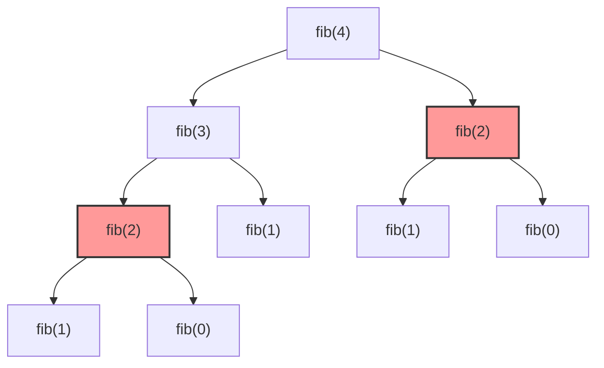
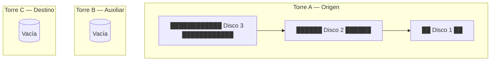
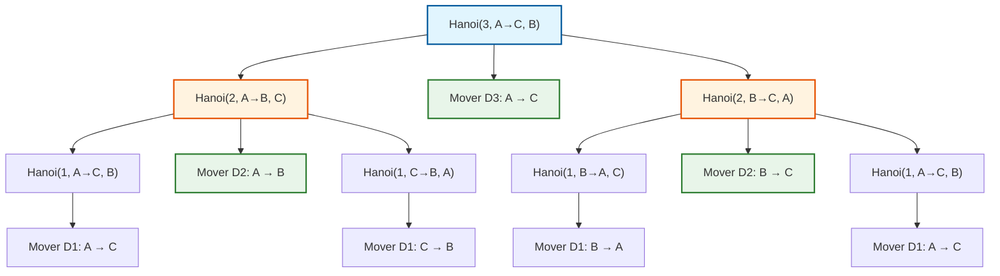

# L32 — Problemas Clásicos Recursivos: Factorial, Fibonacci, Palíndromos y las Torres de Hanói

> [!NOTE]
> **Fundamentación Académica:** Esta lección sintetiza los conceptos del **Capítulo 7 (*Introduction to Recursion*, pp. 315–348)** y **Capítulo 8 (*Recursive Strategies*, pp. 349–388)** del libro oficial de Stanford CS106B (*Programming Abstractions in C++* por Eric Roberts) y **Stanford CS106X Handouts**, cubriendo **7.2** *The factorial function* (p. 318), **7.3** *The Fibonacci function* (p. 325), **7.4** *Checking palindromes* (p. 332) y **8.1** *The Towers of Hanoi* (p. 350).

---

## 🧭 Navegación Rápida

- 📄 **Lecturas Académicas Base:**
  - 🌲 [Stanford CS106B Textbook — Ch 7 (pp. 315–348) & Ch 8.1 (pp. 349–360)](../../files/cs106b/textbook/CS106BX-Reader.pdf)
  - ⚡ [Stanford CS106X — Recursive Problem Solving](../../files/cs106x/README.md)
- 💻 **Laboratorio de Código:** [`L32_RecursiveProblems.cpp`](../code/L32_RecursiveProblems.cpp)

---

## Objetivos de Aprendizaje

- [ ] Implementar la función **Factorial ($n!$)** y analizar el desapilamiento de marcos de memoria (Sección 7.2).
- [ ] Analizar el árbol binario de llamadas de **Fibonacci** ($O(2^N)$) y transformarlo en una función lineal $O(N)$ mediante **Secuencia Aditiva (*Additive Sequence*)** (Sección 7.3).
- [ ] Diseñar el algoritmo para **Verificación de Palíndromos** reduciendo límites con índices a complejidad $O(N)$ (Sección 7.4).
- [ ] Dominar la solución por **Divide y Vencerás** del dilema de **Las Torres de Hanói** (Sección 8.1).

---

## 1. La Función Factorial ($n!$ — Sección 7.2)

El factorial de un número entero no negativo $n$, denotado como $n!$, se define matemáticamente como:
$$
n! = \left\{
\begin{array}{ll}
1 & \text{si } n = 0 \text{ (Caso Base)} \\
n \times (n - 1)! & \text{si } n > 0 \text{ (Paso Recursivo)}
\end{array}
\right.
$$

### Implementación en C++

```cpp
long long factorial(int n) {
    if (n <= 1) { // Caso Base (0! = 1, 1! = 1)
        return 1;
    }
    return n * factorial(n - 1); // Paso Recursivo
}
```

#### Traza de Marcos en la Pila para `factorial(4)`:
```text
[Frame 4: n=4] -> Espera resultado de factorial(3) -> Retorna 4 * 6 = 24
  [Frame 3: n=3] -> Espera resultado de factorial(2) -> Retorna 3 * 2 = 6
    [Frame 2: n=2] -> Espera resultado de factorial(1) -> Retorna 2 * 1 = 2
      [Frame 1: n=1] -> Caso Base alcanzado! -> Retorna 1
```

> [!NOTE]
> **Profundidad de Pila y Complejidad Espacial:**
> `factorial(n)` realiza $N$ llamadas recursivas en cadena lineal, consumiendo una profundidad de pila de espacio $`O(N)`$.

---

## 2. La Función de Fibonacci y la Secuencia Aditiva ($F_n$ — Sección 7.3)

La sucesión de Fibonacci ($0, 1, 1, 2, 3, 5, 8, 13, 21, \dots$) se define por:
$$
F_n = \left\{
\begin{array}{ll}
0 & \text{si } n = 0 \\
1 & \text{si } n = 1 \\
F_{n-1} + F_{n-2} & \text{si } n \ge 2
\end{array}
\right.
$$

### Implementación Directa (Naive — $O(2^N)$)

```cpp
long long fibonacciNaive(int n) {
    if (n == 0) return 0; // Caso Base 1
    if (n == 1) return 1; // Caso Base 2
    return fibonacciNaive(n - 1) + fibonacciNaive(n - 2); // Paso Recursivo Doble
}
```

#### ⚠️ El Árbol Binario de Llamadas y la Redundancia
Al calcular `fibonacciNaive(4)`, la función genera llamadas duplicadas:



> [!CAUTION]
> **Explosión Exponencial:**
> `fib(2)` se recalcula múltiples veces. El número total de llamadas crece a una tasa $`O(2^N)`$, haciendo que `fibonacciNaive(50)` requiera miles de millones de operaciones.

### 🌟 La Optimización: Secuencia Aditiva ($O(N)$)

La Sección 7.3 propone generalizar la recursión a una **Secuencia Aditiva** que mantiene el estado acumulado de los dos términos en parámetros de la función (Recursión de Cola / *Tail-Recursion*):

```cpp
// Función auxiliar que mantiene los dos términos actuales (a y b)
long long secuenciaAditiva(int n, long long a, long long b) {
    if (n == 0) return a; // Caso Base 1
    if (n == 1) return b; // Caso Base 2
    return secuenciaAditiva(n - 1, b, a + b); // Avanza linealmente reduciendo n
}

// Wrapper público limpio
long long fibonacciLineal(int n) {
    return secuenciaAditiva(n, 0, 1);
}
```

> [!TIP]
> **Comparación de Rendimiento:**
> - `fibonacciNaive(40)`: Tarda varias millones de llamadas $`O(2^{40})`$.
> - `fibonacciLineal(40)`: Realiza exactamente **40 llamadas** $`O(N)`$, devolviendo `102,334,155` de manera instantánea.

---

## 3. Verificación de Palíndromos (`esPalindromo` — Sección 7.4)

Un palíndromo es una palabra o frase que se lee igual de izquierda a derecha que de derecha a izquierda (ej. *"reconocer"*, *"anilina"*).

### Reducción Recursiva:
1. **Casos Base:** Una cadena de longitud $0$ o $1$ es siempre un palíndromo (`length <= 1`).
2. **Paso Recursivo:** Si el primer y el último carácter coinciden (`str[low] == str[high]`), el problema se reduce a verificar el sub-string interno.

### Implementación Eficiente con Índices de Frontera ($O(N)$ Tiempo, $O(N)$ Pila)

Para evitar la asignación innecesaria de memoria con `substr()` ($O(N^2)$), se utilizan dos punteros de índice `low` y `high`:

```cpp
#include <string>
using namespace std;

bool esPalindromoHelper(const string& str, int low, int high) {
    if (low >= high) return true; // Caso Base: 0 o 1 carácter restante
    if (str[low] != str[high]) return false; // Descarte temprano
    return esPalindromoHelper(str, low + 1, high - 1); // Reduce los límites
}

bool esPalindromo(const string& str) {
    return esPalindromoHelper(str, 0, str.length() - 1);
}
```

---

## 4. Las Torres de Hanói (Sección 8.1)

> **La Leyenda de Benares:**  
> En el gran templo de Benares, bajo la cúpula que marca el centro del mundo, los sacerdotes de Brahma mueven 64 discos de oro puro entre tres agujas de diamante. Cuando completen el traslado respetando las leyes divinas, el templo caerá en polvo y el mundo desaparecerá.

### Las Reglas del Juego:
1. Solo se puede mover **un disco a la vez**.
2. Un disco más grande **nunca puede colocarse sobre uno más pequeño**.
3. Se deben usar tres torres: `Origen`, `Destino` y `Auxiliar`.

### Estado Inicial (3 Discos)



### Estrategia Divide y Vencerás (Árbol de Llamadas Recursivas)



### La Estrategia Divide y Vencerás (3 Pasos):

Para mover $N$ discos de `Origen` a `Destino` usando `Auxiliar`:
1. **Mover $N-1$ discos** de `Origen` a `Auxiliar` (usando `Destino` como apoyo).
2. **Mover el disco $N$ (el más grande)** directamente de `Origen` a `Destino`.
3. **Mover $N-1$ discos** de `Auxiliar` a `Destino` (usando `Origen` como apoyo).

### Implementación en C++

```cpp
#include <iostream>
using namespace std;

void torresDeHanoi(int n, char origen, char destino, char auxiliar, int& totalMovimientos) {
    if (n == 1) { // Caso Base: Transferencia directa de 1 disco
        totalMovimientos++;
        cout << "  [Mov " << totalMovimientos << "] Mover disco 1 de " << origen << " a " << destino << endl;
        return;
    }

    // 1. Mover n-1 discos de origen a auxiliar
    torresDeHanoi(n - 1, origen, auxiliar, destino, totalMovimientos);

    // 2. Mover el disco n de origen a destino
    totalMovimientos++;
    cout << "  [Mov " << totalMovimientos << "] Mover disco " << n << " de " << origen << " a " << destino << endl;

    // 3. Mover n-1 discos de auxiliar a destino
    torresDeHanoi(n - 1, auxiliar, destino, origen, totalMovimientos);
}
```

### Análisis Matemático del Número de Movimientos

El número de movimientos $M(N)$ para $N$ discos satisface la ecuación de recurrencia:
$$
M(N) = 2 \times M(N-1) + 1
$$

Con caso base $M(1) = 1$. La solución cerrada es:
$$
M(N) = 2^N - 1
$$

- Para $N = 3$ discos: $2^3 - 1 =$ **7 movimientos**.
- Para $N = 64$ discos: $2^{64} - 1 \approx 1.84 \times 10^{19}$ movimientos ($\approx$ **584 mil millones de años** a 1 mov/seg).

---

## ❓ Pregunta de Chequeo #1 — Complejidad de Torres de Hanói

Si ejecutas `torresDeHanoi(5, 'A', 'C', 'B', mov)`, **¿cuántos movimientos totales de discos se realizarán?**

<details>
<summary>🔍 <strong>Ver Explicación y Fórmula</strong></summary>

**Respuesta:** Se realizarán **31 movimientos**.

**Explicación:**
Aplicando la fórmula $M(N) = 2^N - 1$:
$$
M(5) = 2^5 - 1 = 32 - 1 = 31
$$

</details>

---

## 📝 Resumen de L32

1. **Factorial:** Reducción lineal simple con complejidad espacial en pila $O(N)$.
2. **Fibonacci Optimizado:** La llamada ingenua genera un árbol binario $O(2^N)$. Mediante la **Secuencia Aditiva** (Sección 7.3), se optimiza a complejidad lineal $O(N)$.
3. **Palíndromos:** El uso de punteros/índices de frontera (`low`, `high`) evita la copia de subcadenas, optimizando memoria a $O(N)$.
4. **Torres de Hanói:** Paradigma de Divide y Vencerás que requiere $2^N - 1$ movimientos en 3 elegantes pasos recursivos.

---

<div align="center">

### 🧭 Navegación y Progresión

| ⬅️ Lección Anterior | 🏠 Inicio de Sección | ➡️ Siguiente Lección |
|:------------------:|:-------------------:|:------------------:|
| [**⬅️ L31 — Pensar Recursivamente**](L31_ThinkingRecursively.md) | [**🏠 Recursión y Algoritmos**](../README.md) | [**L33 — Memoización y DP ➡️**](L33_Memoization.md) |

</div>

---
*MiniLux0 — Learning C++ Section 05*