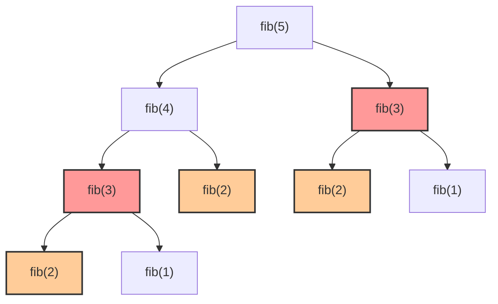
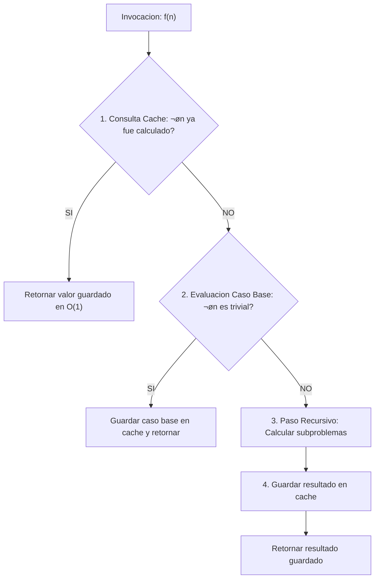
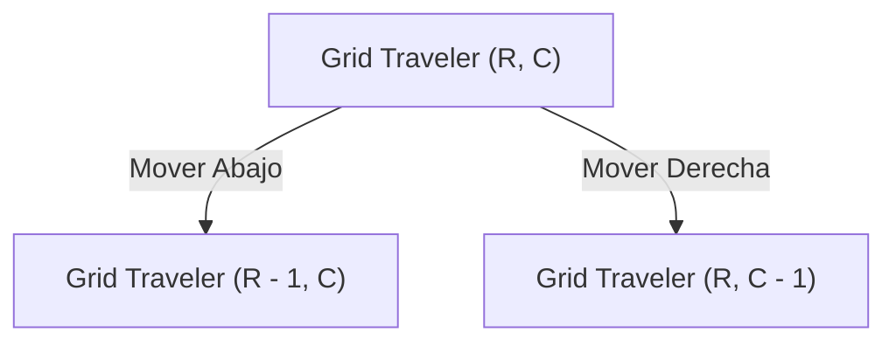

# L33 — Memoización y Programación Dinámica Top-Down: Eliminando la Redundancia Exponencial

> [!NOTE]
> **Fundamentación Académica:** Esta lección sintetiza los conceptos del **Capítulo 8 (*Recursive Strategies*, Sección 8.4: *Memoization*, pp. 365–370)** del libro oficial de Stanford CS106B (*Programming Abstractions in C++* por Eric Roberts) y conferencias avanzadas de **Stanford CS106X / CS106L**.

---

## 🧭 Navegación Rápida

- 📄 **Lecturas Académicas Base:**
  - 🌲 [Stanford CS106B Textbook — Ch 8.4: Memoization (pp. 365–370)](../../files/cs106b/textbook/CS106BX-Reader.pdf)
- 💻 **Laboratorio de Código:** [`L33_Memoization.cpp`](../code/L33_Memoization.cpp)

---

## Objetivos de Aprendizaje

- [ ] Identificar el fenómeno de **Subproblemas Superpuestos (*Overlapping Subproblems*)** en algoritmos recursivos ingenuos.
- [ ] Aplicar la técnica de **Memoización (*Top-Down Dynamic Programming*)** guardando resultados intermedios en memoria caché (`vector` o `unordered_map`).
- [ ] Reducir la complejidad temporal de la función Fibonacci de **exponencial $O(2^N)$ a lineal $O(N)$**.
- [ ] Implementar memoización en problemas de exploración bidimensional (Caminos en Grilla / *Grid Traveler*).
- [ ] Comparar las tres estrategias de solución: Recursión Simple, Memoización Top-Down y Tabulación Bottom-Up.

---

## 1. El Problema: Subproblemas Superpuestos (*Overlapping Subproblems*)

En la Lección **L32** observamos que la llamada recursiva ingenua `fibonacciNaive(N)` genera un árbol de decisiones desproporcionado:



Notice que `fib(3)` se calcula **2 veces** y `fib(2)` se calcula **3 veces**. A medida que $N$ aumenta a 50, el n√∫mero de recalculaciones explota a $O(2^{50}) \approx 1.12 \times 10^{15}$ operaciones.

> [!TIP]
> **Definición de Memoización (Eric Roberts, Sec. 8.4):**  
> La **Memoización** (término acuñado por Donald Michie en 1968, derivado de *"memorandum"*) es una técnica de optimización que consiste en **almacenar en una tabla de memoria caché los resultados de funciones costosas**, de modo que si la función vuelve a ser invocada con los mismos argumentos, retorne inmediatamente el valor guardado en tiempo $O(1)$.

---

## 2. El Patrón Universal de 4 Pasos para Aplicar Memoización

Para transformar cualquier función recursiva exponencial $O(2^N)$ en una versión memoizada lineal $O(N)$, se sigue esta plantilla:



### Plantilla Genérica en C++:

```cpp
#include <vector>
using namespace std;

// Valor centinela (-1) indica que el estado 'n' NO ha sido calculado
long long resolverMemo(int n, vector<long long>& memo) {
    // 1. CONSULTAR CACHÉ (O(1))
    if (memo[n] != -1) return memo[n];

    // 2. CASOS BASE
    if (n <= 1) return (memo[n] = n);

    // 3. PASO RECURSIVO Y 4. ALMACENAMIENTO
    memo[n] = resolverMemo(n - 1, memo) + resolverMemo(n - 2, memo);
    return memo[n];
}
```

---

## 3. Demostración en Código: Fibonacci Memoizado $O(N)$

```cpp
#include <iostream>
#include <vector>
#include <unordered_map>
using namespace std;

// ── 1. Versión con Vector (Ideal para rangos numéricos continuos [0..N]) ───────
long long fibVectorHelper(int n, vector<long long>& memo) {
    if (memo[n] != -1) return memo[n]; // Consulta caché en O(1)
    if (n == 0) return (memo[0] = 0);
    if (n == 1) return (memo[1] = 1);

    memo[n] = fibVectorHelper(n - 1, memo) + fibVectorHelper(n - 2, memo);
    return memo[n];
}

long long fibonacciMemo(int n) {
    if (n < 0) return -1;
    vector<long long> memo(n + 1, -1); // Inicializado con centinela -1
    return fibVectorHelper(n, memo);
}

// ── 2. Versión con Map/Hash Table (Ideal para estados dispersos) ─────────────
long long fibMapHelper(int n, unordered_map<int, long long>& memo) {
    if (memo.count(n)) return memo[n]; // Si ya existe en el map, retornar
    if (n == 0) return 0;
    if (n == 1) return 1;

    memo[n] = fibMapHelper(n - 1, memo) + fibMapHelper(n - 2, memo);
    return memo[n];
}
```

---

## 4. Segundo Caso Pr√°ctico: Caminos en Grilla (*Grid Traveler*)

Imagina un robot ubicado en la esquina superior izquierda de una grilla de $R \times C$ casillas que solo puede moverse **hacia la Derecha** o **hacia Abajo**. ¬øCu√°ntos caminos √∫nicos existen para llegar a la esquina inferior derecha?



### Implementación Recursiva con Memoización de Estados Bidimensionales:

```cpp
#include <iostream>
#include <vector>
#include <string>
#include <unordered_map>
using namespace std;

// Clave √∫nica para el map: "R,C"
long long contarCaminosMemo(int r, int c, unordered_map<string, long long>& memo) {
    string key = to_string(r) + "," + to_string(c);
    if (memo.count(key)) return memo[key];

    // Casos Base: Grilla inv√°lida (0) o destino alcanzado (1x1)
    if (r == 0 || c == 0) return 0;
    if (r == 1 && c == 1) return 1;

    // Paso Recursivo: Mover Abajo (r-1, c) + Mover Derecha (r, c-1)
    memo[key] = contarCaminosMemo(r - 1, c, memo) + contarCaminosMemo(r, c - 1, memo);
    return memo[key];
}
```

> [!IMPORTANT]
> **Impacto de la Memoización en Grillas:**
> - **Sin Memoización:** Complejidad $O(2^{R + C})$. Para una grilla de $18 \times 18$, realiza más de **$2.3 \times 10^{10}$ llamadas recursivas** (tarda minutos).
> - **Con Memoización:** Complejidad $O(R \cdot C)$. Para $18 \times 18$, evalúa exactamente **$18 \times 18 = 324$ estados**, ejecutándose en **menos de 1 milisegundo**.

---

## 5. Tabla Comparativa de Estrategias Algorítmicas

| Criterio | Recursión Simple | Memoización (*Top-Down DP*) | Tabulación (*Bottom-Up DP*) |
| :--- | :--- | :--- | :--- |
| **Enfoque** | Subdivisión directa desde $N \to 0$ | Recursión Top-Down + Caché de memoria | Bucles iterativos desde $0 \to N$ |
| **Complejidad Temporal** | Exponencial $O(2^N)$ | Lineal $O(N)$ | Lineal $O(N)$ |
| **Complejidad Espacial** | $O(N)$ en Pila de llamadas | $O(N)$ Caché + $O(N)$ Pila | $O(N)$ o $O(1)$ optimizado |
| **Facilidad de diseño** | Trivial de escribir | Muy natural derivando de la recursión | Requiere reorganizar el orden de subproblemas |

---

## ❓ Preguntas de Chequeo & Autoevaluación

### Pregunta #1 — Complejidad de Espacio
¿Por qué `fibonacciMemo(N)` utiliza espacio $O(N)$ si no crea copias de arreglos por nivel?

<details>
<summary>🔍 <strong>Ver Explicación y Respuesta</strong></summary>

**Respuesta:** Utiliza espacio $O(N)$ por dos razones:
1. La tabla o `vector` de almacenamiento caché requiere $N + 1$ posiciones para guardar los valores calculados.
2. La pila de llamadas recursivas (*Call Stack*) alcanza una profundidad m√°xima de $N$ marcos de memoria antes de desapilar el primer subproblema trivial.

</details>

---

### Pregunta #2 — Elección de Estructura de Datos para Caché
¿Cuándo es preferible usar un `vector<long long>` en lugar de un `unordered_map<int, long long>` para memoización?

<details>
<summary>üîç <strong>Ver Respuesta</strong></summary>

**Respuesta:** Es preferible usar `vector` cuando los estados son enteros continuos en un rango conocido $[0 \dots N]$, como en Fibonacci. El acceso por índice a un `vector` es $O(1)$ directo y libre de la sobrecarga de funciones hash o colisiones que tiene `unordered_map`.

`unordered_map` es preferible cuando los estados son compuestos (como pares de coordenadas `"R,C"`) o cuando el espacio de estados es muy grande y disperso.

</details>

---

## üìù Resumen de L33

1. **Subproblemas Superpuestos:** La recursión simple recalcula las mismas ramas múltiples veces, causando explosión exponencial $O(2^N)$.
2. **Memoización (Top-Down):** Consiste en guardar cada resultado en una tabla caché (`vector` o `map`) tras calcularlo por primera vez.
3. **Reducción de Complejidad:** Transforma algoritmos exponenciales $O(2^N)$ en lineales $O(N)$ o polinomiales $O(R \cdot C)$.
4. **Patrón de 4 Pasos:** Consultar caché $\to$ Evaluar caso base $\to$ Calcular paso recursivo $\to$ Almacenar en caché y retornar.

---

<div align="center">

### 🧭 Navegación y Progresión

| ⬅️ Lección Anterior | 🏠 Inicio de Sección | ➡️ Siguiente Lección |
|:------------------:|:-------------------:|:------------------:|
| [**⬅️ L32 — Problemas Recursivos**](L32_RecursiveProblems.md) | [**🏠 Recursión y Algoritmos**](../README.md) | [**L34 — Notación Big-O ➡️**](L34_BigONotation.md) |

</div>

---
*MiniLux0 — Learning C++ Section 05*

---

<div align="center">
  <sub>Maintained by <strong>MiniLux0</strong> ∑ 2026</sub>
</div>