```mermaid
graph LR
    O1["O(1) Constante"] --> OlogN["O(log N) Logarítmico"]
    OlogN --> ON["O(N) Lineal"]
    ON --> ONlogN["O(N log N) Linealítmico"]
    ONlogN --> ON2["O(N²) Cuadrático"]
    ON2 --> O2N["O(2ᴺ) Exponencial"]
    O2N --> ONFact["O(N!) Factorial"]

    style O1 fill:#d4edda,stroke:#28a745,stroke-width:2px
    style OlogN fill:#d4edda,stroke:#28a745,stroke-width:2px
    style ON fill:#fff3cd,stroke:#ffc107,stroke-width:2px
    style ONlogN fill:#fff3cd,stroke:#ffc107,stroke-width:2px
    style ON2 fill:#f8d7da,stroke:#dc3545,stroke-width:2px
    style O2N fill:#f8d7da,stroke:#dc3545,stroke-width:2px
    style ONFact fill:#f8d7da,stroke:#dc3545,stroke-width:2px
```

# L34 — Notación Big-O: Análisis Asintótico y Clases de Complejidad

> [!NOTE]
> **Fundamentación Académica:** Esta lección sintetiza los conceptos del **Capítulo 10 (*Algorithmic Analysis*, pp. 429–478)** del libro oficial de Stanford CS106B (*Programming Abstractions in C++* por Eric Roberts) y **Stanford CS106X Handouts**, cubriendo **10.2** *Computational complexity* (p. 435) y **10.4** *Standard complexity classes* (p. 449).

---

## 🧭 Navegación Rápida

- 📄 **Lecturas Académicas Base:**
  - 🌲 [Stanford CS106B Textbook — Ch 10.2 & 10.4 (pp. 429–478)](../../files/cs106b/textbook/CS106BX-Reader.pdf)
  - ⚡ [Stanford CS106X — Asymptotic Algorithmic Analysis](../../files/cs106x/README.md)
- 💻 **Laboratorio de Código:** [`L34_BigONotation.cpp`](../code/L34_BigONotation.cpp)

---

## Objetivos de Aprendizaje

- [ ] Entender qué es el **Análisis Asintótico** y por qué la notación Big-O mide el crecimiento del tiempo en función de $N \to \infty$ (Sección 10.2).
- [ ] Aplicar la definición matemática formal de **Big-O ($O(g(N))$)** ($T(N) \le C \cdot g(N)$).
- [ ] Dominar las **Reglas de Simplificación Asintótica**: eliminar constantes multiplicativas y términos no dominantes.
- [ ] Clasificar la **Jerarquía de Clases de Complejidad Estándar** (Sección 10.4): $O(1)$, $O(\log N)$, $O(N)$, $O(N \log N)$, $O(N^2)$, $O(2^N)$, $O(N!)$.

---

## 1. Fundamentos del Análisis Asintótico (Sección 10.2)

La velocidad de ejecución de un programa depende del reloj de la CPU, el compilador y la RAM. Sin embargo, en ciencias de la computación necesitamos una métrica pura para comparar algoritmos **independientemente del hardware**: la **Notación Big-O ($O$)**.

> [!TIP]
> **Definición Formal de Big-O (Sec. 10.2):**  
> Decimos que un algoritmo tiene un tiempo de ejecución $O(g(N))$ si existen constantes positivas $C$ y $N_0$ tales que para todo $N \ge N_0$:
> ```math
> T(N) \le C \times g(N)
> ```

### Las 2 Reglas de Simplificación Asintótica:
1. **Descartar las constantes multiplicativas:** $O(5 \cdot N) \longrightarrow O(N)$.
2. **Descartar los términos de menor orden:** $O(N^2 + 100N + 500) \longrightarrow O(N^2)$.

---

## 2. Jerarquía de Clases de Complejidad Estándar (Sección 10.4)

Se clasifican las familias de rendimiento algorítmico en una jerarquía de crecimiento de menor a mayor costo:

```math
O(1) < O(\log N) < O(N) < O(N \log N) < O(N^2) < O(2^N) < O(N!)
```



---

## 3. Desglose Detallado por Clase de Complejidad

### ⚡ 1. Complejidad Constante — $O(1)$
El tiempo de ejecución es fijo y no depende del tamaño de la entrada $N$.
- **Ejemplos:** Acceso directo por índice a un arreglo `arr[i]`, inserción al final de `vector` (`push_back`), operaciones aritméticas.

```cpp
int obtenerPrimerElemento(const vector<int>& v) {
    if (v.empty()) return -1;
    return v[0]; // O(1)
}
```

---

### 🔍 2. Complejidad Logarítmica — $O(\log N)$
Divide el espacio del problema a la mitad en cada paso. Extremadamente eficiente.
- **Ejemplos:** Búsqueda Binaria (*Binary Search*), operaciones en árboles AVL/BST balanceados.
- **Impacto Real:** Para $N = 1,000,000$, $\log_2(1,000,000) \approx 20$ comparaciones.

```cpp
int contarPasosLogaritmicos(int n) {
    int pasos = 0;
    while (n > 1) {
        n /= 2; // Divide el espacio a la mitad
        pasos++;
    }
    return pasos; // O(log N)
}
```

---

### 📏 3. Complejidad Lineal — $O(N)$
El tiempo de ejecución crece en proporción directa al número de elementos $N$.
- **Ejemplos:** Búsqueda Lineal (*Linear Search*), recorrido de arreglos, conteo de elementos.

```cpp
int calcularSuma(const vector<int>& v) {
    int suma = 0;
    for (int num : v) { // N iteraciones
        suma += num;
    }
    return suma; // O(N)
}
```

---

### ⚡ 4. Complejidad Linealítmica — $O(N \log N)$
Aparece típicamente en algoritmos de Divide y Vencerás que dividen el problema en subproblemas logarítmicos y luego procesan los $N$ elementos para combinarlos.
- **Ejemplos:** MergeSort, QuickSort (caso promedio), HeapSort, `sort`.

```cpp
long long simularTrabajoLinearithmic(int n) {
    long long operaciones = 0;
    for (int i = 0; i < n; i++) { // N iteraciones
        int temp = n;
        while (temp > 1) { // log N iteraciones
            temp /= 2;
            operaciones++;
        }
    }
    return operaciones; // O(N log N)
}
```

---

### 🐢 5. Complejidad Cuadrática — $O(N^2)$
Aparece cuando se emplean bucles anidados donde cada elemento se compara con todos los demás.
- **Ejemplos:** Selection Sort, Insertion Sort, Bubble Sort, búsqueda de pares duplicados ingenuamente.

```cpp
int contarParesIguales(const vector<int>& v) {
    int contador = 0;
    int n = v.size();
    for (int i = 0; i < n; i++) {       // N iteraciones
        for (int j = 0; j < n; j++) {   // N iteraciones
            if (i != j && v[i] == v[j]) contador++;
        }
    }
    return contador; // O(N^2)
}
```

---

### 💣 6. Complejidad Exponencial — $O(2^N)$
El tiempo de ejecución se duplica con cada nuevo elemento añadido a la entrada. Se vuelve inmanejable rápidamente para $N > 40$.
- **Ejemplos:** Naive Fibonacci, resolución del problema del Subconjunto (*Subset-Sum* por fuerza bruta), traslado de Torres de Hanói.

```cpp
int ramificacionesExponenciales(int n) {
    if (n <= 1) return 1;
    return ramificacionesExponenciales(n - 1) + ramificacionesExponenciales(n - 1); // O(2^N)
}
```

---

## 📊 Tabla Comparativa de Escalamiento ($N \to \text{Operaciones}$)

| $N$ | $O(1)$ | $O(\log_2 N)$ | $O(N)$ | $O(N \log_2 N)$ | $O(N^2)$ | $O(2^N)$ |
| :---: | :---: | :---: | :---: | :---: | :---: | :---: |
| **10** | $1$ | $3.3$ | $10$ | $33$ | $100$ | $1,024$ |
| **100** | $1$ | $6.6$ | $100$ | $664$ | $10,000$ | $1.26 \times 10^{30}$ |
| **1,000** | $1$ | $9.9$ | $1,000$ | $9,965$ | $1,000,000$ | Imposible |
| **1,000,000** | $1$ | $19.9$ | $1,000,000$ | $19,931,568$ | $10^{12}$ | Imposible |

---

## ❓ Pregunta de Chequeo #1 — Simplificación Asintótica

Considera un algoritmo que realiza exactamente $T(N) = 3N^3 + 500N^2 + 2000N + 7500$ operaciones.

**¿Cuál es su complejidad asintótica en Notación Big-O?**

<details>
<summary>🔍 <strong>Ver Explicación y Respuesta</strong></summary>

**Respuesta:** Su complejidad es **$O(N^3)$**.

**Explicación:**
1. **Regla 1 (Términos no dominantes):** Descartamos $500N^2$, $2000N$ y $7500$ porque al tender $N \to \infty$, $N^3$ domina completamente el tiempo de ejecución.
2. **Regla 2 (Constantes multiplicativas):** Descartamos el coeficiente $3$ de $3N^3$.
3. Resultado final: $O(N^3)$.

</details>

---

## 📝 Resumen de L33

1. **Notación Big-O:** Mide la tasa de crecimiento asintótico del tiempo o espacio cuando $N \to \infty$.
2. **Simplificación:** Se eliminan coeficientes constantes y términos de menor orden.
3. **Jerarquía:** $O(1) < O(\log N) < O(N) < O(N \log N) < O(N^2) < O(2^N) < O(N!)$.
4. **Casos:** Distinguir siempre entre Peor Caso (*Worst Case*), Caso Promedio (*Average Case*) y Mejor Caso (*Best Case*).

---

<div align="center">

### 🧭 Navegación y Progresión

| ⬅️ Lección Anterior | 🏠 Inicio de Sección | ➡️ Siguiente Lección |
|:------------------:|:-------------------:|:------------------:|
| [**⬅️ L33 — Memoización y DP**](L33_Memoization.md) | [**🏠 Recursión y Algoritmos**](../README.md) | [**L35 — Búsqueda Lineal y Binaria ➡️**](L35_LinearBinarySearch.md) |

</div>

---

<div align="center">
  <sub>Maintained by <strong>MiniLux0</strong> · 2026</sub>
</div>