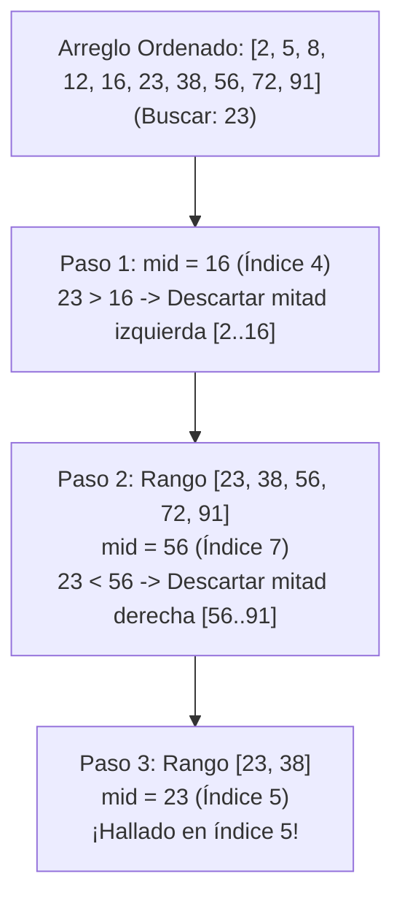

<div align="center">

| ⬅️ Previous Lesson | 🏠 Section Home | ➡️ Next Lesson |
|:------------------:|:--------------:|:--------------:|
| [**⬅️ L33: Big-O Notation**](L33_BigONotation.md) | [**Section 05: Recursion & Algorithms**](../README.md) | [**L35: Quadratic Sorts ➡️**](L35_QuadraticSorts.md) |

</div>

---

# L34 — Búsqueda Lineal y Binaria: Comparativa, Algoritmos Iterativos y Recursivos

> [!NOTE]
> **Fundamentación Académica:** Esta lección sintetiza los conceptos del **Capítulo 10.2 (*Searching*)** del libro oficial de Stanford CS106B ([`CS106BX-Reader.pdf`](../../files/cs106b/textbook/CS106BX-Reader.pdf)) y **Stanford CS106X Handouts**.

---

## 🧭 Navegación Rápida

- 📄 **Lecturas Académicas Base:**
  - 🌲 [Stanford CS106B Textbook (Ch 10.2, pp. 440–450)](../../files/cs106b/textbook/CS106BX-Reader.pdf)
  - ⚡ [Stanford CS106X — Searching & Algorithm Complexity](../../files/cs106x/README.md)
- 💻 **Laboratorio de Código:** [`L34_LinearBinarySearch.cpp`](../code/L34_LinearBinarySearch.cpp)

---

## Objetivos de Aprendizaje

- [ ] Comprender el funcionamiento de la **Búsqueda Lineal ($O(N)$)** en arreglos no ordenados.
- [ ] Dominar la **Búsqueda Binaria ($O(\log N)$)** en arreglos previa y estrictamente **ordenados**.
- [ ] Demostrar matemáticamente por qué la búsqueda binaria realiza como máximo $\log_2(N)$ comparaciones.
- [ ] Implementar versiones tanto **iterativas** como **recursivas** de ambos algoritmos.

---

## 1. Búsqueda Lineal (*Linear Search*)

La búsqueda lineal recorre un arreglo elemento por elemento desde el índice `0` hasta `n - 1` comparando cada valor con la clave buscada (*target*).

> [!TIP]
> **Propiedad Clave:** No requiere que el arreglo esté ordenado.

### Implementación C++ (Iterativa y Recursiva)

```cpp
// Versión Iterativa - O(N)
int busquedaLineal(const int arr[], int size, int target) {
    for (int i = 0; i < size; i++) {
        if (arr[i] == target) return i; // Encontrado (devuelve el índice)
    }
    return -1; // No encontrado
}

// Versión Recursiva - O(N)
int busquedaLinealRecursiva(const int arr[], int size, int target, int index = 0) {
    if (index >= size) return -1;             // Caso Base 1: Llegó al final sin éxito
    if (arr[index] == target) return index;   // Caso Base 2: Elemento encontrado
    
    return busquedaLinealRecursiva(arr, size, target, index + 1); // Paso Recursivo
}
```

---

## 2. Búsqueda Binaria (*Binary Search*)

La búsqueda binaria utiliza el enfoque de **Divide y Vencerás**. En lugar de revisar elemento por elemento, inspecciona el valor central (`mid`) del rango ordenado:
1. Si `arr[mid] == target`, lo hemos encontrado.
2. Si `arr[mid] > target`, descartamos la mitad derecha (buscamos en `[low, mid - 1]`).
3. Si `arr[mid] < target`, descartamos la mitad izquierda (buscamos en `[mid + 1, high]`).

> [!IMPORTANT]
> **REQUISITO INDISPENSABLE:** El arreglo **DEBE ESTAR ORDENADO** previamente. Si el arreglo está desordenado, la búsqueda binaria producirá resultados totalmente incorrectos.



---

## 3. Demostración de la Complejidad Logarítmica $O(\log_2 N)$

En cada paso de la búsqueda binaria, el espacio de búsqueda se reduce a la mitad ($\frac{N}{2}$):

$$\text{Elementos restantes tras } k \text{ pasos} = \frac{N}{2^k}$$

El algoritmo termina cuando el espacio de búsqueda se reduce a $1$ elemento:

$$\frac{N}{2^k} = 1 \implies N = 2^k \implies k = \log_2(N)$$

### Comparación de Eficiencia con Datos Reales:

| Tamaño del Arreglo ($N$) | Búsqueda Lineal $O(N)$ (Peor Caso) | Búsqueda Binaria $O(\log_2 N)$ (Peor Caso) |
| :---: | :---: | :---: |
| **10** | 10 comparaciones | 4 comparaciones |
| **1,000** | 1,000 comparaciones | **10 comparaciones** |
| **1,000,000** | 1,000,000 comparaciones | **20 comparaciones** |
| **8,000,000,000** (Población mundial) | 8,000,000,000 comparaciones | **¡Solo 33 comparaciones!** 🚀 |

---

## 4. Implementación en C++ de Búsqueda Binaria

### Versión Iterativa:
```cpp
int busquedaBinaria(const int arr[], int size, int target) {
    int low = 0;
    int high = size - 1;

    while (low <= high) {
        // Prevenir overflow entero en (low + high) / 2
        int mid = low + (high - low) / 2;

        if (arr[mid] == target) return mid;
        if (arr[mid] < target) low = mid + 1;  // Buscar a la derecha
        else high = mid - 1;                 // Buscar a la izquierda
    }
    return -1; // No encontrado
}
```

### Versión Recursiva:
```cpp
int busquedaBinariaRecursiva(const int arr[], int low, int high, int target) {
    if (low > high) return -1; // Caso Base 1: Rango exhausto sin éxito

    int mid = low + (high - low) / 2;

    if (arr[mid] == target) return mid; // Caso Base 2: Encontrado

    if (arr[mid] > target)
        return busquedaBinariaRecursiva(arr, low, mid - 1, target); // Mitad izquierda
    else
        return busquedaBinariaRecursiva(arr, mid + 1, high, target); // Mitad derecha
}
```

---

## ❓ Pregunta de Chequeo #1 — El Error Típico de Cálculo del Punto Medio

En C++, cuando calculamos el índice medio entre `low` y `high`, muchos programadores escriben:
`int mid = (low + high) / 2;`

**¿Por qué `int mid = low + (high - low) / 2;` es una solución más segura en C++ profesional?**

<details>
<summary>🔍 <strong>Ver Explicación de Prevención de Overflow</strong></summary>

> [!CAUTION]
> **Diagnóstico:** Previene el **Integer Overflow** (Desbordamiento de entero de 32 bits).
>
> **Explicación:**
> Si `low` y `high` son valores enteros muy grandes (por ejemplo, cercanos a $2 \times 10^9$, próximo al límite superior de un `int` firmado de 32 bits `INT_MAX = 2,147,483,647`), la suma `(low + high)` sobrepasará el rango representable, resultando en un valor negativo por overflow.
> La expresión alternativa `low + (high - low) / 2` es matemáticamente equivalente pero evita la suma directa de valores gigantes, garantizando la seguridad en sistemas de producción.

</details>

---

## 📝 Resumen Resumido de L34

1. **Búsqueda Lineal ($O(N)$):** Funciona en cualquier arreglo (ordenado o desordenado), pero es lenta para grandes volúmenes de datos.
2. **Búsqueda Binaria ($O(\log N)$):** Divide el rango de búsqueda a la mitad en cada paso; extremadamente rápida pero **exige un arreglo previamente ordenado**.
3. **Cálculo seguro del punto medio:** `int mid = low + (high - low) / 2`.

---

## Archivos Relacionados

- 📘 [`L33_BigONotation.md`](L33_BigONotation.md) — Lección anterior: Notación Big-O
- 💻 [`L34_LinearBinarySearch.cpp`](../code/L34_LinearBinarySearch.cpp) — Código ejecutable con pruebas de rendimiento
- 📘 [`L35_QuadraticSorts.md`](L35_QuadraticSorts.md) — Siguiente lección: Algoritmos de Ordenamiento Cuadráticos

---
*MiniLux0 — Learning C++ Section 05*
